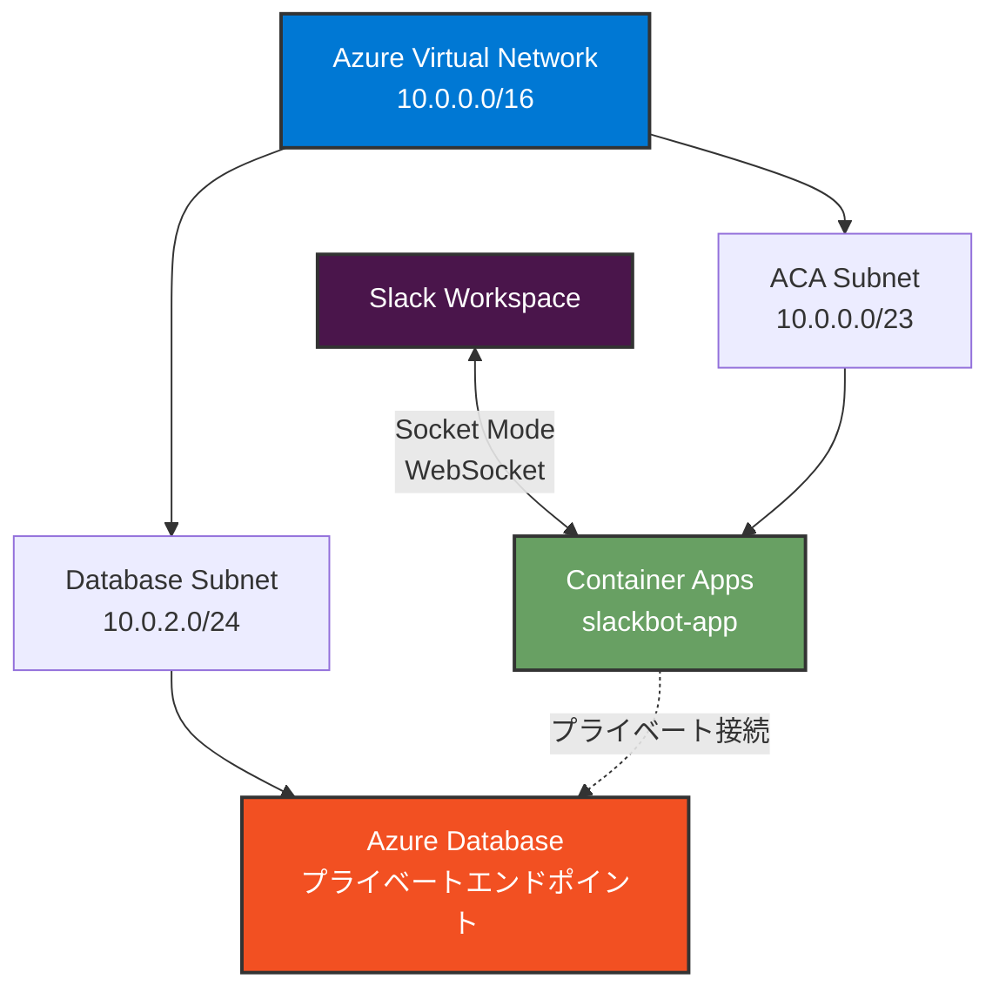

# Azure リソースの作成

このドキュメントでは、Slack Bot を Azure Container Apps (ACA) で動作させるために必要な Azure リソースを作成する手順を説明します。

**Azure CLI** または **Azure Portal** のいずれかの方法で作成できます。各セクションで両方の手順を記載しています。

## 目次

1. [前提条件](#前提条件)
2. [リソースグループの作成](#1-リソースグループの作成)
3. [Azure Container Registry (ACR) の作成](#2-azure-container-registry-acr-の作成)
4. [初期 Docker イメージのビルドとプッシュ](#25-初期-docker-イメージのビルドとプッシュ)
5. [Virtual Network (VNET) とサブネットの作成](#3-virtual-network-vnet-の作成)
6. [Log Analytics Workspace の作成](#4-log-analytics-workspace-の作成)
7. [Container Apps Environment の作成](#5-container-apps-environment-の作成)
8. [Container Apps の作成 (Key Vault 統合)](#6-azure-container-apps-の作成key-vault-統合)
   - 6.1 Key Vault の作成
   - 6.2 Key Vault にシークレットを登録
   - 6.3 Container App の作成
   - 6.4 Managed Identity の付与
   - 6.5 Key Vault アクセス権の付与
   - 6.6 シークレット同期
   - 6.7 アプリコードから直接取得 (オプション)
9. [シークレットの更新・ローテーション](#7-シークレットの更新ローテーション)
10. [デプロイの確認](#8-デプロイの確認)
11. [追加のセキュリティ / ネットワーク設定](#9-追加のセキュリティ設定)
12. [トラブルシューティング](#トラブルシューティング)

## 前提条件

### Azure CLI を使用する場合

- Azure サブスクリプション
- Azure CLI (バージョン 2.28.0 以上) がインストールされていること
- Azure にログイン済みであること (`az login`)

#### セットアップ手順

1. **Azure CLI を最新版に更新**

```bash
az upgrade
```

> **⚠️ 重要**: `az upgrade` を実行しないと、次のステップの `--allow-preview` オプションが使えません。

2. **Container Apps 拡張機能のインストール/更新（プレビュー機能を有効化）**

```bash
az extension add --name containerapp --upgrade --allow-preview true
```

> **📝 Note**: `az containerapp` コマンドは**拡張機能(Extension)**であり、**Preview**（プレビュー）ステータスです。
>
> - 2024 年 5 月以降、Azure CLI 拡張機能では既定でプレビュー機能が無効になっているため、`--allow-preview true` が必要です
> - コマンド実行時に以下のような警告が表示されますが、これは正常な動作です：
>
> ```
> Command group 'containerapp' is in preview and under development.
> ```

3. **必要なリソースプロバイダーの登録**

```bash
az provider register --namespace Microsoft.App
az provider register --namespace Microsoft.OperationalInsights
```

登録には数分かかる場合があります。以下のコマンドで状態を確認できます:

```bash
az provider show -n Microsoft.App --query "registrationState"
az provider show -n Microsoft.OperationalInsights --query "registrationState"
```

両方とも `"Registered"` と表示されれば完了です。

### Azure Portal を使用する場合

- Azure サブスクリプション
- Azure Portal へのアクセス権限

---

## 1. リソースグループの作成

すべての Azure リソースを管理するリソースグループを作成します。

### Azure CLI を使用する場合

```bash
az group create \
  --name rg-slackbot-aca \
  --location japaneast
```

**パラメータ**:

- `--name`: リソースグループ名 (任意、例: `rg-slackbot-aca`)
- `--location`: リージョン (`japaneast` を推奨)

### Azure Portal を使用する場合

1. [Azure Portal](https://portal.azure.com) にサインイン
2. 上部の検索バーで **リソース グループ** を検索
3. **+ 作成** をクリック
4. 以下を入力:
   - **サブスクリプション**: 使用するサブスクリプションを選択
   - **リソース グループ**: `rg-slackbot-aca` (任意の名前)
   - **リージョン**: `Japan East`
5. **確認および作成** → **作成**

---

## 2. Azure Container Registry (ACR) の作成

Docker イメージを保存するためのコンテナレジストリを作成します。

### Azure CLI を使用する場合

#### ACR の作成

```bash
az acr create \
  --resource-group rg-slackbot-aca \
  --name <YOUR_ACR_NAME> \
  --sku Standard \
  --admin-enabled true
```

**パラメータ**:

- `--resource-group`: リソースグループ名
- `--name`: ACR 名 (グローバルで一意、例: `slackbotaca123`)
- `--sku`: SKU (`Basic`, `Standard`, `Premium`)
- `--admin-enabled`: 管理者ユーザーを有効化

#### 管理者認証情報の取得

```bash
az acr credential show \
  --name <YOUR_ACR_NAME> \
  --query "{username:username, password:passwords[0].value}" \
  --output table
```

> **⚠️ 重要**: ユーザー名とパスワードを保存してください (GitHub Actions で使用)

### Azure Portal を使用する場合

#### ACR の作成

1. Azure Portal の検索バーで **コンテナー レジストリ** を検索
2. **+ 作成** をクリック
3. **基本** タブで以下を設定:
   - **サブスクリプション**: 使用するサブスクリプション
   - **リソース グループ**: `rg-slackbot-aca`
   - **レジストリ名**: グローバルで一意な名前 (例: `slackbotaca123`)
   - **場所**: `Japan East`
   - **SKU**: `Standard`
4. **確認および作成** → **作成**

#### 管理者ユーザーの有効化

1. 作成した ACR を開く
2. 左メニューから **アクセス キー** を選択
3. **管理者ユーザー** を **有効** に設定
4. **ユーザー名** と **パスワード** を保存 (GitHub Actions で使用)

---

## 2.5. 初期 Docker イメージのビルドとプッシュ

Container App を作成する前に、ACR に初期イメージを配置する必要があります。ここでは開発環境から直接ビルド・プッシュする手順を説明します。

> **📝 補足**: 本番運用では GitHub Actions で自動ビルド・デプロイしますが、初回の動作確認のために手動でイメージをプッシュします。

### 前提条件

- Docker がローカル環境にインストールされていること
- プロジェクトのルートディレクトリに `Dockerfile` と `package.json` が存在すること

### Azure CLI を使用する場合

#### 1. ACR にログイン

**方法 A: Azure AD 認証を使用 (推奨)**

```bash
az acr login --name <YOUR_ACR_NAME>
```

この方法は Azure CLI の認証情報を使用するため、パスワード管理が不要です。

**方法 B: 管理者認証情報を使用**

```bash
# 管理者パスワードを取得
ACR_PASSWORD=$(az acr credential show --name <YOUR_ACR_NAME> --query "passwords[0].value" -o tsv)

# Docker で ACR にログイン
docker login <YOUR_ACR_NAME>.azurecr.io \
  --username <YOUR_ACR_NAME> \
  --password $ACR_PASSWORD
```

#### 2. Docker イメージのビルド

プロジェクトのルートディレクトリで実行:

```bash
docker build -t slackbot-sample:1 .
```

#### 3. イメージにタグを付与

```bash
docker tag slackbot-sample:1 <YOUR_ACR_NAME>.azurecr.io/slackbot-sample:1
```

#### 4. ACR にプッシュ

```bash
docker push <YOUR_ACR_NAME>.azurecr.io/slackbot-sample:1
```

#### 5. イメージが登録されたか確認

```bash
az acr repository show \
  --name <YOUR_ACR_NAME> \
  --repository slackbot-sample
```

または、イメージのタグ一覧を表示:

```bash
az acr repository show-tags \
  --name <YOUR_ACR_NAME> \
  --repository slackbot-sample \
  --output table
```

**期待される出力**:

```
Result
--------
1
```

### Azure Portal を使用する場合

Portal では直接イメージをプッシュできないため、CLI の手順 (上記) を実行してください。プッシュ後、Portal で確認できます。

#### Portal でイメージを確認

1. Azure Portal で作成した ACR を開く
2. 左メニューから **リポジトリ** を選択
3. `slackbot-sample` リポジトリをクリック
4. タグ `1` が表示されることを確認

### トラブルシューティング

#### Docker ログインエラー

```
Error response from daemon: login attempt failed with status: 401 Unauthorized
```

**原因**: 管理者ユーザーが無効、またはパスワードが間違っている

**解決策**:

1. Portal で ACR の **アクセス キー** → **管理者ユーザー** が **有効** になっているか確認
2. パスワードを再取得して再試行

#### ビルドエラー

```
ERROR [internal] load metadata for docker.io/library/node:18-alpine
```

**原因**: ネットワーク接続の問題、または Dockerfile の FROM イメージが見つからない

**解決策**:

1. インターネット接続を確認
2. `Dockerfile` の `FROM` ディレクティブを確認 (例: `FROM node:18-alpine`)

#### プッシュ権限エラー

```
unauthorized: authentication required
```

**原因**: ACR にログインしていない、または認証が切れている

**解決策**:

```bash
az acr login --name <YOUR_ACR_NAME>
```

を再実行してから、プッシュをリトライ

---

## 3. Virtual Network とサブネットの作成

セキュリティを強化するため、Container Apps を仮想ネットワーク内に配置します。

### セキュアなアーキテクチャ



### Azure CLI を使用する場合

```bash
# VNET の作成
az network vnet create \
  --resource-group rg-slackbot-aca \
  --name slackbot-aca-vnet \
  --address-prefix 10.0.0.0/16 \
  --location japaneast

# Container Apps 用サブネットの作成 (最低 /23 が必要)
az network vnet subnet create \
  --resource-group rg-slackbot-aca \
  --vnet-name slackbot-aca-vnet \
  --name aca-subnet \
  --address-prefixes 10.0.0.0/23 \
  --delegations Microsoft.App/environments

# データベース用サブネットの作成 (将来の拡張用)
az network vnet subnet create \
  --resource-group rg-slackbot-aca \
  --vnet-name slackbot-aca-vnet \
  --name database-subnet \
  --address-prefixes 10.0.2.0/24 \
  --disable-private-endpoint-network-policies false
```

> **⚠️ 重要**: サブネットの委任について
>
> `--allow-preview true`で containerapp 拡張機能をインストールした場合、サブネットを `Microsoft.App/environments` に**委任する必要があります**。
>
> - サブネット作成時に `--delegations Microsoft.App/environments` を指定
> - または、既存のサブネットに委任を追加：
>   ```bash
>   az network vnet subnet update \
>     --resource-group rg-slackbot-aca \
>     --vnet-name slackbot-aca-vnet \
>     --name aca-subnet \
>     --delegations Microsoft.App/environments
>   ```

**パラメータ**:

- `--address-prefix`: VNET のアドレス空間 (`10.0.0.0/16`)
- `--address-prefixes`: サブネットのアドレス範囲
  - Container Apps 用: `/23` 以上が必要 (512 アドレス)
  - データベース用: `/24` (256 アドレス)

### Azure Portal を使用する場合

1. Azure Portal で **仮想ネットワーク** を検索
2. **+ 作成** をクリック
3. **基本** タブ:
   - **サブスクリプション**: 使用するサブスクリプション
   - **リソース グループ**: `rg-slackbot-aca`
   - **名前**: `slackbot-aca-vnet`
   - **リージョン**: `Japan East`
4. **IP アドレス** タブ:
   - **IPv4 アドレス空間**: `10.0.0.0/16`
   - **+ サブネットの追加**:
     - **名前**: `aca-subnet`
     - **サブネット アドレス範囲**: `10.0.0.0/23`
   - **+ サブネットの追加**:
     - **名前**: `database-subnet`
     - **サブネット アドレス範囲**: `10.0.2.0/24`
5. **確認および作成** → **作成**

> **📝 補足**:
>
> - Container Apps Environment には最低でも `/23` (512 アドレス) のサブネットが必要です
> - データベース用サブネットは将来の拡張用です (プライベートエンドポイント接続に使用)

---

## 4. Log Analytics Workspace の作成

Container Apps のログとメトリクスを収集するための Log Analytics Workspace を作成します。

### Azure CLI を使用する場合

```bash
# Log Analytics Workspaceを作成
az monitor log-analytics workspace create \
  --resource-group rg-slackbot-aca \
  --workspace-name ws-slackapp-aca \
  --location japaneast

# Workspace IDを取得
WORKSPACE_ID=$(az monitor log-analytics workspace show \
  --resource-group rg-slackbot-aca \
  --workspace-name ws-slackapp-aca \
  --query customerId \
  --output tsv)

# Workspace Keyを取得
WORKSPACE_KEY=$(az monitor log-analytics workspace get-shared-keys \
  --resource-group rg-slackbot-aca \
  --workspace-name ws-slackapp-aca \
  --query primarySharedKey \
  --output tsv)
```

**パラメータ**:

- `--workspace-name`: Workspace 名 (任意、例: `ws-slackapp-aca`)
- `--resource-group`: リソースグループ名
- `--location`: リージョン

### Azure Portal を使用する場合

1. Azure Portal で **Log Analytics ワークスペース** を検索
2. **+ 作成** をクリック
3. 以下を設定:
   - **サブスクリプション**: 使用するサブスクリプション
   - **リソース グループ**: `rg-slackbot-aca`
   - **名前**: `ws-slackapp-aca`
   - **リージョン**: `Japan East`
4. **確認および作成** → **作成**

> **📝 補足**: Portal で作成した場合、次のステップで Workspace を選択する際に使用します。

---

## 5. Container Apps Environment の作成 (VNET 統合)

Container Apps の実行環境を VNET 内に作成します。

### Azure CLI を使用する場合

```bash
# サブネット ID の取得
SUBNET_ID=$(az network vnet subnet show \
  --resource-group rg-slackbot-aca \
  --vnet-name slackbot-aca-vnet \
  --name aca-subnet \
  --query id \
  --output tsv)

# VNET 統合された Environment の作成（Log Analytics Workspace を指定）
az containerapp env create \
  --name slackbot-aca-env \
  --resource-group rg-slackbot-aca \
  --location japaneast \
  --infrastructure-subnet-resource-id $SUBNET_ID \
  --internal-only false \
  --logs-workspace-id $WORKSPACE_ID \
  --logs-workspace-key $WORKSPACE_KEY
```

> **📝 Note**: コマンド実行時に以下の警告が表示されますが、これは正常です：
>
> ```
> Command group 'containerapp' is in preview and under development.
> ```
>
> `az containerapp` は拡張機能(Extension)かつ Preview ステータスのため、この警告が表示されます。

> **⚠️ トラブルシューティング**:
>
> もし `ManagedEnvironmentInvalidNetworkConfiguration` エラーが発生した場合:
>
> 1. サブネットに委任が設定されていないことを確認:
>
>    ```bash
>    az network vnet subnet show --resource-group rg-slackbot-aca \
>      --vnet-name slackbot-aca-vnet --name aca-subnet \
>      --query "delegations" -o json
>    ```
>
>    結果が `[]` (空配列) であることを確認してください。
>
> 2. もし委任がある場合は削除:
>
>    ```bash
>    az network vnet subnet update --resource-group rg-slackbot-aca \
>      --vnet-name slackbot-aca-vnet --name aca-subnet \
>      --remove delegations
>    ```
>
> 3. リソースプロバイダーが登録済みか確認:
>    ```bash
>    az provider show -n Microsoft.App --query "registrationState"
>    az provider show -n Microsoft.OperationalInsights --query "registrationState"
>    ```
>    両方とも `"Registered"` であることを確認してください。

**パラメータ**:

- `--name`: 環境名 (任意、例: `slackbot-aca-env`)
- `--resource-group`: リソースグループ名
- `--location`: リージョン
- `--infrastructure-subnet-resource-id`: Container Apps が使用するサブネットの ID
- `--internal-only`: 内部専用環境にするか (`false` = Slack からの接続を許可)
- `--logs-workspace-id`: Log Analytics Workspace の Customer ID
- `--logs-workspace-key`: Log Analytics Workspace の共有キー

> **📝 Note**: Socket Mode では外部からの WebSocket 接続が必要なため、`--internal-only` は `false` に設定します。

### Azure Portal を使用する場合

1. Azure Portal の検索バーで **コンテナー アプリ環境** を検索
2. **+ 作成** をクリック
3. **基本** タブで以下を設定:
   - **サブスクリプション**: 使用するサブスクリプション
   - **リソース グループ**: `rg-slackbot-aca`
   - **コンテナー アプリ環境名**: `slackbot-aca-env`
   - **リージョン**: `Japan East`
   - **ゾーン冗長**: `無効` (開発環境の場合)
4. **ネットワーク** タブ:
   - **仮想ネットワーク**: `slackbot-aca-vnet`
   - **インフラストラクチャ サブネット**: `aca-subnet`
   - **仮想ネットワーク内部専用**: `いいえ` (Slack からの接続を許可)
5. **監視** タブ:
   - **Log Analytics ワークスペース**: `ws-slackapp-aca` (先ほど作成したもの)
6. **確認および作成** → **作成**

> **📝 補足**: 先ほど作成した Log Analytics ワークスペースを選択することで、ログが指定した Workspace に収集されます。

---

## 6. Azure Container Apps の作成 (Key Vault 統合パターン)

このセクションでは、**Azure Key Vault を使った安全なシークレット管理**を前提に、Container Apps を作成します。手順は以下の流れです:

1. **Key Vault 作成** → シークレットを一元管理する基盤を用意
2. **シークレット登録** → Slack トークンを Key Vault に保存 (この時点でユーザーに書き込み権限が必要)
3. **Container App 作成** → 初期状態 (シークレットは未設定、後で Key Vault から同期)
4. **Managed Identity 付与** → Container App が Key Vault にアクセスできる ID を取得
5. **Key Vault アクセス権付与** → Managed Identity に読み取り権限を付与
6. **シークレット同期** → Key Vault から値を取得し Container App に反映

> **📝 Note**: CI/CD 用サービスプリンシパルの権限設定は [GitHub の設定](setup-github.md) で後述します。

### 6.1 Key Vault の作成

#### 6.1 Key Vault の作成

```bash
az keyvault create \
  --name kv-slackbot-aca \  # グローバル一意な名前が必要
  --resource-group rg-slackbot-aca \
  --location japaneast \
  --enable-purge-protection true
```

> **ℹ️ 注意 (Key Vault 作成フラグ変更)**: `--enable-soft-delete` は現在の CLI では指定不要 (既定で有効)。削除保護を有効化したい場合は `--enable-purge-protection true` のみで十分です。検証環境で不要な場合は省略可能。

> **📝 補足**: 名前はグローバル一意です。既に使用されている場合はサフィックスを付けてください (例: `kv-slackbot-aca-dev`). `--enable-purge-protection` は本番で推奨。検証環境では省略可能。

#### 6.2 Key Vault にシークレットを登録

##### 事前準備 (必須): シークレット書き込み権限の確認と付与

以下の `az keyvault secret set` を実行するには、呼び出し主体 (あなた自身のユーザー、または CI/CD 用サービスプリンシパル) が Key Vault に対して「書き込み」権限を持っている必要があります。`Key Vault Secrets User` ロールは読み取り専用のためシークレット登録は失敗します。まず次の手順を完了してください。

1. サインイン中ユーザーの Object ID を取得:

```bash
USER_OBJECT_ID=$(az ad signed-in-user show --query id -o tsv)
echo $USER_OBJECT_ID
```

2. Key Vault のリソース ID を取得:

```bash
KV_ID=$(az keyvault show --name kv-slackbot-aca --query id -o tsv)
echo $KV_ID
```

3. 既存ロール割り当てを確認 (Secrets Officer か Administrator があれば書き込み可能):

```bash
az role assignment list \
  --assignee $USER_OBJECT_ID \
  --scope $KV_ID \
  --query "[].roleDefinitionName" -o tsv
```

4. 権限が無い場合は `Key Vault Secrets Officer` を付与:

```bash
az role assignment create \
  --assignee $USER_OBJECT_ID \
  --role "Key Vault Secrets Officer" \
  --scope $KV_ID
```

5. 伝播待ち (1〜5 分程度)。再度手順 3 のコマンドでロール名を確認してください。

> **📝 CI/CD 用サービスプリンシパルの権限設定**: GitHub Actions からシークレットを更新する場合は、サービスプリンシパルにも `Key Vault Secrets Officer` ロールが必要です。設定手順は [GitHub の設定](setup-github.md) で説明します。

> **⚠️ Forbidden エラー例 (権限不足)**:
>
> ```
> (Forbidden) Caller is not authorized.
>   Code: Forbidden
>   Message: The user, group or application 'xxxx-....' does not have secrets set permission on key vault 'kv-slackbot-aca'.
>   Inner error: { "code": "ForbiddenByRbac" }
> ```
>
> このメッセージが表示された場合はロール未付与または未伝播です。数分待って再試行し、解消しない場合は手順 3〜4 を再確認してください。

準備ができたらシークレットを登録します:

```bash
az keyvault secret set --vault-name kv-slackbot-aca --name slack-bot-token --value <SLACK_BOT_TOKEN>
az keyvault secret set --vault-name kv-slackbot-aca --name slack-app-token --value <SLACK_APP_TOKEN>
az keyvault secret set --vault-name kv-slackbot-aca --name bot-user-id --value <BOT_USER_ID>
```

#### 6.3 Container App の作成 (初期状態)

まず、**シークレット統合前の基本構成**で Container App を作成します。この時点ではシークレットを設定せず、後の手順で Key Vault から同期します。

##### Azure CLI を使用する場合

```bash
az containerapp create \
  --name slackbot-app \
  --resource-group rg-slackbot-aca \
  --environment slackbot-aca-env \
  --image <YOUR_ACR_NAME>.azurecr.io/slackbot-sample:1 \
  --target-port 3000 \
  --ingress internal \
  --registry-server <YOUR_ACR_NAME>.azurecr.io \
  --registry-username <ACR_USERNAME> \
  --registry-password <ACR_PASSWORD> \
  --min-replicas 1 \
  --max-replicas 1 \
  --cpu 0.5 \
  --memory 1.0Gi
```

**パラメータ**:

| パラメータ                          | 説明                                            | 例                                             |
| ----------------------------------- | ----------------------------------------------- | ---------------------------------------------- |
| `--name`                            | Container Apps の名前                           | `slackbot-app`                                 |
| `--resource-group`                  | リソースグループ名                              | `rg-slackbot-aca`                              |
| `--environment`                     | Container Apps Environment の名前               | `slackbot-aca-env`                             |
| `--image`                           | Docker イメージ                                 | `<YOUR_ACR_NAME>.azurecr.io/slackbot-sample:1` |
| `--target-port`                     | コンテナポート (Socket Mode では不使用だが必須) | `3000`                                         |
| `--ingress`                         | イングレス設定 (Socket Mode なので internal)    | `internal`                                     |
| `--registry-server`                 | ACR サーバー名                                  | `<YOUR_ACR_NAME>.azurecr.io`                   |
| `--registry-username`               | ACR の管理者ユーザー名                          | ステップ 2 で取得                              |
| `--registry-password`               | ACR の管理者パスワード                          | ステップ 2 で取得                              |
| `--min-replicas` / `--max-replicas` | レプリカ数 (1 固定を推奨)                       | `1`                                            |
| `--cpu` / `--memory`                | リソース割り当て                                | `0.5` / `1.0Gi`                                |

> **📝 前提条件**: このコマンドを実行する前に、[2.5 初期 Docker イメージのビルドとプッシュ](#25-初期-docker-イメージのビルドとプッシュ) を完了し、ACR にイメージが存在することを確認してください。
>
> **⚠️ 注意**: この時点ではシークレット (`--secrets`) や環境変数 (`--env-vars`) は設定していません。後の手順 (6.6) で Key Vault から同期します。

##### Azure Portal を使用する場合

1. Azure Portal の検索バーで **コンテナー アプリ** を検索
2. **+ 作成** をクリック

**基本タブ**:

- **サブスクリプション**: 使用するサブスクリプション
- **リソース グループ**: `rg-slackbot-aca`
- **コンテナー アプリ名**: `slackbot-app`
- **リージョン**: `Japan East`
- **コンテナー アプリ環境**: `slackbot-aca-env`

**コンテナー タブ**:

- **イメージ ソース**: `Azure Container Registry`
- **レジストリ**: 作成した ACR を選択
- **イメージ**: `slackbot-sample`
- **イメージ タグ**: `1` または `latest`
- **CPU コア**: `0.5`
- **メモリ (Gi)**: `1.0`

**イングレス タブ**:

- **イングレス**: `有効`
- **イングレス トラフィック**: `内部のみ`
- **ターゲット ポート**: `3000`

**スケール タブ**:

- **最小レプリカ数**: `1`
- **最大レプリカ数**: `1`

> **📝 Note**: この時点ではシークレットと環境変数は設定しません。後の手順で追加します。

**確認と作成**: **確認および作成** → **作成**

#### 6.4 Container App にマネージド ID を付与

Container App が Key Vault にアクセスできるように、システム割り当てマネージド ID を付与します。

```bash
az containerapp identity assign \
  --name slackbot-app \
  --resource-group rg-slackbot-aca \
  --system-assigned
```

ID が付与されたら、そのプリンシパル ID を取得します:

```bash
APP_PRINCIPAL_ID=$(az containerapp show \
  --name slackbot-app \
  --resource-group rg-slackbot-aca \
  --query identity.principalId -o tsv)
echo $APP_PRINCIPAL_ID
```

#### 6.5 Key Vault へのアクセス権付与 (Managed Identity に読み取り権限)

Container App の Managed Identity に Key Vault からシークレットを読み取る権限を付与します。

```bash
az role assignment create \
  --assignee $APP_PRINCIPAL_ID \
  --role "Key Vault Secrets User" \
  --scope $(az keyvault show --name kv-slackbot-aca --query id -o tsv)
```

**ロール選択のガイド**:

| 用途                                    | 推奨ロール                | 付与対象                          | 権限概要            |
| --------------------------------------- | ------------------------- | --------------------------------- | ------------------- |
| Container App がシークレットを参照      | Key Vault Secrets User    | Container App の Managed Identity | get/list (set 不可) |
| ユーザーがシークレットを登録/更新 (6.2) | Key Vault Secrets Officer | 開発者ユーザー                    | set/delete/list     |
| CI/CD でシークレットを同期 (後述)       | Key Vault Secrets Officer | GitHub Actions SP                 | set/delete/list     |

> **� Note**: CI/CD 用サービスプリンシパルの権限設定は [GitHub の設定](setup-github.md) で後述します。

#### 6.6 Key Vault シークレットを Container App に同期

Key Vault に保存したシークレットを Container App に反映します。ここでは **CLI 同期パターン** を使用します (Key Vault から値を取得 → Container App のシークレットに設定)。

> **🔄 同期パターンについて**: Container Apps は Key Vault シークレットの自動同期機能がないため、更新時に手動で再同期するか、アプリコードで Managed Identity + SDK を使って直接取得する方式があります。ここでは運用が単純な CLI 同期方式を採用します。SDK 方式は 6.7 で説明します。

```bash
# Key Vault から最新値を取得して Container App のシークレットに反映
SLACK_BOT_TOKEN=$(az keyvault secret show --vault-name kv-slackbot-aca --name slack-bot-token --query value -o tsv)
SLACK_APP_TOKEN=$(az keyvault secret show --vault-name kv-slackbot-aca --name slack-app-token --query value -o tsv)
BOT_USER_ID=$(az keyvault secret show --vault-name kv-slackbot-aca --name bot-user-id --query value -o tsv)

az containerapp secret set \
  --name slackbot-app \
  --resource-group rg-slackbot-aca \
  --secrets \
    slack-bot-token=$SLACK_BOT_TOKEN \
    slack-app-token=$SLACK_APP_TOKEN \
    bot-user-id=$BOT_USER_ID

az containerapp update \
  --name slackbot-app \
  --resource-group rg-slackbot-aca \
  --set-env-vars \
    SLACK_BOT_TOKEN=secretref:slack-bot-token \
    SLACK_APP_TOKEN=secretref:slack-app-token \
    BOT_USER_ID=secretref:bot-user-id
```

#### 6.7 アプリコードから直接取得する方式 (代替案・オプション)

CLI 同期の代わりに、アプリケーション起動時に Key Vault から直接シークレットを取得する方式です。ローテーション時の自動反映が可能ですが、SDK 依存が増えます。

**Node.js 例 (Managed Identity + Azure SDK)**:

```javascript
// package.json に "@azure/identity", "@azure/keyvault-secrets" を追加
import { DefaultAzureCredential } from '@azure/identity';
import { SecretClient } from '@azure/keyvault-secrets';

const credential = new DefaultAzureCredential();
const vaultUrl = 'https://kv-slackbot-aca.vault.azure.net';
const client = new SecretClient(vaultUrl, credential);

async function loadSecrets() {
  const slackBotToken = await client.getSecret('slack-bot-token');
  const slackAppToken = await client.getSecret('slack-app-token');
  const botUserId = await client.getSecret('bot-user-id');
  return {
    SLACK_BOT_TOKEN: slackBotToken.value,
    SLACK_APP_TOKEN: slackAppToken.value,
    BOT_USER_ID: botUserId.value,
  };
}

loadSecrets().then((secrets) => {
  console.log('Secrets loaded', Object.keys(secrets));
});
```

> **📝 補足**: この方式では `package.json` に `@azure/identity` と `@azure/keyvault-secrets` を追加し、アプリケーションコードを修正する必要があります。CLI 同期方式が運用上シンプルなため、本ガイドでは CLI 同期を推奨します。

> **🔁 ローテーション運用**: Slack トークンが更新されたら Key Vault の値を差し替え → 次回 CI/CD 実行時に自動反映。即時反映したい場合は手動で同期コマンドを実行。

> **🔐 CI/CD でのシークレット同期**: GitHub Actions から Key Vault へアクセスする場合は、サービスプリンシパルに `Key Vault Secrets Officer` ロールを付与する必要があります。詳細は [GitHub の設定](setup-github.md) を参照してください。

---

### Azure Portal を使用する場合 (Key Vault 統合)

Portal 経由で Container App を作成する場合も、上記の CLI 手順に準じて以下の流れで実施します:

1. **[2.5 初期イメージのビルドとプッシュ](#25-初期-docker-イメージのビルドとプッシュ)** を完了 (CLI で実施)
2. **Key Vault を作成** (Portal の Key Vault サービスから)
3. **アクセスポリシーまたは RBAC で自分に Secrets Officer 権限を付与**
4. **Key Vault にシークレットを登録** (Portal の Key Vault → シークレット)
5. **Container App を作成** (下記手順)
6. **Managed Identity を有効化** (Container App → ID)
7. **Managed Identity に Key Vault Secrets User 権限を付与** (Key Vault → アクセス制御)
8. **Container App のシークレットを同期** (CLI で実施、または Portal で手動設定)
9. **Key Vault にシークレットを登録** (Portal の Key Vault → シークレット)
10. **Container App を作成** (下記手順)
11. **Managed Identity を有効化** (Container App → ID)
12. **Managed Identity に Key Vault Secrets User 権限を付与** (Key Vault → アクセス制御)
13. **Container App のシークレットを手動更新** (CLI 推奨、または Portal)

#### Container App 作成 (Portal)

1. Azure Portal の検索バーで **コンテナー アプリ** を検索
2. **+ 作成** をクリック

**基本タブ**:

- **サブスクリプション**: 使用するサブスクリプション
- **リソース グループ**: `rg-slackbot-aca`
- **コンテナー アプリ名**: `slackbot-app`
- **リージョン**: `Japan East`
- **コンテナー アプリ環境**: `slackbot-aca-env`

**コンテナー タブ**:

- **イメージ ソース**: `Azure Container Registry`
- **レジストリ**: 作成した ACR を選択
- **イメージ**: `slackbot-sample` (初回は後で更新)
- **イメージ タグ**: `1` または `latest`
- **CPU コア**: `0.5` / **メモリ (Gi)**: `1.0`

**イングレス タブ**:

- **イングレス**: `有効` / **イングレス トラフィック**: `内部のみ`
- **ターゲット ポート**: `3000`

**シークレット・環境変数タブ**: 初期作成時はスキップ (後で Key Vault 同期時に設定)

**スケール タブ**:

- **最小レプリカ数**: `1` / **最大レプリカ数**: `1`

3. **確認および作成** → **作成**

#### Managed Identity の有効化

1. 作成した Container App を開く → 左メニュー **ID** → **システム割り当て** を **オン** → **保存**
2. **オブジェクト (プリンシパル) ID** をコピー

#### Key Vault アクセス権付与

1. Key Vault を開く → **アクセス制御 (IAM)** → **+ 追加** → **ロールの割り当ての追加**
2. **ロール**: `Key Vault Secrets User` → **メンバー**: `slackbot-app` (Managed Identity) → **割り当て**

#### シークレット同期

CLI で Key Vault から取得して Container App に反映 (上記 6.6 の CLI コマンドを実行)。

---

## 7. シークレットの更新・ローテーション

Slack トークンやその他のシークレットを更新する場合の手順です。Key Vault を単一ソースとして管理します。

### 更新手順 (推奨フロー)

1. **Key Vault でシークレットを更新**:

   ```bash
   az keyvault secret set --vault-name kv-slackbot-aca --name slack-bot-token --value <NEW_TOKEN>
   ```

2. **Container App に同期** (6.6 の同期手順を再実行):

   ```bash
   SLACK_BOT_TOKEN=$(az keyvault secret show --vault-name kv-slackbot-aca --name slack-bot-token --query value -o tsv)
   az containerapp secret set \
     --name slackbot-app \
     --resource-group rg-slackbot-aca \
     --secrets slack-bot-token=$SLACK_BOT_TOKEN
   ```

3. **Container App を再起動** (必要に応じて):

   ```bash
   az containerapp revision restart \
     --name slackbot-app \
     --resource-group rg-slackbot-aca
   ```

> **📝 補足**: CI/CD が設定されている場合は、次回デプロイ時に自動的に同期されます。即時反映が必要な場合のみ手動で上記を実行してください。

### Portal を使用する場合

1. Key Vault でシークレットを更新 (Portal の Key Vault → シークレット)
2. CLI で同期コマンドを実行 (上記手順 2)
3. または Container App の **シークレット** タブで手動更新 (Key Vault から値をコピー)

---

## 8. デプロイの確認

デプロイが正常に完了したかを確認します。

### Azure CLI を使用する場合

#### ステータスの確認

```bash
az containerapp show \
  --name slackbot-app \
  --resource-group rg-slackbot-aca \
  --query properties.provisioningState
```

`"Succeeded"` が表示されれば成功です。

#### ログの確認

```bash
az containerapp logs show \
  --name slackbot-app \
  --resource-group rg-slackbot-aca \
  --follow
```

以下のようなログが表示されれば成功:

```
✅ Slack auth test success: { ok: true, ... }
⚡️ Slack Bot is running!
```

### Azure Portal を使用する場合

#### ステータスの確認

1. Azure Portal で Container Apps (`slackbot-app`) を開く
2. **概要** ページでステータスを確認
3. **実行状態** が `実行中` になっていることを確認

#### ログの確認

1. 左メニューから **ログ ストリーム** または **監視** → **ログ** を選択
2. 以下のようなログが表示されれば成功:

```
✅ Slack auth test success: { ok: true, ... }
⚡️ Slack Bot is running!
```

#### Log Analytics でのログクエリ

より詳細なログを確認する場合:

1. 左メニューから **ログ** を選択
2. 以下のクエリを実行:

```kusto
ContainerAppConsoleLogs_CL
| where ContainerAppName_s == "slackbot-app"
| order by TimeGenerated desc
| take 50
```

---

## リソース一覧

作成した Azure リソース:

| リソースタイプ             | 名前 (例)                    | 説明                              |
| -------------------------- | ---------------------------- | --------------------------------- |
| Resource Group             | `rg-slackbot-aca`            | すべてのリソースを格納            |
| Container Registry         | `<YOUR_ACR_NAME>.azurecr.io` | Docker イメージを保存             |
| Container Apps Environment | `slackbot-aca-env`           | Container Apps の実行環境         |
| Container Apps             | `slackbot-app`               | Slack Bot アプリケーション        |
| Log Analytics Workspace    | `(自動生成)`                 | ログとメトリクスの保存 (自動作成) |

---

## コスト管理

### 推奨設定

- **Container Apps**: 最小レプリカ 1、最大レプリカ 1 (常時起動)
- **CPU**: 0.5 vCPU
- **メモリ**: 1.0 GiB

### コストの確認 (Azure Portal)

1. Azure Portal で **コスト管理 + 課金** を検索
2. **コスト分析** で使用状況を確認
3. リソース グループ `rg-slackbot-aca` でフィルタリング

### コスト削減のヒント

開発・テスト環境では、以下のように設定してコストを削減できます:

#### Azure CLI を使用する場合

```bash
az containerapp update \
  --name slackbot-app \
  --resource-group rg-slackbot-aca \
  --min-replicas 0 \
  --max-replicas 1
```

#### Azure Portal を使用する場合

1. Container Apps を開く
2. **概要** → **停止** をクリック (使用しない時間帯)
3. 使用時に **開始** をクリック

> **⚠️ 注意**: `min-replicas 0` にすると、リクエストがないときはスケールダウンしますが、Socket Mode では常時接続が必要なため、ボットが反応しなくなります。

---

## トラブルシューティング

### Container Apps が起動しない

**確認項目**:

1. **イメージが存在するか確認**

   - ACR でイメージがプッシュされているか確認
   - GitHub Actions で初回デプロイを実行

2. **レジストリの認証情報を確認**

   - ACR の管理者ユーザーが有効になっているか確認

3. **リビジョンの確認**
   - Azure Portal: **リビジョン管理** で失敗したリビジョンのログを確認
   - Azure CLI: `az containerapp revision list --name slackbot-app --resource-group rg-slackbot-aca`

### ログが表示されない

**確認項目**:

1. **Log Analytics の接続を確認**

   - Container Apps Environment で Log Analytics が正しく設定されているか確認

2. **診断設定を確認**
   - Azure Portal: **監視** → **診断設定** で診断ログが有効になっているか確認

---

## 9. 追加のセキュリティ設定 (オプション)

基本的な VNET 統合に加え、さらなるセキュリティ強化のための設定です。

### プライベートエンドポイントの設定

将来、Azure Database などのリソースに接続する場合のプライベートエンドポイント設定例です。

#### Azure Database for PostgreSQL の例 (CLI)

```bash
# プライベートエンドポイントの作成
az network private-endpoint create \
  --resource-group rg-slackbot-aca \
  --name postgres-private-endpoint \
  --vnet-name slackbot-aca-vnet \
  --subnet database-subnet \
  --private-connection-resource-id <POSTGRES_RESOURCE_ID> \
  --group-id postgresqlServer \
  --connection-name postgres-connection

# プライベート DNS ゾーンの作成
az network private-dns zone create \
  --resource-group rg-slackbot-aca \
  --name privatelink.postgres.database.azure.com

# VNET リンクの作成
az network private-dns link vnet create \
  --resource-group rg-slackbot-aca \
  --zone-name privatelink.postgres.database.azure.com \
  --name postgres-dns-link \
  --virtual-network slackbot-aca-vnet \
  --registration-enabled false

# DNS レコードの自動作成
az network private-endpoint dns-zone-group create \
  --resource-group rg-slackbot-aca \
  --endpoint-name postgres-private-endpoint \
  --name postgres-dns-zone-group \
  --private-dns-zone privatelink.postgres.database.azure.com \
  --zone-name postgres
```

#### Azure Database の例 (Portal)

1. Azure Database for PostgreSQL を作成
2. **ネットワーク** → **プライベート エンドポイント接続**
3. **+ プライベート エンドポイント** をクリック
4. 以下を設定:
   - **リソース グループ**: `rg-slackbot-aca`
   - **名前**: `postgres-private-endpoint`
   - **リージョン**: `Japan East`
5. **リソース** タブ:
   - **ターゲット サブリソース**: `postgresqlServer`
6. **仮想ネットワーク** タブ:
   - **仮想ネットワーク**: `slackbot-aca-vnet`
   - **サブネット**: `database-subnet`
7. **DNS** タブ:
   - **プライベート DNS ゾーンと統合する**: `はい`
8. **確認および作成** → **作成**

### セキュリティのベストプラクティス

#### 1. ネットワークセキュリティグループ (NSG) の設定

```bash
# NSG の作成
az network nsg create \
  --resource-group rg-slackbot-aca \
  --name aca-nsg

# HTTPS アウトバウンドを許可
az network nsg rule create \
  --resource-group rg-slackbot-aca \
  --nsg-name aca-nsg \
  --name allow-https-outbound \
  --priority 100 \
  --direction Outbound \
  --access Allow \
  --protocol Tcp \
  --destination-port-ranges 443 \
  --source-address-prefixes '*' \
  --destination-address-prefixes '*'

# NSG をサブネットに適用
az network vnet subnet update \
  --resource-group rg-slackbot-aca \
  --vnet-name slackbot-aca-vnet \
  --name aca-subnet \
  --network-security-group aca-nsg
```

#### 2. マネージド ID の使用

パスワードを使用せず、マネージド ID で ACR にアクセス:

```bash
# システム割り当てマネージド ID の有効化
az containerapp identity assign \
  --name slackbot-app \
  --resource-group rg-slackbot-aca \
  --system-assigned

# マネージド ID に ACR へのアクセス権を付与
PRINCIPAL_ID=$(az containerapp show \
  --name slackbot-app \
  --resource-group rg-slackbot-aca \
  --query identity.principalId \
  --output tsv)

ACR_ID=$(az acr show \
  --name <YOUR_ACR_NAME> \
  --query id \
  --output tsv)

az role assignment create \
  --assignee $PRINCIPAL_ID \
  --role AcrPull \
  --scope $ACR_ID
```

#### 3. Azure Key Vault でシークレット管理

```bash
# Key Vault の作成
az keyvault create \
  --name slackbot-kv \
  --resource-group rg-slackbot-aca \
  --location japaneast \
  --enable-rbac-authorization false

# シークレットの追加
az keyvault secret set \
  --vault-name slackbot-kv \
  --name slack-bot-token \
  --value <SLACK_BOT_TOKEN>

# Container Apps からのアクセスを許可
az keyvault set-policy \
  --name slackbot-kv \
  --object-id $PRINCIPAL_ID \
  --secret-permissions get list
```

### セキュリティチェックリスト

実装後、以下の項目を確認してください:

- [ ] Container Apps Environment が VNET 内に配置されている
- [ ] データベースなどの Azure リソースがプライベートエンドポイント経由で接続されている
- [ ] NSG で不要なトラフィックがブロックされている
- [ ] マネージド ID を使用して、認証情報をコードに含めていない
- [ ] Azure Key Vault でシークレットを管理している
- [ ] 診断ログが有効化されている
- [ ] 最小権限の原則に従ってロールが割り当てられている

### コスト影響

VNET 統合による追加コスト:

| リソース                   | 追加コスト                          |
| -------------------------- | ----------------------------------- |
| Virtual Network            | 無料                                |
| プライベートエンドポイント | 約 ¥1,000/月 (エンドポイントあたり) |
| NSG                        | 無料                                |
| Key Vault                  | 約 ¥500/月 + トランザクション料金   |

---

## 次のステップ

- **[GitHub の設定](setup-github.md)** - CI/CD パイプラインの構築
- **[デプロイフロー](deployment.md)** - 自動デプロイの仕組み
- **[トラブルシューティング](troubleshooting.md)** - よくある問題と解決方法
