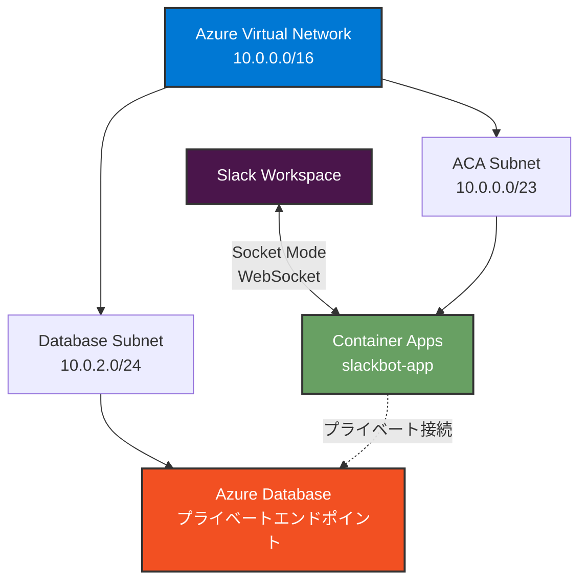

# Azure リソースの作成 (Azure CLI)

このドキュメントでは、**Azure CLI** を使用して Slack Bot を Azure Container Apps (ACA) で動作させるために必要な Azure リソースを作成する手順を説明します。

> **📝 Note**: Azure Portal を使用した手順は [setup-azure_portal.md](setup-azure_portal.md) を参照してください。

## 目次

1. [前提条件](#1-前提条件)

   - 1.1 必要な環境
   - 1.2 作成するリソース一覧
   - 1.3 セットアップ手順

2. [リソースグループの作成](#2-リソースグループの作成)
3. [Azure Container Registry (ACR) の作成](#3-azure-container-registry-acr-の作成)

   - 3.1 推奨構成: Standard SKU + Azure RBAC
   - 3.2 ACR の作成
   - 3.3 Azure RBAC による権限設定
   - 3.4 診断ログの有効化
   - 3.5 Premium SKU の追加機能 (オプション)

4. [初期 Docker イメージのビルドとプッシュ](#4-初期-docker-イメージのビルドとプッシュ)

   - 4.1 前提条件
   - 4.2 ACR にログイン (Azure RBAC 使用)
   - 4.3 Docker イメージのビルド
   - 4.4 イメージにタグを付与
   - 4.5 ACR にプッシュ
   - 4.6 イメージが登録されたか確認

5. [Virtual Network (VNET) とサブネットの作成](#5-virtual-network-とサブネットの作成)

   - 5.1 セキュアなアーキテクチャ
   - 5.2 リソースの作成

6. [Log Analytics Workspace の作成](#6-log-analytics-workspace-の作成)
7. [Container Apps Environment の作成](#7-container-apps-environment-の作成-vnet-統合)
8. [Container Apps の作成 (Key Vault 統合)](#8-container-apps-の作成-key-vault-統合)
   - 8.1 Key Vault の作成
   - 8.2 Key Vault にシークレットを登録
   - 8.3 Container App の作成
   - 8.4 ACR へのアクセス権付与
   - 8.5 Key Vault アクセス権の付与
   - 8.6 シークレット同期
9. [デプロイの確認](#9-デプロイの確認)
10. [追加の設定 (オプション)](#10-追加の設定オプション)

- 10.1 シークレットの更新・ローテーション
- 10.2 SDK を使った Key Vault 直接アクセス
- 10.3 Key Vault プライベートエンドポイント設定 (オプション)
- 10.4 ネットワークセキュリティグループ (NSG)
- 10.5 セキュリティチェックリスト
- 10.6 ヘルスプローブ設定
- 10.7 イメージのクリーンアップ運用 (推奨)
- 10.8 Premium SKU の追加機能 (オプション)

11. [コスト管理](#11-コスト管理)
12. [トラブルシューティング](#12-トラブルシューティング)

- 12.1 ACR 関連
- 12.2 Container Apps 関連
- 12.3 Key Vault 関連
- 12.4 ネットワーク関連
- 12.5 その他の一般的な問題

---

## 1. 前提条件

### 1.1 必要な環境

- Azure サブスクリプション
- Azure CLI (バージョン 2.28.0 以上) がインストールされていること
- Azure にログイン済みであること (`az login`)
- Docker がローカル環境にインストールされていること

### 1.2 作成するリソース一覧

このガイドで作成する Azure リソースの全体像:

| リソースタイプ             | 名前 (例)                    | 用途                                      | SKU/構成           |
| -------------------------- | ---------------------------- | ----------------------------------------- | ------------------ |
| Resource Group             | `rg-slackbot-aca`            | すべてのリソースを格納                    | -                  |
| Container Registry         | `<YOUR_ACR_NAME>.azurecr.io` | Docker イメージを保存                     | Standard (推奨)    |
| Virtual Network            | `slackbot-aca-vnet`          | Container Apps を配置する仮想ネットワーク | 10.0.0.0/16        |
| - Subnet (ACA)             | `aca-subnet`                 | Container Apps Environment 用             | 10.0.0.0/23        |
| - Subnet (Database)        | `database-subnet`            | 将来の拡張用 (プライベートエンドポイント) | 10.0.2.0/24        |
| Log Analytics Workspace    | `ws-slackapp-aca`            | ログとメトリクスの保存                    | PerGB2018          |
| Container Apps Environment | `slackbot-aca-env`           | Container Apps の実行環境                 | VNET 統合          |
| Container Apps             | `slackbot-app`               | Slack Bot アプリケーション                | 0.5 vCPU / 1.0 GiB |
| Key Vault                  | `kv-slackbot-aca`            | シークレット管理 (Slack トークン等)       | Standard           |

> **💰 概算月額コスト**:
>
> - Container Apps: 約 ¥3,000〜¥5,000/月
> - ACR Standard: 約 ¥6,000/月
> - Key Vault: 約 ¥500/月
> - Log Analytics: 約 ¥500〜¥1,000/月 (使用量により変動)
> - **合計: 約 ¥10,000〜¥13,000/月**

### 1.3 セットアップ手順

#### 1. Azure CLI を最新版に更新

```bash
az upgrade
```

> **⚠️ 重要**: `az upgrade` を実行しないと、次のステップの `--allow-preview` オプションが使えません。

#### 2. Container Apps 拡張機能のインストール/更新（プレビュー機能を有効化）

```bash
az extension add --name containerapp --upgrade --allow-preview true
```

> **📝 Note**: `az containerapp` コマンドは**拡張機能(Extension)**であり、**Preview**（プレビュー）ステータスです。
>
> - 2024 年 5 月以降、Azure CLI 拡張機能では既定でプレビュー機能が無効になっているため、`--allow-preview true` が必要です
> - コマンド実行時に以下のような警告が表示されますが、これは正常な動作です：
>
> ```
> Command group 'containerapp' is in preview and under development.
> ```

#### 3. 必要なリソースプロバイダーの登録

```bash
az provider register --namespace Microsoft.App
az provider register --namespace Microsoft.OperationalInsights
```

登録には数分かかる場合があります。以下のコマンドで状態を確認できます:

```bash
az provider show -n Microsoft.App --query "registrationState"
az provider show -n Microsoft.OperationalInsights --query "registrationState"
```

両方とも `"Registered"` と表示されれば完了です。

---

## 2. リソースグループの作成

すべての Azure リソースを管理するリソースグループを作成します。

```bash
az group create \
  --name rg-slackbot-aca \
  --location japaneast
```

**パラメータ**:

- `--name`: リソースグループ名 (任意、例: `rg-slackbot-aca`)
- `--location`: リージョン (`japaneast` を推奨)

---

## 3. Azure Container Registry (ACR) の作成

Docker イメージを保存するためのコンテナレジストリを作成します。

### 3.1 推奨構成: Standard SKU + Azure RBAC

本ガイドでは、コストと機能のバランスが良い **Standard SKU** を標準とし、**Azure RBAC によるセキュアな認証**を推奨します。

| 項目         | 推奨設定                        | 理由                                       |
| ------------ | ------------------------------- | ------------------------------------------ |
| SKU          | Standard                        | 本番利用に十分な性能、月額約 ¥6,000        |
| 認証方式     | Azure RBAC (管理者ユーザー無効) | パスワード管理不要、権限の細かい制御が可能 |
| 診断ログ     | 有効 (Log Analytics)            | セキュリティ監査とトラブルシューティング   |
| イメージ管理 | 手動削除運用                    | 不要イメージを定期的にクリーンアップ       |

> **📝 Premium SKU のみの機能 (オプション)**: Private Endpoint による閉域化、IP 制限、自動保持ポリシー、Geo レプリケーションなど。必要に応じて後から SKU アップグレード可能です。

### 3.2 ACR の作成

```bash
az acr create \
  --resource-group rg-slackbot-aca \
  --name <YOUR_ACR_NAME> \
  --sku Standard \
  --admin-enabled false
```

**パラメータ**:

- `--resource-group`: リソースグループ名
- `--name`: ACR 名 (グローバルで一意、例: `slackbotaca123`)
- `--sku`: `Standard` (推奨)
- `--admin-enabled`: `false` (Azure RBAC を使用するため無効化)

> **🔐 セキュリティ**: 管理者ユーザーを無効化し、Azure RBAC で必要最小限の権限を付与します。

### 3.3 Azure RBAC による権限設定

#### 開発者への権限付与 (イメージ push 用)

開発環境から ACR にイメージをプッシュできるよう、開発者に `AcrPush` ロールを付与します。

```bash
# 現在サインインしているユーザーの Object ID を取得
USER_OBJECT_ID=$(az ad signed-in-user show --query id -o tsv)

# ACR のリソース ID を取得
ACR_ID=$(az acr show --name <YOUR_ACR_NAME> --query id -o tsv)

# AcrPush ロールを付与 (push + pull 権限)
az role assignment create \
  --assignee $USER_OBJECT_ID \
  --role AcrPush \
  --scope $ACR_ID

# Reader ロールを付与 (ACR 情報の読み取り用)
az role assignment create \
  --assignee $USER_OBJECT_ID \
  --role Reader \
  --scope $ACR_ID
```

> **📝 Note**: `AcrPush` ロールには push/pull 権限が含まれますが、`az acr show` や `az acr repository show*` など**レジストリ情報の参照**には `Reader` ロールが必要です。開発者は通常、イメージ操作と状態確認の両方を行うため、`AcrPush + Reader` の組み合わせを推奨します。

#### GitHub Actions 用 Service Principal の権限設定

CI/CD パイプライン用の Service Principal 設定は [setup-cicd-app.md](setup-cicd-app.md) で後述します。

#### Container Apps 用の権限設定

Container Apps からイメージを pull するための Managed Identity 権限設定は、[8.4 節](#84-acr-へのアクセス権付与-managed-identity) で実施します。

### 3.4 診断ログの有効化

ACR への認証やイメージ操作をログに記録し、セキュリティ監査に活用します。

> **⏰ タイミング**: このコマンドは「5. Log Analytics Workspace の作成」完了後に実行してください。

```bash
# Log Analytics Workspace ID を取得 (後の手順で作成するため、ここではスキップ可)
# 5. Log Analytics Workspace 作成後に実行してください

# 診断設定を有効化
az monitor diagnostic-settings create \
  --name acr-diagnostics \
  --resource $(az acr show --name <YOUR_ACR_NAME> --query id -o tsv) \
  --workspace $(az monitor log-analytics workspace show \
    --resource-group rg-slackbot-aca \
    --workspace-name ws-slackapp-aca \
    --query id -o tsv) \
  --logs '[
    {
      "category": "ContainerRegistryLoginEvents",
      "enabled": true
    },
    {
      "category": "ContainerRegistryRepositoryEvents",
      "enabled": true
    }
  ]' \
  --metrics '[
    {
      "category": "AllMetrics",
      "enabled": true
    }
  ]'
```

**記録される情報**:

- **ContainerRegistryLoginEvents**: 認証の成功/失敗、アクセス元 IP
- **ContainerRegistryRepositoryEvents**: イメージの push/pull/delete 操作
- **AllMetrics**: ストレージ使用量、操作回数

### 3.5 Premium SKU の追加機能 (オプション)

Premium SKU の機能概要のみ記載します。詳細な手順や設定例は「[10.8 Premium SKU の追加機能 (オプション)](#108-premium-sku-の追加機能-オプション)」を参照してください。

**主な機能**: Private Endpoint、IP 制限、自動保持ポリシー、Geo レプリケーション、SKU アップグレード可

---

## 4. 初期 Docker イメージのビルドとプッシュ

Container App を作成する前に、ACR に初期イメージを配置する必要があります。ここでは開発環境から直接ビルド・プッシュする手順を説明します。

> **📝 補足**: 本番運用では GitHub Actions で自動ビルド・デプロイしますが、初回の動作確認のために手動でイメージをプッシュします。

### 4.1 前提条件

- Docker がローカル環境にインストールされていること
- プロジェクトのルートディレクトリに `Dockerfile` と `package.json` が存在すること
- Azure CLI でログイン済みであること (`az login`)
- ACR への `AcrPush` 権限が付与されていること ([3.3 節](#33-azure-rbac-による権限設定) で設定済み)

### 4.2 ACR にログイン (Azure RBAC 使用)

```bash
az acr login --name <YOUR_ACR_NAME>
```

このコマンドは、Azure CLI の認証情報 (Azure AD) を使用して ACR にログインします。パスワード管理が不要で、RBAC で付与された権限が適用されます。

**ログイン成功時の出力**:

```
Login Succeeded
```

**エラー時の対処**:

```
unauthorized: authentication required
```

→ [3.3 節](#33-azure-rbac-による権限設定) で `AcrPush` ロールが付与されているか確認してください。詳細なトラブルシューティングは [12.1 ACR 関連のトラブルシューティング](#121-acr関連のトラブルシューティング) を参照してください。

### 4.3 Docker イメージのビルド

プロジェクトのルートディレクトリで実行:

```bash
docker build -t slackbot-sample:1 .
```

### 4.4 イメージにタグを付与

```bash
docker tag slackbot-sample:1 <YOUR_ACR_NAME>.azurecr.io/slackbot-sample:1
```

### 4.5 ACR にプッシュ

```bash
docker push <YOUR_ACR_NAME>.azurecr.io/slackbot-sample:1
```

### 4.6 イメージが登録されたか確認

```bash
az acr repository show \
  --name <YOUR_ACR_NAME> \
  --repository slackbot-sample
```

または、イメージのタグ一覧を表示:

```bash
az acr repository show-tags \
  --name <YOUR_ACR_NAME> \
  --repository slackbot-sample \
  --output table
```

**期待される出力**:

```
Result
--------
1
```

> **📝 Note**: エラーが発生した場合は [12.1 ACR 関連のトラブルシューティング](#121-acr関連のトラブルシューティング) を参照してください。

---

## 5. Virtual Network とサブネットの作成

セキュリティを強化するため、Container Apps を仮想ネットワーク内に配置します。

### 5.1 セキュアなアーキテクチャ



### 5.2 リソースの作成

```bash
# VNET の作成
az network vnet create \
  --resource-group rg-slackbot-aca \
  --name slackbot-aca-vnet \
  --address-prefix 10.0.0.0/16 \
  --location japaneast

# Container Apps 用サブネットの作成 (最低 /23 が必要)
az network vnet subnet create \
  --resource-group rg-slackbot-aca \
  --vnet-name slackbot-aca-vnet \
  --name aca-subnet \
  --address-prefixes 10.0.0.0/23 \
  --delegations Microsoft.App/environments

# データベース用サブネットの作成 (将来の拡張用)
az network vnet subnet create \
  --resource-group rg-slackbot-aca \
  --vnet-name slackbot-aca-vnet \
  --name database-subnet \
  --address-prefixes 10.0.2.0/24 \
  --disable-private-endpoint-network-policies false
```

> **⚠️ 重要**: サブネットの委任について
>
> `--allow-preview true`で containerapp 拡張機能をインストールした場合、サブネットを `Microsoft.App/environments` に**委任する必要があります**。
>
> - サブネット作成時に `--delegations Microsoft.App/environments` を指定
> - または、既存のサブネットに委任を追加：
>   ```bash
>   az network vnet subnet update \
>     --resource-group rg-slackbot-aca \
>     --vnet-name slackbot-aca-vnet \
>     --name aca-subnet \
>     --delegations Microsoft.App/environments
>   ```

**パラメータ**:

- `--address-prefix`: VNET のアドレス空間 (`10.0.0.0/16`)
- `--address-prefixes`: サブネットのアドレス範囲
  - Container Apps 用: `/23` 以上が必要 (512 アドレス)
  - データベース用: `/24` (256 アドレス)

> **📝 補足**:
>
> - Container Apps Environment には最低でも `/23` (512 アドレス) のサブネットが必要です
> - データベース用サブネットは将来の拡張用です (プライベートエンドポイント接続に使用)

---

## 6. Log Analytics Workspace の作成

Container Apps のログとメトリクスを収集するための Log Analytics Workspace を作成します。

```bash
# Log Analytics Workspaceを作成
az monitor log-analytics workspace create \
  --resource-group rg-slackbot-aca \
  --workspace-name ws-slackapp-aca \
  --location japaneast

# Workspace IDを取得
WORKSPACE_ID=$(az monitor log-analytics workspace show \
  --resource-group rg-slackbot-aca \
  --workspace-name ws-slackapp-aca \
  --query customerId \
  --output tsv)

# Workspace Keyを取得
WORKSPACE_KEY=$(az monitor log-analytics workspace get-shared-keys \
  --resource-group rg-slackbot-aca \
  --workspace-name ws-slackapp-aca \
  --query primarySharedKey \
  --output tsv)
```

**パラメータ**:

- `--workspace-name`: Workspace 名 (任意、例: `ws-slackapp-aca`)
- `--resource-group`: リソースグループ名
- `--location`: リージョン

---

## 7. Container Apps Environment の作成 (VNET 統合)

Container Apps の実行環境を VNET 内に作成します。

```bash
# サブネット ID の取得
SUBNET_ID=$(az network vnet subnet show \
  --resource-group rg-slackbot-aca \
  --vnet-name slackbot-aca-vnet \
  --name aca-subnet \
  --query id \
  --output tsv)

# VNET 統合された Environment の作成（Log Analytics Workspace を指定）
az containerapp env create \
  --name slackbot-aca-env \
  --resource-group rg-slackbot-aca \
  --location japaneast \
  --infrastructure-subnet-resource-id $SUBNET_ID \
  --internal-only true \
  --logs-workspace-id $WORKSPACE_ID \
  --logs-workspace-key $WORKSPACE_KEY
```

> **📝 Note**: コマンド実行時に以下の警告が表示されますが、これは正常です：
>
> ```
> Command group 'containerapp' is in preview and under development.
> ```
>
> `az containerapp` は拡張機能(Extension)かつ Preview ステータスのため、この警告が表示されます。

**パラメータ**:

- `--name`: 環境名 (任意、例: `slackbot-aca-env`)
- `--resource-group`: リソースグループ名
- `--location`: リージョン
- `--infrastructure-subnet-resource-id`: Container Apps が使用するサブネットの ID
- `--internal-only`: 内部専用環境にするか (`true` = パブリックインターネットからの分離)
- `--logs-workspace-id`: Log Analytics Workspace の Customer ID
- `--logs-workspace-key`: Log Analytics Workspace の共有キー

> **📝 Note**: Socket Mode では **Slack へのアウトバウンド WebSocket 接続**のみ使用し、インバウンド接続は不要です。そのため `--internal-only true` で環境を閉域化できます。Container App 側では Ingress を無効化することで、HTTP ヘルスチェックの失敗を防ぎます。

---

## 8. Container Apps の作成 (Key Vault 統合)

このセクションでは、**Azure Key Vault を使った安全なシークレット管理**を前提に、Container Apps を作成します。手順は以下の流れです:

1. **Key Vault 作成** → シークレットを一元管理する基盤を用意
2. **シークレット登録** → Slack トークンを Key Vault に保存 (この時点でユーザーに書き込み権限が必要)
3. **Container App 作成** → 初期状態 (シークレットは未設定、後で Key Vault から同期)
4. **Managed Identity 付与** → Container App が Key Vault にアクセスできる ID を取得
5. **Key Vault アクセス権付与** → Managed Identity に読み取り権限を付与
6. **シークレット同期** → Key Vault から値を取得し Container App に反映

> **📝 Note**: CI/CD 用サービスプリンシパルの権限設定は [GitHub の設定](setup-github.md) で後述します。

### 8.1 Key Vault の作成

```bash
az keyvault create \
  --name kv-slackbot-aca \  # グローバル一意な名前が必要
  --resource-group rg-slackbot-aca \
  --location japaneast \
  --enable-purge-protection true
```

> **ℹ️ 注意 (Key Vault 作成フラグ変更)**: `--enable-soft-delete` は現在の CLI では指定不要 (既定で有効)。削除保護を有効化したい場合は `--enable-purge-protection true` のみで十分です。検証環境で不要な場合は省略可能。

> **📝 補足**: 名前はグローバル一意です。既に使用されている場合はサフィックスを付けてください (例: `kv-slackbot-aca-dev`). `--enable-purge-protection` は本番で推奨。検証環境では省略可能。

### 8.2 Key Vault にシークレットを登録

#### 事前準備 (必須): シークレット書き込み権限の確認と付与

以下の `az keyvault secret set` を実行するには、呼び出し主体 (あなた自身のユーザー、または CI/CD 用サービスプリンシパル) が Key Vault に対して「書き込み」権限を持っている必要があります。`Key Vault Secrets User` ロールは読み取り専用のためシークレット登録は失敗します。まず次の手順を完了してください。

1. サインイン中ユーザーの Object ID を取得:

```bash
USER_OBJECT_ID=$(az ad signed-in-user show --query id -o tsv)
echo $USER_OBJECT_ID
```

2. Key Vault のリソース ID を取得:

```bash
KV_ID=$(az keyvault show --name kv-slackbot-aca --query id -o tsv)
echo $KV_ID
```

3. 既存ロール割り当てを確認 (Secrets Officer か Administrator があれば書き込み可能):

```bash
az role assignment list \
  --assignee $USER_OBJECT_ID \
  --scope $KV_ID \
  --query "[].roleDefinitionName" -o tsv
```

4. 権限が無い場合は `Key Vault Secrets Officer` を付与:

```bash
az role assignment create \
  --assignee $USER_OBJECT_ID \
  --role "Key Vault Secrets Officer" \
  --scope $KV_ID
```

5. 伝播待ち (1〜5 分程度)。再度手順 3 のコマンドでロール名を確認してください。

> **📝 CI/CD 用サービスプリンシパルの権限設定**: GitHub Actions からシークレットを更新する場合は、サービスプリンシパルにも `Key Vault Secrets Officer` ロールが必要です。設定手順は [GitHub の設定](setup-cicd-app.md) で説明します。

> **⚠️ Forbidden エラー例 (権限不足)**:
>
> ```
> (Forbidden) Caller is not authorized.
>   Code: Forbidden
>   Message: The user, group or application 'xxxx-....' does not have secrets set permission on key vault 'kv-slackbot-aca'.
>   Inner error: { "code": "ForbiddenByRbac" }
> ```
>
> このメッセージが表示された場合はロール未付与または未伝播です。数分待って再試行し、解消しない場合は手順 3〜4 を再確認してください。

準備ができたらシークレットを登録します:

```bash
az keyvault secret set --vault-name kv-slackbot-aca --name slack-bot-token --value <SLACK_BOT_TOKEN>
az keyvault secret set --vault-name kv-slackbot-aca --name slack-app-token --value <SLACK_APP_TOKEN>
az keyvault secret set --vault-name kv-slackbot-aca --name bot-user-id --value <BOT_USER_ID>
```

### 8.3 Container App の作成 (初期状態)

まず、**シークレット統合前の基本構成**で Container App を作成します。この時点ではシークレットを設定せず、後の手順で Key Vault から同期します。

**重要**: ACR 認証は Managed Identity を使用するため、Container App 作成時に `--registry-identity` を指定します。

```bash
az containerapp create \
  --name slackbot-app \
  --resource-group rg-slackbot-aca \
  --environment slackbot-aca-env \
  --image <YOUR_ACR_NAME>.azurecr.io/slackbot-sample:1 \
  --registry-server <YOUR_ACR_NAME>.azurecr.io \
  --registry-identity system \
  --min-replicas 1 \
  --max-replicas 1 \
  --cpu 0.5 \
  --memory 1.0Gi
```

> **🔒 Socket Mode の重要な設定**: Slack Socket Mode アプリは WebSocket 経由で **Slack へアウトバウンド接続** するだけで、HTTP リクエストを受信する必要がありません。そのため `--ingress` と `--target-port` は指定せず、Ingress を無効にします。これにより、Container Apps のヘルスチェックで失敗することを防ぎます。

**パラメータ**:

| パラメータ                          | 説明                                            | 例                                             |
| ----------------------------------- | ----------------------------------------------- | ---------------------------------------------- |
| `--name`                            | Container Apps の名前                  | `slackbot-app`                                 |
| `--resource-group`                  | リソースグループ名                     | `rg-slackbot-aca`                              |
| `--environment`                     | Container Apps Environment の名前      | `slackbot-aca-env`                             |
| `--image`                           | Docker イメージ                        | `<YOUR_ACR_NAME>.azurecr.io/slackbot-sample:1` |
| `--registry-server`                 | ACR サーバー名                         | `<YOUR_ACR_NAME>.azurecr.io`                   |
| `--registry-identity`               | **ACR 認証に Managed Identity を使用** | `system`                                       |
| `--min-replicas` / `--max-replicas` | レプリカ数 (1 固定を推奨)              | `1`                                            |
| `--cpu` / `--memory`                | リソース割り当て                       | `0.5` / `1.0Gi`                                |

> **📝 前提条件**: このコマンドを実行する前に、[3. 初期 Docker イメージのビルドとプッシュ](#3-初期-docker-イメージのビルドとプッシュ) を完了し、ACR にイメージが存在することを確認してください。
>
> **⚠️ 注意**:
>
> - この時点ではシークレット (`--secrets`) や環境変数 (`--env-vars`) は設定していません。後の手順 (7.6) で Key Vault から同期します。
> - `--registry-identity system` により、Container App の Managed Identity が自動的に有効化され、ACR へのアクセスに使用されます。

### 8.4 ACR へのアクセス権付与 (Managed Identity)

Container App の Managed Identity に ACR からイメージを pull する権限を付与します。

```bash
# Container App の Managed Identity のプリンシパル ID を取得
APP_PRINCIPAL_ID=$(az containerapp show \
  --name slackbot-app \
  --resource-group rg-slackbot-aca \
  --query identity.principalId -o tsv)
echo "Container App Principal ID: $APP_PRINCIPAL_ID"

# ACR のリソース ID を取得
ACR_ID=$(az acr show --name <YOUR_ACR_NAME> --query id -o tsv)

# AcrPull ロールを付与
az role assignment create \
  --assignee $APP_PRINCIPAL_ID \
  --role AcrPull \
  --scope $ACR_ID
```

> **📝 Note**: `AcrPull` ロールは、イメージの pull (読み取り) のみの権限です。Container App は push 不要なため、最小権限の原則に従って `AcrPull` を付与します。

### 8.5 Key Vault へのアクセス権付与 (Managed Identity に読み取り権限)

Container App の Managed Identity に Key Vault からシークレットを読み取る権限を付与します。

```bash
# Container App のプリンシパル ID を再利用 (7.4 で取得済み)
# 念のため再取得する場合:
# APP_PRINCIPAL_ID=$(az containerapp show --name slackbot-app --resource-group rg-slackbot-aca --query identity.principalId -o tsv)

az role assignment create \
  --assignee $APP_PRINCIPAL_ID \
  --role "Key Vault Secrets User" \
  --scope $(az keyvault show --name kv-slackbot-aca --query id -o tsv)
```

**ロール選択のガイド**:

| 用途                                    | 推奨ロール                | 付与対象                          | 権限概要            |
| --------------------------------------- | ------------------------- | --------------------------------- | ------------------- |
| Container App がシークレットを参照      | Key Vault Secrets User    | Container App の Managed Identity | get/list (set 不可) |
| ユーザーがシークレットを登録/更新 (7.2) | Key Vault Secrets Officer | 開発者ユーザー                    | set/delete/list     |
| CI/CD でシークレットを同期 (後述)       | Key Vault Secrets Officer | GitHub Actions SP                 | set/delete/list     |

> **📝 Note**: CI/CD 用サービスプリンシパルの権限設定は [GitHub の設定](setup-github.md) で後述します。

### 8.6 Key Vault 参照の設定

Key Vault に保存したシークレットを Container App から参照できるように設定します。ここでは **Key Vault 参照パターン** を使用します (Container App が Key Vault から直接シークレットを取得)。

> **🔄 Key Vault 参照とは**: Container Apps のシークレットに Key Vault の URL を設定することで、アプリケーション起動時に Managed Identity を使って Key Vault から自動的にシークレット値を取得します。シークレットを Key Vault で更新した場合、Container App を再起動するだけで新しい値が反映されます。

#### 手順 1: Container App のシークレットを Key Vault 参照に設定

```bash
az containerapp secret set \
  --name slackbot-app \
  --resource-group rg-slackbot-aca \
  --secrets \
    "slack-bot-token=keyvaultref:https://kv-slackbot-aca.vault.azure.net/secrets/slack-bot-token,identityref:system" \
    "slack-app-token=keyvaultref:https://kv-slackbot-aca.vault.azure.net/secrets/slack-app-token,identityref:system" \
    "bot-user-id=keyvaultref:https://kv-slackbot-aca.vault.azure.net/secrets/bot-user-id,identityref:system"
```

**パラメータの説明**:

- `keyvaultref:<KEY_VAULT_URL>`: Key Vault のシークレット URL
- `identityref:system`: システム割り当てマネージド ID を使用

> **⚠️ 重要**: Key Vault 名は `kv-slackbot-aca` の部分を実際の Key Vault 名に置き換えてください。

#### 手順 2: 環境変数の設定

```bash
az containerapp update \
  --name slackbot-app \
  --resource-group rg-slackbot-aca \
  --set-env-vars \
    "SLACK_BOT_TOKEN=secretref:slack-bot-token" \
    "SLACK_APP_TOKEN=secretref:slack-app-token" \
    "BOT_USER_ID=secretref:bot-user-id"
```

#### 手順 3: Key Vault 参照が正しく設定されたか確認

```bash
az containerapp secret list \
  --name slackbot-app \
  --resource-group rg-slackbot-aca \
  --query "[].{Name:name, KeyVaultUrl:keyVaultUrl}" \
  --output table
```

**期待される出力**:

```
Name              KeyVaultUrl
----------------  ------------------------------------------------------------
slack-bot-token   https://kv-slackbot-aca.vault.azure.net/secrets/slack-bot-token
slack-app-token   https://kv-slackbot-aca.vault.azure.net/secrets/slack-app-token
bot-user-id       https://kv-slackbot-aca.vault.azure.net/secrets/bot-user-id
```

#### 手順 4: Container App を再起動して変更を反映

```bash
# 現在のリビジョン名を取得
REVISION_NAME=$(az containerapp revision list \
  --name slackbot-app \
  --resource-group rg-slackbot-aca \
  --query "[0].name" \
  --output tsv)

# リビジョンを再起動
az containerapp revision restart \
  --name slackbot-app \
  --resource-group rg-slackbot-aca \
  --revision $REVISION_NAME
```

> **📝 Note**: シークレット設定変更後は必ず再起動が必要です。再起動により、Key Vault から最新のシークレット値が取得されます。

> **🔄 代替案**: Key Vault 参照の代わりに、アプリコードから Key Vault SDK を使ってシークレットを直接取得する方式もあります。詳細は [9.2 SDK を使った Key Vault 直接アクセス](#92-sdk-を使った-key-vault-直接アクセス) を参照してください。

> **⚠️ エラーが発生した場合**: [12.3 Key Vault 関連のトラブルシューティング](#123-key-vault関連のトラブルシューティング) を参照してください。

#### Key Vault 参照のメリット

| 項目                 | Key Vault 参照                    | CLI 同期パターン                         |
| -------------------- | --------------------------------- | ---------------------------------------- |
| **シークレット更新** | Key Vault で更新 → 再起動のみ     | Key Vault で更新 → CLI で再同期 → 再起動 |
| **監査ログ**         | Key Vault のアクセスログに記録    | Container Apps のログのみ                |
| **セキュリティ**     | シークレット値は Key Vault に保存 | Container Apps にもコピーが保存される    |
| **運用**             | シンプル (再起動のみ)             | 複雑 (同期スクリプトが必要)              |

---

## 9. デプロイの確認

Container App が正しく構成され、動作していることを確認します。

### 9.1 リソース作成状態の確認

#### Container App のプロビジョニング状態

```bash
az containerapp show \
  --name slackbot-app \
  --resource-group rg-slackbot-aca \
  --query properties.provisioningState
```

**期待される出力**: `"Succeeded"`

#### Managed Identity の確認

```bash
az containerapp show \
  --name slackbot-app \
  --resource-group rg-slackbot-aca \
  --query "identity.{type:type, principalId:principalId}"
```

**期待される出力**:

```json
{
  "principalId": "xxxxxxxx-xxxx-xxxx-xxxx-xxxxxxxxxxxx",
  "type": "SystemAssigned"
}
```

### 9.2 権限設定の確認

#### ACR への権限

```bash
APP_PRINCIPAL_ID=$(az containerapp show --name slackbot-app --resource-group rg-slackbot-aca --query identity.principalId -o tsv)

az role assignment list \
  --assignee $APP_PRINCIPAL_ID \
  --query "[?roleDefinitionName=='AcrPull'].{Role:roleDefinitionName, Scope:scope}" \
  --output table
```

**期待される出力**: ACR リソースへの `AcrPull` ロール割り当てが表示される

> **📝 Note**: `--query` フィルターが結果を返さない場合は、以下のコマンドで ACR スコープの全ロールを確認できます:
>
> ```bash
> ACR_ID=$(az acr show --name <YOUR_ACR_NAME> --query id -o tsv)
> az role assignment list --assignee $APP_PRINCIPAL_ID --scope $ACR_ID
> ```
>
> JSON 出力から `roleDefinitionName` が `AcrPull` であることを確認してください。

#### Key Vault への権限

```bash
az role assignment list \
  --assignee $APP_PRINCIPAL_ID \
  --query "[?roleDefinitionName=='Key Vault Secrets User'].{Role:roleDefinitionName, Scope:scope}" \
  --output table
```

**期待される出力**: Key Vault リソースへの `Key Vault Secrets User` ロール割り当てが表示される

> **📝 Note**: `--query` フィルターが結果を返さない場合は、以下のコマンドで Key Vault スコープの全ロールを確認できます:
>
> ```bash
> KV_ID=$(az keyvault show --name <YOUR_KV_NAME> --query id -o tsv)
> az role assignment list --assignee $APP_PRINCIPAL_ID --scope $KV_ID
> ```
>
> JSON 出力から `roleDefinitionName` が `Key Vault Secrets User` であることを確認してください。

### 9.3 環境変数とシークレットの確認

#### Key Vault 参照の確認

```bash
az containerapp secret list \
  --name slackbot-app \
  --resource-group rg-slackbot-aca \
  --query "[].{Name:name, KeyVaultUrl:keyVaultUrl}" \
  --output table
```

**期待される出力**:

```
Name              KeyVaultUrl
----------------  ------------------------------------------------------------
slack-bot-token   https://kv-slackbot-aca.vault.azure.net/secrets/slack-bot-token
slack-app-token   https://kv-slackbot-aca.vault.azure.net/secrets/slack-app-token
bot-user-id       https://kv-slackbot-aca.vault.azure.net/secrets/bot-user-id
```

> **✅ 確認ポイント**: `KeyVaultUrl` 列に Key Vault の URL が表示されていれば、Key Vault 参照が正しく設定されています。

#### 環境変数の確認

```bash
az containerapp show \
  --name slackbot-app \
  --resource-group rg-slackbot-aca \
  --query "properties.template.containers[0].env[].{Name:name, SecretRef:secretRef}" \
  --output table
```

**期待される出力**:

```
Name               SecretRef
-----------------  ------------------
SLACK_BOT_TOKEN    slack-bot-token
SLACK_APP_TOKEN    slack-app-token
BOT_USER_ID        bot-user-id
```

### 9.4 アプリケーションログの確認

Container App が正常に起動し、Slack に接続できているかログで確認します。

```bash
az containerapp logs show \
  --name slackbot-app \
  --resource-group rg-slackbot-aca \
  --follow
```

**期待されるログ出力**:

```
✅ Slack auth test success: { ok: true, ... }
⚡️ Slack Bot is running!
```

> **⚠️ エラーが発生した場合**: 詳細なトラブルシューティングは以下を参照してください:
>
> - ACR イメージ関連: [12.1 ACR 関連のトラブルシューティング](#121-acr関連のトラブルシューティング)
> - Container Apps 関連: [12.2 Container Apps 関連のトラブルシューティング](#122-container-apps関連のトラブルシューティング)
> - Key Vault 関連: [12.3 Key Vault 関連のトラブルシューティング](#123-key-vault関連のトラブルシューティング)

---

## 10. 追加の設定 (オプション)

基本的なデプロイ完了後、必要に応じて実施する追加設定です。

### 10.1 シークレットの更新・ローテーション

Slack トークンやその他のシークレットを更新する場合の手順です。Key Vault 参照を使用している場合、Key Vault で更新して Container App を再起動するだけで反映されます。

#### 更新手順 (Key Vault 参照使用時 - 推奨)

1. **Key Vault でシークレットを更新**:

   ```bash
   az keyvault secret set --vault-name kv-slackbot-aca --name slack-bot-token --value <NEW_TOKEN>
   ```

2. **Container App を再起動して新しい値を取得**:

   ```bash
   # 現在のリビジョン名を取得
   REVISION_NAME=$(az containerapp revision list \
     --name slackbot-app \
     --resource-group rg-slackbot-aca \
     --query "[0].name" \
     --output tsv)

   # リビジョンを再起動
   az containerapp revision restart \
     --name slackbot-app \
     --resource-group rg-slackbot-aca \
     --revision $REVISION_NAME
   ```

3. **更新が反映されたか確認**:

   ```bash
   az containerapp logs show \
     --name slackbot-app \
     --resource-group rg-slackbot-aca \
     --tail 20
   ```

> **✅ Key Vault 参照のメリット**: Container App のシークレット設定を変更する必要がなく、Key Vault での更新と再起動だけで完了します。CLI 同期パターンと比べて運用が大幅に簡素化されます。

#### 複数のシークレットを一括更新する場合

```bash
# 複数のシークレットを Key Vault で更新
az keyvault secret set --vault-name kv-slackbot-aca --name slack-bot-token --value <NEW_BOT_TOKEN>
az keyvault secret set --vault-name kv-slackbot-aca --name slack-app-token --value <NEW_APP_TOKEN>

# Container App を再起動 (すべての新しい値が取得される)
REVISION_NAME=$(az containerapp revision list \
  --name slackbot-app \
  --resource-group rg-slackbot-aca \
  --query "[0].name" \
  --output tsv)
az containerapp revision restart \
  --name slackbot-app \
  --resource-group rg-slackbot-aca \
  --revision $REVISION_NAME
```

> **📝 補足**: CI/CD が設定されている場合は、次回デプロイ時に自動的に再起動されます。即時反映が必要な場合のみ手動で上記を実行してください。

### 10.2 SDK を使った Key Vault 直接アクセス

Key Vault 参照の代わりに、アプリケーションコード内で Azure SDK を使って Key Vault から直接シークレットを取得する方式です。より細かい制御が可能ですが、実装が複雑になります。

#### メリット・デメリット

| 方式                        | メリット                                 | デメリット                         |
| --------------------------- | ---------------------------------------- | ---------------------------------- |
| Key Vault 参照 (推奨)       | 設定のみで完結、再起動で自動更新         | Container Apps の機能に依存        |
| SDK 直接アクセス            | キャッシュやリトライなど細かい制御が可能 | SDK 依存追加、アプリコード変更必要 |
| Container Apps シークレット | 最もシンプル                             | Key Vault の一元管理機能が使えない |

> **📝 推奨**: 特別な要件がない限り、**Key Vault 参照** (セクション 7.6) を使用することを推奨します。運用がシンプルで、Azure のセキュリティベストプラクティスにも準拠しています。

#### Node.js 実装例 (Managed Identity + Azure SDK)

**1. パッケージのインストール**:

```bash
npm install @azure/identity @azure/keyvault-secrets
```

**2. アプリケーションコード**:

```javascript
import { DefaultAzureCredential } from '@azure/identity';
import { SecretClient } from '@azure/keyvault-secrets';

const credential = new DefaultAzureCredential();
const vaultUrl = 'https://kv-slackbot-aca.vault.azure.net';
const client = new SecretClient(vaultUrl, credential);

async function loadSecrets() {
  const slackBotToken = await client.getSecret('slack-bot-token');
  const slackAppToken = await client.getSecret('slack-app-token');
  const botUserId = await client.getSecret('bot-user-id');

  return {
    SLACK_BOT_TOKEN: slackBotToken.value,
    SLACK_APP_TOKEN: slackAppToken.value,
    BOT_USER_ID: botUserId.value,
  };
}

// アプリケーション起動時に実行
loadSecrets()
  .then((secrets) => {
    console.log('Secrets loaded from Key Vault');
    // Slack Bot を初期化
    // ...
  })
  .catch((error) => {
    console.error('Failed to load secrets:', error);
    process.exit(1);
  });
```

> **📝 Note**: この方式では Managed Identity の `Key Vault Secrets User` 権限が必要です (7.5 で設定済み)。

> **🔁 ローテーション運用**: Key Vault でシークレットを更新 → Container App を再起動すれば、自動的に最新値を取得します。

### 10.3 Key Vault プライベートエンドポイント設定 (オプション)

より高度なセキュリティ要件がある場合、Key Vault をプライベートエンドポイント経由で接続し、パブリックインターネットからのアクセスを完全に遮断できます。

> **💰 コスト影響**: Private Endpoint 約 ¥1,000/月 + Private DNS Zone 約 ¥500/月 = **合計 約 ¥1,500/月** の追加コストが発生します。

> **📝 推奨シナリオ**:
>
> - 本番環境で顧客の機密情報を扱う場合
> - コンプライアンス要件でネットワーク分離が必須の場合
> - ゼロトラストアーキテクチャを実装する場合
>
> **標準構成**: 基本的には **Azure RBAC による保護で十分**です。Managed Identity と最小権限の原則により、認証情報の漏洩リスクは最小化されています。

#### 前提条件

- Key Vault が作成済み ([7.1 節](#71-key-vault-の作成) 完了)
- VNET とサブネットが作成済み ([4 節](#4-virtual-network-とサブネットの作成) 完了)
- Key Vault 用のプライベートエンドポイント専用サブネットを推奨 (オプション)

#### 手順 1: プライベートエンドポイント用サブネットの作成 (オプション)

既存の `database-subnet` を使用することもできますが、管理を明確にするため専用サブネットを作成することを推奨します。

```bash
# Key Vault 用サブネットの作成
az network vnet subnet create \
  --resource-group rg-slackbot-aca \
  --vnet-name slackbot-aca-vnet \
  --name keyvault-subnet \
  --address-prefix 10.0.3.0/24
```

> **📝 Note**: 既存の `database-subnet` (10.0.2.0/24) を使用する場合はこの手順をスキップできます。

#### 手順 2: プライベートエンドポイントの作成

```bash
# Key Vault のリソース ID を取得
KV_ID=$(az keyvault show --name kv-slackbot-aca --query id -o tsv)

# プライベートエンドポイントの作成
az network private-endpoint create \
  --resource-group rg-slackbot-aca \
  --name kv-private-endpoint \
  --vnet-name slackbot-aca-vnet \
  --subnet keyvault-subnet \
  --private-connection-resource-id $KV_ID \
  --group-id vault \
  --connection-name kv-connection
```

**パラメータ**:

- `--subnet`: `keyvault-subnet` または `database-subnet` を指定
- `--group-id`: Key Vault の場合は `vault` を指定

#### 手順 3: Private DNS Zone の作成

Key Vault のプライベートエンドポイントが正しく名前解決されるよう DNS を設定します。

```bash
# プライベート DNS ゾーンの作成
az network private-dns zone create \
  --resource-group rg-slackbot-aca \
  --name privatelink.vaultcore.azure.net

# VNET リンクの作成
az network private-dns link vnet create \
  --resource-group rg-slackbot-aca \
  --zone-name privatelink.vaultcore.azure.net \
  --name kv-dns-link \
  --virtual-network slackbot-aca-vnet \
  --registration-enabled false

# DNS レコードの自動作成 (Private Endpoint と DNS Zone を関連付け)
az network private-endpoint dns-zone-group create \
  --resource-group rg-slackbot-aca \
  --endpoint-name kv-private-endpoint \
  --name kv-dns-zone-group \
  --private-dns-zone privatelink.vaultcore.azure.net \
  --zone-name vault
```

#### 手順 4: パブリックネットワークアクセスの無効化

プライベートエンドポイント設定後、パブリックインターネットからのアクセスを完全に遮断します。

```bash
az keyvault update \
  --name kv-slackbot-aca \
  --public-network-access Disabled
```

> **⚠️ 重要**: この設定後、ローカル開発環境から直接 Key Vault にアクセスできなくなります。以下のいずれかの方法が必要です:
>
> - Azure Bastion または VPN 経由で VNET 内から接続
> - Azure Cloud Shell を使用
> - 一時的に `--public-network-access Enabled` に戻してシークレット登録

#### 手順 5: 接続確認

```bash
# Container App から Key Vault への接続確認
az containerapp logs show \
  --name slackbot-app \
  --resource-group rg-slackbot-aca \
  --tail 20

# DNS 解決の確認 (VNET 内のリソースから実行)
nslookup kv-slackbot-aca.vault.azure.net
# 期待される結果: 10.0.x.x (プライベートIP) が返される
```

> **⚠️ エラーが発生した場合**: [12.3 Key Vault 関連のトラブルシューティング](#123-key-vault関連のトラブルシューティング) の「Key Vault プライベートエンドポイント接続エラー」を参照してください。

---

#### 参考: Azure Database など他のリソースへのプライベートエンドポイント

Key Vault と同様の手順で、他の Azure リソースにもプライベートエンドポイントを設定できます。

**PostgreSQL の例**:

```bash
az network private-endpoint create \
  --resource-group rg-slackbot-aca \
  --name postgres-private-endpoint \
  --vnet-name slackbot-aca-vnet \
  --subnet database-subnet \
  --private-connection-resource-id <POSTGRES_RESOURCE_ID> \
  --group-id postgresqlServer \
  --connection-name postgres-connection

az network private-dns zone create \
  --resource-group rg-slackbot-aca \
  --name privatelink.postgres.database.azure.com
```

> **📝 Note**: `--group-id` はリソースタイプにより異なります:
>
> - Key Vault: `vault`
> - PostgreSQL: `postgresqlServer`
> - MySQL: `mysqlServer`
> - Storage Account: `blob`, `file`, `table`, `queue`
> - Cosmos DB: `Sql`, `MongoDB`, etc.

### 10.4 ネットワークセキュリティグループ (NSG)

```bash
# NSG の作成
az network nsg create \
  --resource-group rg-slackbot-aca \
  --name aca-nsg

# HTTPS アウトバウンドを許可
az network nsg rule create \
  --resource-group rg-slackbot-aca \
  --nsg-name aca-nsg \
  --name allow-https-outbound \
  --priority 100 \
  --direction Outbound \
  --access Allow \
  --protocol Tcp \
  --destination-port-ranges 443 \
  --source-address-prefixes '*' \
  --destination-address-prefixes '*'

# NSG をサブネットに適用
az network vnet subnet update \
  --resource-group rg-slackbot-aca \
  --vnet-name slackbot-aca-vnet \
  --name aca-subnet \
  --network-security-group aca-nsg
```

### 10.5 セキュリティチェックリスト

実装後、以下の項目を確認してください:

#### 必須項目 (Standard SKU で実装済み)

- [ ] Container Apps Environment が VNET 内に配置されている
- [ ] ACR 認証に Azure RBAC を使用 (管理者ユーザー無効)
  - [ ] 開発者に `AcrPush` ロール付与
  - [ ] Container App の Managed Identity に `AcrPull` ロール付与
- [ ] マネージド ID を使用して、認証情報をコードに含めていない
- [ ] Azure Key Vault でシークレットを管理している
- [ ] ACR の診断ログが有効化されている (Log Analytics)
- [ ] 最小権限の原則に従ってロールが割り当てられている
- [ ] 不要なイメージを定期的に削除する運用ルールを策定

#### オプション項目 (高度なセキュリティ要件)

- [ ] ACR に Private Endpoint を設定 (閉域化、Premium SKU 必要)
- [ ] ACR に IP ネットワーク制限を設定 (Premium SKU 必要)
- [ ] ACR の自動保持ポリシーを有効化 (Premium SKU 必要)
- [ ] Key Vault に Private Endpoint を設定 (閉域化、追加コスト: 約 ¥1,500/月)
- [ ] データベースなどの Azure リソースがプライベートエンドポイント経由で接続されている
- [ ] NSG で不要なトラフィックがブロックされている

### 10.6 ヘルスプローブ設定

Container App の正常性を監視し、異常なコンテナーを自動的に再起動するためのヘルスプローブを設定します。

#### Microsoft 推奨設定

| プローブ種別  | 用途                                       | 推奨設定                                                                                                                      |
| ------------- | ------------------------------------------ | ----------------------------------------------------------------------------------------------------------------------------- |
| **Liveness**  | 失敗状態のコンテナーを検出して再起動       | `failureThreshold: 3`<br/>`periodSeconds: 10`<br/>`timeoutSeconds: 5`<br/>`successThreshold: 1`<br/>`initialDelaySeconds: 10` |
| **Readiness** | 正常なコンテナーのみがトラフィックを受信   | `failureThreshold: 3`<br/>`periodSeconds: 5`<br/>`timeoutSeconds: 3`<br/>`successThreshold: 1`<br/>`initialDelaySeconds: 5`   |
| **Startup**   | 起動に時間がかかるアプリの初期化完了を検出 | `failureThreshold: 30`<br/>`periodSeconds: 10`<br/>`timeoutSeconds: 3`                                                        |

#### アプリケーションへの実装

**1. Node.js でヘルスエンドポイントを追加**:

```javascript
// app.js または index.js
const express = require('express');
const app = express();

// ヘルスチェックエンドポイント
app.get('/health', (req, res) => {
  // Slack Bot の接続状態などをチェック
  const isHealthy = checkSlackConnection(); // 実装に応じてカスタマイズ

  if (isHealthy) {
    res
      .status(200)
      .json({ status: 'healthy', timestamp: new Date().toISOString() });
  } else {
    res
      .status(503)
      .json({ status: 'unhealthy', timestamp: new Date().toISOString() });
  }
});

// Readiness チェック（起動完了を示す）
app.get('/ready', (req, res) => {
  res.status(200).json({ status: 'ready' });
});

app.listen(3000, () => {
  console.log('Health check endpoints available at /health and /ready');
});
```

**2. Container App にプローブを設定**:

```bash
az containerapp update \
  --name slackbot-app \
  --resource-group rg-slackbot-aca \
  --set-env-vars "LIVENESS_PROBE_PATH=/health" \
  --set-env-vars "READINESS_PROBE_PATH=/ready"
```

> **📝 Note**: Azure Portal または ARM テンプレートでより詳細なプローブ設定が可能です。CLI では基本的な設定のみサポートされています。

#### ARM テンプレート/Bicep での詳細設定例

```bicep
resource containerApp 'Microsoft.App/containerApps@2023-05-01' = {
  name: 'slackbot-app'
  properties: {
    template: {
      containers: [{
        name: 'slackbot'
        image: 'myacr.azurecr.io/slackbot-sample:1'
        probes: [
          {
            type: 'Liveness'
            httpGet: {
              path: '/health'
              port: 3000
            }
            initialDelaySeconds: 10
            periodSeconds: 10
            timeoutSeconds: 5
            failureThreshold: 3
            successThreshold: 1
          }
          {
            type: 'Readiness'
            httpGet: {
              path: '/ready'
              port: 3000
            }
            initialDelaySeconds: 5
            periodSeconds: 5
            timeoutSeconds: 3
            failureThreshold: 3
            successThreshold: 1
          }
        ]
      }]
    }
  }
}
```

#### 動作確認

```bash
# プローブの設定を確認
az containerapp show \
  --name slackbot-app \
  --resource-group rg-slackbot-aca \
  --query "properties.template.containers[0].probes" \
  --output json

# コンテナーの再起動履歴を確認（Liveness プローブ失敗時）
az containerapp revision list \
  --name slackbot-app \
  --resource-group rg-slackbot-aca \
  --query "[].{Name:name, Active:properties.active, Replicas:properties.replicas}" \
  --output table
```

> **💡 ベストプラクティス**:
>
> - Socket Mode アプリでは、Slack WebSocket 接続の状態をヘルスチェックに含める
> - `/health` エンドポイントは軽量に保ち、データベースなど外部依存の詳細チェックは避ける
> - Readiness プローブは起動完了を示すシンプルなチェックに留める
> - Startup プローブは起動に 30 秒以上かかる場合のみ設定

---

### 10.7 イメージのクリーンアップ運用 (推奨)

不要なイメージを定期的に削除してストレージコストを最適化します。

> **📝 事前条件**: `slackbot-sample` リポジトリにイメージがプッシュ済みである必要があります。未作成の場合は [3. 初期 Docker イメージのビルドとプッシュ](#3-初期-docker-イメージのビルドとプッシュ) を完了後に実行してください。

#### タグなしイメージの確認と削除

```bash
# タグなしマニフェストを一覧表示
az acr repository show-manifests \
  --name <YOUR_ACR_NAME> \
  --repository slackbot-sample \
  --query "[?tags==null].digest" \
  --output tsv

# タグなしマニフェストを削除
az acr repository show-manifests \
  --name <YOUR_ACR_NAME> \
  --repository slackbot-sample \
  --query "[?tags==null].digest" \
  --output tsv | xargs -I% az acr repository delete \
  --name <YOUR_ACR_NAME> \
  --image slackbot-sample@% \
  --yes
```

#### 古いタグの削除

```bash
# 特定のタグを削除
az acr repository delete \
  --name <YOUR_ACR_NAME> \
  --image slackbot-sample:old-tag \
  --yes
```

> **📝 運用ルール例**:
>
> - 開発環境: 週次で古いイメージを削除
> - 本番環境: 直近 3 世代のみ保持、それ以外は削除
> - タグ命名規則: `<version>-<commit-sha>` (例: `1.2.3-abc1234`)

### 10.8 Premium SKU の追加機能 (オプション)

セキュリティ要件が高い場合や、複数リージョン展開が必要な場合は Premium SKU を検討してください。

#### Premium 限定機能

| 機能                     | 用途                                       | 月額追加コスト       |
| ------------------------ | ------------------------------------------ | -------------------- |
| **Private Endpoint**     | VNET 閉域化、パブリックアクセス遮断        | 約 ¥1,000/endpoint   |
| **IP ネットワーク制限**  | 特定 IP のみアクセス許可 (最大 100 ルール) | なし (SKU 内)        |
| **自動保持ポリシー**     | タグなしイメージを自動削除                 | なし (SKU 内)        |
| **Geo レプリケーション** | 複数リージョンで同期                       | リージョンあたり課金 |

#### SKU のアップグレード

必要に応じて、ダウンタイムなしで SKU を変更できます:

```bash
az acr update \
  --name <YOUR_ACR_NAME> \
  --sku Premium
```

#### Private Endpoint の設定例 (Premium 必須)

```bash
# Private Endpoint 作成
az network private-endpoint create \
  --resource-group rg-slackbot-aca \
  --name acr-private-endpoint \
  --vnet-name slackbot-aca-vnet \
  --subnet aca-subnet \
  --private-connection-resource-id $(az acr show --name <YOUR_ACR_NAME> --query id -o tsv) \
  --group-id registry \
  --connection-name acr-connection

# パブリックアクセスを無効化
az acr update \
  --name <YOUR_ACR_NAME> \
  --public-network-enabled false
```

> **💰 コスト比較**:
>
> - Standard: 約 ¥6,000/月
> - Premium: 約 ¥18,000/月 + Private Endpoint ¥1,000/月
> - 開発・検証環境では Standard で十分です

---

## 11. コスト管理

### 推奨設定

- **Container Apps**: 最小レプリカ 1、最大レプリカ 1 (常時起動)
- **CPU**: 0.5 vCPU
- **メモリ**: 1.0 GiB

### コスト削減のヒント

開発・テスト環境では、以下のように設定してコストを削減できます:

```bash
az containerapp update \
  --name slackbot-app \
  --resource-group rg-slackbot-aca \
  --min-replicas 0 \
  --max-replicas 1
```

> **⚠️ 注意**: `min-replicas 0` にすると、リクエストがないときはスケールダウンしますが、Socket Mode では常時接続が必要なため、ボットが反応しなくなります。

### コストの確認

```bash
az consumption usage list \
  --query "[?contains(instanceName, 'slackbot')].{Name:instanceName, Cost:pretaxCost}" \
  --output table
```

### コスト影響

VNET 統合による追加コスト:

| リソース                               | 追加コスト                          | 備考                             |
| -------------------------------------- | ----------------------------------- | -------------------------------- |
| Virtual Network                        | 無料                                | -                                |
| プライベートエンドポイント (ACR)       | 約 ¥1,000/月 (エンドポイントあたり) | Premium SKU 必要                 |
| プライベートエンドポイント (Key Vault) | 約 ¥1,000/月 (エンドポイントあたり) | オプション                       |
| Private DNS Zone                       | 約 ¥500/月                          | プライベートエンドポイント使用時 |
| NSG                                    | 無料                                | -                                |
| Key Vault (基本料金)                   | 約 ¥500/月 + トランザクション料金   | -                                |

---

## 12. トラブルシューティング

このセクションでは、Azure リソース単位でよくある問題と解決方法をまとめています。

### 12.1 ACR 関連のトラブルシューティング

#### Docker ログインエラー

**症状**:

```
Error response from daemon: login attempt failed with status: 401 Unauthorized
```

**原因**: Azure RBAC による認証が失敗している、または権限が不足している

**解決策**:

1. Azure CLI でログインしているか確認:

   ```bash
   az account show
   ```

2. ACR に対する権限を確認:

   ```bash
   USER_OBJECT_ID=$(az ad signed-in-user show --query id -o tsv)
   ACR_ID=$(az acr show --name <YOUR_ACR_NAME> --query id -o tsv)
   az role assignment list --assignee $USER_OBJECT_ID --scope $ACR_ID
   ```

   → `AcrPush` または `AcrPull` ロールが付与されているか確認

3. ロールが未付与の場合は [3.3 節](#33-azure-rbac-による権限設定) を参照して付与

4. 再度ログインを試行:
   ```bash
   az acr login --name <YOUR_ACR_NAME>
   ```

#### ビルドエラー

**症状**:

```
ERROR [internal] load metadata for docker.io/library/node:18-alpine
```

**原因**: ネットワーク接続の問題、または Dockerfile の FROM イメージが見つからない

**解決策**:

1. インターネット接続を確認
2. Docker Hub にアクセスできるか確認:
   ```bash
   docker pull node:18-alpine
   ```
3. `Dockerfile` の `FROM` ディレクティブを確認 (例: `FROM node:18-alpine`)
4. プロキシ環境の場合は Docker のプロキシ設定を確認

#### プッシュ権限エラー

**症状**:

```
unauthorized: authentication required
```

**原因**: ACR にログインしていない、または認証が切れている、権限不足

**解決策**:

1. ACR に再ログイン:

   ```bash
   az acr login --name <YOUR_ACR_NAME>
   ```

2. `AcrPush` ロールが付与されているか確認:

   ```bash
   USER_OBJECT_ID=$(az ad signed-in-user show --query id -o tsv)
   ACR_ID=$(az acr show --name <YOUR_ACR_NAME> --query id -o tsv)
   az role assignment list --assignee $USER_OBJECT_ID --scope $ACR_ID --query "[?roleDefinitionName=='AcrPush']"
   ```

3. 権限が無い場合は [3.3 節](#33-azure-rbac-による権限設定) を参照

#### イメージが見つからない

**症状**:

```
manifest unknown: manifest unknown
```

**原因**: 指定したイメージまたはタグが ACR に存在しない

**解決策**:

1. リポジトリ一覧を確認:

   ```bash
   az acr repository list --name <YOUR_ACR_NAME> --output table
   ```

2. 特定リポジトリのタグ一覧を確認:

   ```bash
   az acr repository show-tags --name <YOUR_ACR_NAME> --repository slackbot-sample --output table
   ```

3. イメージが存在しない場合は [3. 初期 Docker イメージのビルドとプッシュ](#3-初期-docker-イメージのビルドとプッシュ) を実施

---

### 12.2 Container Apps 関連のトラブルシューティング

#### Container Apps が起動しない

**症状**: Container App の Provisioning State が "Failed" または "Succeeded" だがコンテナが起動しない

**確認項目と解決策**:

1. **プロビジョニング状態の確認**:

   ```bash
   az containerapp show \
     --name slackbot-app \
     --resource-group rg-slackbot-aca \
     --query properties.provisioningState
   ```

2. **リビジョンの状態を確認**:

   ```bash
   az containerapp revision list \
     --name slackbot-app \
     --resource-group rg-slackbot-aca \
     --query "[].{Name:name, Active:properties.active, ProvisioningState:properties.provisioningState, Replicas:properties.replicas}" \
     --output table
   ```

3. **最新のログを確認**:
   ```bash
   az containerapp logs show \
     --name slackbot-app \
     --resource-group rg-slackbot-aca \
     --tail 100
   ```

#### イメージ Pull エラー (ImagePullBackOff)

**症状**: ログに `ImagePullBackOff` や `ErrImagePull` が表示される

**原因**: Container App が ACR からイメージを取得できない

**解決策**:

1. **ACR にイメージが存在するか確認**:

   ```bash
   az acr repository show \
     --name <YOUR_ACR_NAME> \
     --repository slackbot-sample
   ```

2. **Managed Identity が有効か確認**:

   ```bash
   az containerapp show \
     --name slackbot-app \
     --resource-group rg-slackbot-aca \
     --query identity
   ```

   → `principalId` が表示されること

3. **Managed Identity に AcrPull ロールが付与されているか確認**:

   ```bash
   APP_PRINCIPAL_ID=$(az containerapp show \
     --name slackbot-app \
     --resource-group rg-slackbot-aca \
     --query identity.principalId -o tsv)

   ACR_ID=$(az acr show --name <YOUR_ACR_NAME> --query id -o tsv)

   az role assignment list \
     --assignee $APP_PRINCIPAL_ID \
     --scope $ACR_ID \
     --query "[?roleDefinitionName=='AcrPull']"
   ```

4. **権限が無い場合は付与** ([8.4 節](#84-acr-へのアクセス権付与-managed-identity) 参照):

   ```bash
   az role assignment create \
     --assignee $APP_PRINCIPAL_ID \
     --role AcrPull \
     --scope $ACR_ID
   ```

5. **ロール伝播を待って (5〜10 分) Container App を再起動**:

   ```bash
   REVISION_NAME=$(az containerapp revision list \
     --name slackbot-app \
     --resource-group rg-slackbot-aca \
     --query "[0].name" \
     --output tsv)

   az containerapp revision restart \
     --name slackbot-app \
     --resource-group rg-slackbot-aca \
     --revision $REVISION_NAME
   ```

#### ログが表示されない

**症状**: `az containerapp logs show` でログが取得できない

**解決策**:

1. **Log Analytics Workspace の接続を確認**:

   ```bash
   az containerapp env show \
     --name slackbot-aca-env \
     --resource-group rg-slackbot-aca \
     --query properties.appLogsConfiguration
   ```

2. **Container App がログを出力しているか確認**:

   - アプリケーションコードで `console.log()` などが実行されているか確認
   - stdout/stderr に出力されているか確認

3. **Log Analytics で直接クエリ**:

   ```bash
   # Workspace ID を取得
   WORKSPACE_ID=$(az monitor log-analytics workspace show \
     --resource-group rg-slackbot-aca \
     --workspace-name ws-slackapp-aca \
     --query customerId -o tsv)

   # Azure Portal で Log Analytics にアクセスし、以下のクエリを実行:
   # ContainerAppConsoleLogs_CL
   # | where ContainerAppName_s == "slackbot-app"
   # | order by TimeGenerated desc
   ```

#### アプリケーションが Slack に接続できない

**症状**: ログに認証エラー (`invalid_auth`, `not_authed`) が表示される

**解決策**:

1. **環境変数が正しく設定されているか確認** ([8.3 節](#83-環境変数の設定確認) 参照):

   ```bash
   az containerapp show \
     --name slackbot-app \
     --resource-group rg-slackbot-aca \
     --query "properties.template.containers[0].env[].{Name:name, SecretRef:secretRef}" \
     --output table
   ```

2. **Key Vault のシークレット値が正しいか確認**:

   ```bash
   az keyvault secret show \
     --vault-name kv-slackbot-aca \
     --name slack-bot-token \
     --query value -o tsv
   ```

   → Slack の設定画面のトークンと一致するか確認

3. **シークレットを更新して再起動** ([9.1 節](#91-シークレットの更新・ローテーション) 参照)

---

### 12.3 Key Vault 関連のトラブルシューティング

#### Key Vault アクセスエラー (403 Forbidden)

**症状**: Container App のログに `403 Forbidden` または `Access denied` が表示される

**原因**: Managed Identity に Key Vault へのアクセス権限が付与されていない、またはロール伝播が未完了

**解決策**:

1. **Managed Identity が有効か確認**:

   ```bash
   az containerapp show \
     --name slackbot-app \
     --resource-group rg-slackbot-aca \
     --query identity
   ```

2. **Managed Identity に Key Vault Secrets User ロールが付与されているか確認**:

   ```bash
   APP_PRINCIPAL_ID=$(az containerapp show \
     --name slackbot-app \
     --resource-group rg-slackbot-aca \
     --query identity.principalId -o tsv)

   KV_ID=$(az keyvault show --name kv-slackbot-aca --query id -o tsv)

   az role assignment list \
     --assignee $APP_PRINCIPAL_ID \
     --scope $KV_ID \
     --query "[?roleDefinitionName=='Key Vault Secrets User']"
   ```

3. **権限が無い場合は付与** ([7.5 節](#75-key-vault-アクセス権の付与-managed-identity) 参照):

   ```bash
   az role assignment create \
     --assignee $APP_PRINCIPAL_ID \
     --role "Key Vault Secrets User" \
     --scope $KV_ID
   ```

4. **ロール伝播を待つ (5〜10 分)**:

   - Azure RBAC のロール割り当ては伝播に時間がかかります
   - 10 分待ってから Container App を再起動

5. **Container App を再起動**:

   ```bash
   REVISION_NAME=$(az containerapp revision list \
     --name slackbot-app \
     --resource-group rg-slackbot-aca \
     --query "[0].name" \
     --output tsv)

   az containerapp revision restart \
     --name slackbot-app \
     --resource-group rg-slackbot-aca \
     --revision $REVISION_NAME
   ```

#### シークレット登録時の権限エラー

**症状**: `az keyvault secret set` 実行時に `Forbidden` エラーが発生

**原因**: 実行ユーザーまたはサービスプリンシパルに書き込み権限が無い

**解決策**:

1. **現在のユーザーの権限を確認**:

   ```bash
   USER_OBJECT_ID=$(az ad signed-in-user show --query id -o tsv)
   KV_ID=$(az keyvault show --name kv-slackbot-aca --query id -o tsv)

   az role assignment list \
     --assignee $USER_OBJECT_ID \
     --scope $KV_ID \
     --query "[].roleDefinitionName" -o tsv
   ```

2. **Key Vault Secrets Officer ロールを付与** ([7.2 節](#72-key-vault-にシークレットを登録) 参照):

   ```bash
   az role assignment create \
     --assignee $USER_OBJECT_ID \
     --role "Key Vault Secrets Officer" \
     --scope $KV_ID
   ```

3. **ロール伝播を待って (1〜5 分) 再試行**

#### シークレット参照エラー

**症状**: Container App でシークレットが取得できない、または空の値が返される

**原因**: Key Vault URL が間違っている、またはシークレット名が存在しない

**解決策**:

1. **Key Vault のシークレット一覧を確認**:

   ```bash
   az keyvault secret list \
     --vault-name kv-slackbot-aca \
     --query "[].name" \
     --output table
   ```

2. **Container App のシークレット設定を確認** ([8.3 節](#83-シークレットの設定確認) 参照):

   ```bash
   az containerapp secret list \
     --name slackbot-app \
     --resource-group rg-slackbot-aca \
     --query "[].{Name:name, KeyVaultUrl:keyVaultUrl}" \
     --output table
   ```

   → `KeyVaultUrl` が正しい形式か確認: `https://kv-slackbot-aca.vault.azure.net/secrets/<secret-name>`

3. **シークレットを再設定** ([7.6 節](#76-シークレット同期) 参照)

#### Key Vault プライベートエンドポイント接続エラー

**症状**: プライベートエンドポイント設定後、Container App が Key Vault にアクセスできない

**解決策**:

1. **Private Endpoint の状態を確認**:

   ```bash
   az network private-endpoint show \
     --name kv-private-endpoint \
     --resource-group rg-slackbot-aca \
     --query "provisioningState"
   ```

2. **DNS 設定を確認**:

   ```bash
   az network private-dns record-set a list \
     --resource-group rg-slackbot-aca \
     --zone-name privatelink.vaultcore.azure.net
   ```

3. **VNET 内から名前解決ができるか確認** (Azure Cloud Shell または VNET 内の VM から):

   ```bash
   nslookup kv-slackbot-aca.vault.azure.net
   ```

   → プライベート IP (10.0.x.x) が返されること

4. **Container App が VNET 統合されているか確認**:
   ```bash
   az containerapp env show \
     --name slackbot-aca-env \
     --resource-group rg-slackbot-aca \
     --query "properties.vnetConfiguration.infrastructureSubnetId"
   ```

---

### 12.4 ネットワーク関連のトラブルシューティング

#### VNET 統合エラー (ManagedEnvironmentInvalidNetworkConfiguration)

**症状**: Container Apps Environment 作成時にネットワーク設定エラーが発生

**原因**: サブネット設定が正しくない、またはサブネットサイズが不足

**解決策**:

1. **サブネットのアドレス範囲を確認**:

   ```bash
   az network vnet subnet show \
     --resource-group rg-slackbot-aca \
     --vnet-name slackbot-aca-vnet \
     --name aca-subnet \
     --query addressPrefix
   ```

   → 最小 `/23` (512 個の IP アドレス) が必要

2. **サブネット委任を確認**:

   ```bash
   az network vnet subnet show \
     --resource-group rg-slackbot-aca \
     --vnet-name slackbot-aca-vnet \
     --name aca-subnet \
     --query delegations
   ```

   → `Microsoft.App/environments` が設定されていること

3. **設定が正しくない場合は [4. Virtual Network とサブネットの作成](#4-virtual-network-とサブネットの作成) を再実行**

4. **委任が誤って付与されている場合のリセット**:

   サブネットに意図しない委任が残っていると `ManagedEnvironmentInvalidNetworkConfiguration` エラーになります。委任が不要/誤っている場合は削除して再試行してください。

   ```bash
   az network vnet subnet show --resource-group rg-slackbot-aca \
     --vnet-name slackbot-aca-vnet --name aca-subnet \
     --query "delegations" -o json
   # 結果が [] (空配列) であることを確認

   az network vnet subnet update --resource-group rg-slackbot-aca \
     --vnet-name slackbot-aca-vnet --name aca-subnet \
     --remove delegations
   ```

5. **リソースプロバイダー登録確認**:

   `Microsoft.App` / `Microsoft.OperationalInsights` が未登録の場合も失敗します。状態が `Registered` であることを確認し、未登録なら登録完了まで待機してください。

   ```bash
   az provider show -n Microsoft.App --query "registrationState"
   az provider show -n Microsoft.OperationalInsights --query "registrationState"
   ```

   両方とも `"Registered"` であれば OK です。

---

### 12.5 その他の一般的な問題

#### Azure CLI コマンドが失敗する

**症状**: `az` コマンドがエラーを返す

**解決策**:

1. **Azure CLI のバージョンを確認**:

   ```bash
   az version
   ```

   → 2.28.0 以上であること

2. **最新版にアップグレード**:

   ```bash
   az upgrade
   ```

3. **拡張機能を更新**:

   ```bash
   az extension update --name containerapp
   ```

4. **ログインし直す**:
   ```bash
   az logout
   az login
   ```

#### リソース作成時のクォータエラー

**症状**: `QuotaExceeded` または `LimitExceeded` エラーが発生

**解決策**:

1. **現在の使用状況を確認**:

   ```bash
   az vm list-usage --location japaneast --output table
   ```

2. **Azure Portal でクォータ引き上げリクエストを送信**:
   - [サポート] → [新しいサポートリクエスト] → [サービスとサブスクリプションの制限 (クォータ)]

---

## 次のステップ

- **[GitHub の設定](setup-cicd-app.md)** - CI/CD パイプラインの構築
- **[デプロイフロー](deployment.md)** - 自動デプロイの仕組み
- **[トラブルシューティング](troubleshooting.md)** - よくある問題と解決方法
