# Azure リソースの作成 (Azure CLI)

このドキュメントでは、**Azure CLI** を使用して Slack Bot を Azure Container Apps (ACA) で動作させるために必要な Azure リソースを作成する手順を説明します。

> **📝 Note**: Azure Portal を使用した手順は [setup-azure_portal.md](setup-azure_portal.md) を参照してください。

## 目次

1. [前提条件](#前提条件)
2. [リソースグループの作成](#1-リソースグループの作成)
3. [Azure Container Registry (ACR) の作成](#2-azure-container-registry-acr-の作成)
4. [初期 Docker イメージのビルドとプッシュ](#3-初期-docker-イメージのビルドとプッシュ)
5. [Virtual Network (VNET) とサブネットの作成](#4-virtual-network-とサブネットの作成)
6. [Log Analytics Workspace の作成](#5-log-analytics-workspace-の作成)
7. [Container Apps Environment の作成](#6-container-apps-environment-の作成-vnet-統合)
8. [Container Apps の作成 (Key Vault 統合)](#7-container-apps-の作成-key-vault-統合)
   - 7.1 Key Vault の作成
   - 7.2 Key Vault にシークレットを登録
   - 7.3 Container App の作成
   - 7.4 ACR へのアクセス権付与
   - 7.5 Key Vault アクセス権の付与
   - 7.6 シークレット同期
9. [デプロイの確認](#8-デプロイの確認)
10. [追加の設定 (オプション)](#9-追加の設定オプション)
    - 9.1 シークレットの更新・ローテーション
    - 9.2 SDK を使った Key Vault 直接アクセス
    - 9.3 プライベートエンドポイント設定
    - 9.4 ネットワークセキュリティグループ (NSG)
    - 9.5 セキュリティチェックリスト
    - 9.6 ヘルスプローブ設定

- 9.7 イメージのクリーンアップ運用 (推奨)
- 9.8 Premium SKU の追加機能 (オプション)

11. [リソース一覧](#10-リソース一覧)
12. [コスト管理](#11-コスト管理)
13. [トラブルシューティング](#12-トラブルシューティング)

---

## 前提条件

- Azure サブスクリプション
- Azure CLI (バージョン 2.28.0 以上) がインストールされていること
- Azure にログイン済みであること (`az login`)
- Docker がローカル環境にインストールされていること

### セットアップ手順

#### 1. Azure CLI を最新版に更新

```bash
az upgrade
```

> **⚠️ 重要**: `az upgrade` を実行しないと、次のステップの `--allow-preview` オプションが使えません。

#### 2. Container Apps 拡張機能のインストール/更新（プレビュー機能を有効化）

```bash
az extension add --name containerapp --upgrade --allow-preview true
```

> **📝 Note**: `az containerapp` コマンドは**拡張機能(Extension)**であり、**Preview**（プレビュー）ステータスです。
>
> - 2024 年 5 月以降、Azure CLI 拡張機能では既定でプレビュー機能が無効になっているため、`--allow-preview true` が必要です
> - コマンド実行時に以下のような警告が表示されますが、これは正常な動作です：
>
> ```
> Command group 'containerapp' is in preview and under development.
> ```

#### 3. 必要なリソースプロバイダーの登録

```bash
az provider register --namespace Microsoft.App
az provider register --namespace Microsoft.OperationalInsights
```

登録には数分かかる場合があります。以下のコマンドで状態を確認できます:

```bash
az provider show -n Microsoft.App --query "registrationState"
az provider show -n Microsoft.OperationalInsights --query "registrationState"
```

両方とも `"Registered"` と表示されれば完了です。

---

## 1. リソースグループの作成

すべての Azure リソースを管理するリソースグループを作成します。

```bash
az group create \
  --name rg-slackbot-aca \
  --location japaneast
```

**パラメータ**:

- `--name`: リソースグループ名 (任意、例: `rg-slackbot-aca`)
- `--location`: リージョン (`japaneast` を推奨)

---

## 2. Azure Container Registry (ACR) の作成

Docker イメージを保存するためのコンテナレジストリを作成します。

### 推奨構成: Standard SKU + Azure RBAC

本ガイドでは、コストと機能のバランスが良い **Standard SKU** を標準とし、**Azure RBAC によるセキュアな認証**を推奨します。

| 項目         | 推奨設定                        | 理由                                       |
| ------------ | ------------------------------- | ------------------------------------------ |
| SKU          | Standard                        | 本番利用に十分な性能、月額約 ¥6,000        |
| 認証方式     | Azure RBAC (管理者ユーザー無効) | パスワード管理不要、権限の細かい制御が可能 |
| 診断ログ     | 有効 (Log Analytics)            | セキュリティ監査とトラブルシューティング   |
| イメージ管理 | 手動削除運用                    | 不要イメージを定期的にクリーンアップ       |

> **📝 Premium SKU のみの機能 (オプション)**: Private Endpoint による閉域化、IP 制限、自動保持ポリシー、Geo レプリケーションなど。必要に応じて後から SKU アップグレード可能です。

### 2.1 ACR の作成

```bash
az acr create \
  --resource-group rg-slackbot-aca \
  --name <YOUR_ACR_NAME> \
  --sku Standard \
  --admin-enabled false
```

**パラメータ**:

- `--resource-group`: リソースグループ名
- `--name`: ACR 名 (グローバルで一意、例: `slackbotaca123`)
- `--sku`: `Standard` (推奨)
- `--admin-enabled`: `false` (Azure RBAC を使用するため無効化)

> **🔐 セキュリティ**: 管理者ユーザーを無効化し、Azure RBAC で必要最小限の権限を付与します。

### 2.2 Azure RBAC による権限設定

#### 開発者への権限付与 (イメージ push 用)

開発環境から ACR にイメージをプッシュできるよう、開発者に `AcrPush` ロールを付与します。

```bash
# 現在サインインしているユーザーの Object ID を取得
USER_OBJECT_ID=$(az ad signed-in-user show --query id -o tsv)

# ACR のリソース ID を取得
ACR_ID=$(az acr show --name <YOUR_ACR_NAME> --query id -o tsv)

# AcrPush ロールを付与 (push + pull 権限)
az role assignment create \
  --assignee $USER_OBJECT_ID \
  --role AcrPush \
  --scope $ACR_ID

# Reader ロールを付与 (ACR 情報の読み取り用)
az role assignment create \
  --assignee $USER_OBJECT_ID \
  --role Reader \
  --scope $ACR_ID
```

> **📝 Note**: `AcrPush` ロールには push/pull 権限が含まれますが、`az acr show` や `az acr repository show*` など**レジストリ情報の参照**には `Reader` ロールが必要です。開発者は通常、イメージ操作と状態確認の両方を行うため、`AcrPush + Reader` の組み合わせを推奨します。

#### GitHub Actions 用 Service Principal の権限設定

CI/CD パイプライン用の Service Principal 設定は [setup-github.md](setup-github.md) で後述します。

#### Container Apps 用の権限設定

Container Apps からイメージを pull するための Managed Identity 権限設定は、[7.4 節](#74-container-app-にマネージド-id-を付与) で実施します。

### 2.3 診断ログの有効化

ACR への認証やイメージ操作をログに記録し、セキュリティ監査に活用します。

> **⏰ タイミング**: このコマンドは「5. Log Analytics Workspace の作成」完了後に実行してください。

```bash
# Log Analytics Workspace ID を取得 (後の手順で作成するため、ここではスキップ可)
# 5. Log Analytics Workspace 作成後に実行してください

# 診断設定を有効化
az monitor diagnostic-settings create \
  --name acr-diagnostics \
  --resource $(az acr show --name <YOUR_ACR_NAME> --query id -o tsv) \
  --workspace $(az monitor log-analytics workspace show \
    --resource-group rg-slackbot-aca \
    --workspace-name ws-slackapp-aca \
    --query id -o tsv) \
  --logs '[
    {
      "category": "ContainerRegistryLoginEvents",
      "enabled": true
    },
    {
      "category": "ContainerRegistryRepositoryEvents",
      "enabled": true
    }
  ]' \
  --metrics '[
    {
      "category": "AllMetrics",
      "enabled": true
    }
  ]'
```

**記録される情報**:

- **ContainerRegistryLoginEvents**: 認証の成功/失敗、アクセス元 IP
- **ContainerRegistryRepositoryEvents**: イメージの push/pull/delete 操作
- **AllMetrics**: ストレージ使用量、操作回数

### 2.5 Premium SKU の追加機能 (オプション)

Premium SKU の機能概要のみ記載します。詳細な手順や設定例は「[9.8 Premium SKU の追加機能 (オプション)](#98-premium-sku-の追加機能-オプション)」を参照してください。

**主な機能**: Private Endpoint、IP 制限、自動保持ポリシー、Geo レプリケーション、SKU アップグレード可

---

## 3. 初期 Docker イメージのビルドとプッシュ

Container App を作成する前に、ACR に初期イメージを配置する必要があります。ここでは開発環境から直接ビルド・プッシュする手順を説明します。

> **📝 補足**: 本番運用では GitHub Actions で自動ビルド・デプロイしますが、初回の動作確認のために手動でイメージをプッシュします。

### 前提条件

- Docker がローカル環境にインストールされていること
- プロジェクトのルートディレクトリに `Dockerfile` と `package.json` が存在すること
- Azure CLI でログイン済みであること (`az login`)
- ACR への `AcrPush` 権限が付与されていること ([2.2 節](#22-azure-rbac-による権限設定) で設定済み)

### 1. ACR にログイン (Azure RBAC 使用)

```bash
az acr login --name <YOUR_ACR_NAME>
```

このコマンドは、Azure CLI の認証情報 (Azure AD) を使用して ACR にログインします。パスワード管理が不要で、RBAC で付与された権限が適用されます。

**ログイン成功時の出力**:

```
Login Succeeded
```

**エラー時の対処**:

```
unauthorized: authentication required
```

→ [2.2 節](#22-azure-rbac-による権限設定) で `AcrPush` ロールが付与されているか確認してください

### 2. Docker イメージのビルド

プロジェクトのルートディレクトリで実行:

```bash
docker build -t slackbot-sample:1 .
```

### 3. イメージにタグを付与

```bash
docker tag slackbot-sample:1 <YOUR_ACR_NAME>.azurecr.io/slackbot-sample:1
```

### 4. ACR にプッシュ

```bash
docker push <YOUR_ACR_NAME>.azurecr.io/slackbot-sample:1
```

### 5. イメージが登録されたか確認

```bash
az acr repository show \
  --name <YOUR_ACR_NAME> \
  --repository slackbot-sample
```

または、イメージのタグ一覧を表示:

```bash
az acr repository show-tags \
  --name <YOUR_ACR_NAME> \
  --repository slackbot-sample \
  --output table
```

**期待される出力**:

```
Result
--------
1
```

### トラブルシューティング

#### Docker ログインエラー

```
Error response from daemon: login attempt failed with status: 401 Unauthorized
```

**原因**: 管理者ユーザーが無効、またはパスワードが間違っている

**解決策**:

1. Portal で ACR の **アクセス キー** → **管理者ユーザー** が **有効** になっているか確認
2. パスワードを再取得して再試行

#### ビルドエラー

```
ERROR [internal] load metadata for docker.io/library/node:18-alpine
```

**原因**: ネットワーク接続の問題、または Dockerfile の FROM イメージが見つからない

**解決策**:

1. インターネット接続を確認
2. `Dockerfile` の `FROM` ディレクティブを確認 (例: `FROM node:18-alpine`)

#### プッシュ権限エラー

```
unauthorized: authentication required
```

**原因**: ACR にログインしていない、または認証が切れている

**解決策**:

```bash
az acr login --name <YOUR_ACR_NAME>
```

を再実行してから、プッシュをリトライ

---

## 4. Virtual Network とサブネットの作成

セキュリティを強化するため、Container Apps を仮想ネットワーク内に配置します。

### セキュアなアーキテクチャ

```mermaid
graph TB
    Slack[Slack Workspace]
    VNET[Azure Virtual Network<br/>10.0.0.0/16]
    ACASubnet[ACA Subnet<br/>10.0.0.0/23]
    DBSubnet[Database Subnet<br/>10.0.2.0/24]
    ACA[Container Apps<br/>slackbot-app]
    DB[Azure Database<br/>プライベートエンドポイント]

    Slack <-->|Socket Mode<br/>WebSocket| ACA
    VNET --> ACASubnet
    VNET --> DBSubnet
    ACASubnet --> ACA
    DBSubnet --> DB
    ACA -.->|プライベート接続| DB

    style Slack fill:#4A154B,stroke:#333,stroke-width:2px,color:#fff
    style VNET fill:#0078D4,stroke:#333,stroke-width:2px,color:#fff
    style ACA fill:#68A063,stroke:#333,stroke-width:2px,color:#fff
    style DB fill:#F25022,stroke:#333,stroke-width:2px,color:#fff
```



### リソースの作成

```bash
# VNET の作成
az network vnet create \
  --resource-group rg-slackbot-aca \
  --name slackbot-aca-vnet \
  --address-prefix 10.0.0.0/16 \
  --location japaneast

# Container Apps 用サブネットの作成 (最低 /23 が必要)
az network vnet subnet create \
  --resource-group rg-slackbot-aca \
  --vnet-name slackbot-aca-vnet \
  --name aca-subnet \
  --address-prefixes 10.0.0.0/23 \
  --delegations Microsoft.App/environments

# データベース用サブネットの作成 (将来の拡張用)
az network vnet subnet create \
  --resource-group rg-slackbot-aca \
  --vnet-name slackbot-aca-vnet \
  --name database-subnet \
  --address-prefixes 10.0.2.0/24 \
  --disable-private-endpoint-network-policies false
```

> **⚠️ 重要**: サブネットの委任について
>
> `--allow-preview true`で containerapp 拡張機能をインストールした場合、サブネットを `Microsoft.App/environments` に**委任する必要があります**。
>
> - サブネット作成時に `--delegations Microsoft.App/environments` を指定
> - または、既存のサブネットに委任を追加：
>   ```bash
>   az network vnet subnet update \
>     --resource-group rg-slackbot-aca \
>     --vnet-name slackbot-aca-vnet \
>     --name aca-subnet \
>     --delegations Microsoft.App/environments
>   ```

**パラメータ**:

- `--address-prefix`: VNET のアドレス空間 (`10.0.0.0/16`)
- `--address-prefixes`: サブネットのアドレス範囲
  - Container Apps 用: `/23` 以上が必要 (512 アドレス)
  - データベース用: `/24` (256 アドレス)

> **📝 補足**:
>
> - Container Apps Environment には最低でも `/23` (512 アドレス) のサブネットが必要です
> - データベース用サブネットは将来の拡張用です (プライベートエンドポイント接続に使用)

---

## 5. Log Analytics Workspace の作成

Container Apps のログとメトリクスを収集するための Log Analytics Workspace を作成します。

```bash
# Log Analytics Workspaceを作成
az monitor log-analytics workspace create \
  --resource-group rg-slackbot-aca \
  --workspace-name ws-slackapp-aca \
  --location japaneast

# Workspace IDを取得
WORKSPACE_ID=$(az monitor log-analytics workspace show \
  --resource-group rg-slackbot-aca \
  --workspace-name ws-slackapp-aca \
  --query customerId \
  --output tsv)

# Workspace Keyを取得
WORKSPACE_KEY=$(az monitor log-analytics workspace get-shared-keys \
  --resource-group rg-slackbot-aca \
  --workspace-name ws-slackapp-aca \
  --query primarySharedKey \
  --output tsv)
```

**パラメータ**:

- `--workspace-name`: Workspace 名 (任意、例: `ws-slackapp-aca`)
- `--resource-group`: リソースグループ名
- `--location`: リージョン

---

## 6. Container Apps Environment の作成 (VNET 統合)

Container Apps の実行環境を VNET 内に作成します。

```bash
# サブネット ID の取得
SUBNET_ID=$(az network vnet subnet show \
  --resource-group rg-slackbot-aca \
  --vnet-name slackbot-aca-vnet \
  --name aca-subnet \
  --query id \
  --output tsv)

# VNET 統合された Environment の作成（Log Analytics Workspace を指定）
az containerapp env create \
  --name slackbot-aca-env \
  --resource-group rg-slackbot-aca \
  --location japaneast \
  --infrastructure-subnet-resource-id $SUBNET_ID \
  --internal-only true \
  --logs-workspace-id $WORKSPACE_ID \
  --logs-workspace-key $WORKSPACE_KEY
```

> **📝 Note**: コマンド実行時に以下の警告が表示されますが、これは正常です：
>
> ```
> Command group 'containerapp' is in preview and under development.
> ```
>
> `az containerapp` は拡張機能(Extension)かつ Preview ステータスのため、この警告が表示されます。

> **⚠️ トラブルシューティング**:
>
> もし `ManagedEnvironmentInvalidNetworkConfiguration` エラーが発生した場合:
>
> 1. サブネットに委任が設定されていないことを確認:
>
>    ```bash
>    az network vnet subnet show --resource-group rg-slackbot-aca \
>      --vnet-name slackbot-aca-vnet --name aca-subnet \
>      --query "delegations" -o json
>    ```
>
>    結果が `[]` (空配列) であることを確認してください。
>
> 2. もし委任がある場合は削除:
>
>    ```bash
>    az network vnet subnet update --resource-group rg-slackbot-aca \
>      --vnet-name slackbot-aca-vnet --name aca-subnet \
>      --remove delegations
>    ```
>
> 3. リソースプロバイダーが登録済みか確認:
>    ```bash
>    az provider show -n Microsoft.App --query "registrationState"
>    az provider show -n Microsoft.OperationalInsights --query "registrationState"
>    ```
>    両方とも `"Registered"` であることを確認してください。

**パラメータ**:

- `--name`: 環境名 (任意、例: `slackbot-aca-env`)
- `--resource-group`: リソースグループ名
- `--location`: リージョン
- `--infrastructure-subnet-resource-id`: Container Apps が使用するサブネットの ID
- `--internal-only`: 内部専用環境にするか (`true` = パブリックインターネットからの分離)
- `--logs-workspace-id`: Log Analytics Workspace の Customer ID
- `--logs-workspace-key`: Log Analytics Workspace の共有キー

> **📝 Note**: Socket Mode では **Slack へのアウトバウンド WebSocket 接続**のみ使用し、インバウンド接続は不要です。そのため `--internal-only true` で環境を閉域化できます。`--ingress internal` と併用することで、パブリックインターネットからのアクセスを完全に遮断します。

---

## 7. Container Apps の作成 (Key Vault 統合)

このセクションでは、**Azure Key Vault を使った安全なシークレット管理**を前提に、Container Apps を作成します。手順は以下の流れです:

1. **Key Vault 作成** → シークレットを一元管理する基盤を用意
2. **シークレット登録** → Slack トークンを Key Vault に保存 (この時点でユーザーに書き込み権限が必要)
3. **Container App 作成** → 初期状態 (シークレットは未設定、後で Key Vault から同期)
4. **Managed Identity 付与** → Container App が Key Vault にアクセスできる ID を取得
5. **Key Vault アクセス権付与** → Managed Identity に読み取り権限を付与
6. **シークレット同期** → Key Vault から値を取得し Container App に反映

> **📝 Note**: CI/CD 用サービスプリンシパルの権限設定は [GitHub の設定](setup-github.md) で後述します。

### 7.1 Key Vault の作成

```bash
az keyvault create \
  --name kv-slackbot-aca \  # グローバル一意な名前が必要
  --resource-group rg-slackbot-aca \
  --location japaneast \
  --enable-purge-protection true
```

> **ℹ️ 注意 (Key Vault 作成フラグ変更)**: `--enable-soft-delete` は現在の CLI では指定不要 (既定で有効)。削除保護を有効化したい場合は `--enable-purge-protection true` のみで十分です。検証環境で不要な場合は省略可能。

> **📝 補足**: 名前はグローバル一意です。既に使用されている場合はサフィックスを付けてください (例: `kv-slackbot-aca-dev`). `--enable-purge-protection` は本番で推奨。検証環境では省略可能。

### 7.2 Key Vault にシークレットを登録

#### 事前準備 (必須): シークレット書き込み権限の確認と付与

以下の `az keyvault secret set` を実行するには、呼び出し主体 (あなた自身のユーザー、または CI/CD 用サービスプリンシパル) が Key Vault に対して「書き込み」権限を持っている必要があります。`Key Vault Secrets User` ロールは読み取り専用のためシークレット登録は失敗します。まず次の手順を完了してください。

1. サインイン中ユーザーの Object ID を取得:

```bash
USER_OBJECT_ID=$(az ad signed-in-user show --query id -o tsv)
echo $USER_OBJECT_ID
```

2. Key Vault のリソース ID を取得:

```bash
KV_ID=$(az keyvault show --name kv-slackbot-aca --query id -o tsv)
echo $KV_ID
```

3. 既存ロール割り当てを確認 (Secrets Officer か Administrator があれば書き込み可能):

```bash
az role assignment list \
  --assignee $USER_OBJECT_ID \
  --scope $KV_ID \
  --query "[].roleDefinitionName" -o tsv
```

4. 権限が無い場合は `Key Vault Secrets Officer` を付与:

```bash
az role assignment create \
  --assignee $USER_OBJECT_ID \
  --role "Key Vault Secrets Officer" \
  --scope $KV_ID
```

5. 伝播待ち (1〜5 分程度)。再度手順 3 のコマンドでロール名を確認してください。

> **📝 CI/CD 用サービスプリンシパルの権限設定**: GitHub Actions からシークレットを更新する場合は、サービスプリンシパルにも `Key Vault Secrets Officer` ロールが必要です。設定手順は [GitHub の設定](setup-github.md) で説明します。

> **⚠️ Forbidden エラー例 (権限不足)**:
>
> ```
> (Forbidden) Caller is not authorized.
>   Code: Forbidden
>   Message: The user, group or application 'xxxx-....' does not have secrets set permission on key vault 'kv-slackbot-aca'.
>   Inner error: { "code": "ForbiddenByRbac" }
> ```
>
> このメッセージが表示された場合はロール未付与または未伝播です。数分待って再試行し、解消しない場合は手順 3〜4 を再確認してください。

準備ができたらシークレットを登録します:

```bash
az keyvault secret set --vault-name kv-slackbot-aca --name slack-bot-token --value <SLACK_BOT_TOKEN>
az keyvault secret set --vault-name kv-slackbot-aca --name slack-app-token --value <SLACK_APP_TOKEN>
az keyvault secret set --vault-name kv-slackbot-aca --name bot-user-id --value <BOT_USER_ID>
```

### 7.3 Container App の作成 (初期状態)

まず、**シークレット統合前の基本構成**で Container App を作成します。この時点ではシークレットを設定せず、後の手順で Key Vault から同期します。

**重要**: ACR 認証は Managed Identity を使用するため、Container App 作成時に `--registry-identity` を指定します。

```bash
az containerapp create \
  --name slackbot-app \
  --resource-group rg-slackbot-aca \
  --environment slackbot-aca-env \
  --image <YOUR_ACR_NAME>.azurecr.io/slackbot-sample:1 \
  --target-port 3000 \
  --ingress internal \
  --registry-server <YOUR_ACR_NAME>.azurecr.io \
  --registry-identity system \
  --min-replicas 1 \
  --max-replicas 1 \
  --cpu 0.5 \
  --memory 1.0Gi
```

**パラメータ**:

| パラメータ                          | 説明                                            | 例                                             |
| ----------------------------------- | ----------------------------------------------- | ---------------------------------------------- |
| `--name`                            | Container Apps の名前                           | `slackbot-app`                                 |
| `--resource-group`                  | リソースグループ名                              | `rg-slackbot-aca`                              |
| `--environment`                     | Container Apps Environment の名前               | `slackbot-aca-env`                             |
| `--image`                           | Docker イメージ                                 | `<YOUR_ACR_NAME>.azurecr.io/slackbot-sample:1` |
| `--target-port`                     | コンテナポート (Socket Mode では不使用だが必須) | `3000`                                         |
| `--ingress`                         | イングレス設定 (Socket Mode なので internal)    | `internal`                                     |
| `--registry-server`                 | ACR サーバー名                                  | `<YOUR_ACR_NAME>.azurecr.io`                   |
| `--registry-identity`               | **ACR 認証に Managed Identity を使用**          | `system`                                       |
| `--min-replicas` / `--max-replicas` | レプリカ数 (1 固定を推奨)                       | `1`                                            |
| `--cpu` / `--memory`                | リソース割り当て                                | `0.5` / `1.0Gi`                                |

> **📝 前提条件**: このコマンドを実行する前に、[3. 初期 Docker イメージのビルドとプッシュ](#3-初期-docker-イメージのビルドとプッシュ) を完了し、ACR にイメージが存在することを確認してください。
>
> **⚠️ 注意**:
>
> - この時点ではシークレット (`--secrets`) や環境変数 (`--env-vars`) は設定していません。後の手順 (7.6) で Key Vault から同期します。
> - `--registry-identity system` により、Container App の Managed Identity が自動的に有効化され、ACR へのアクセスに使用されます。

### 7.4 ACR へのアクセス権付与 (Managed Identity)

Container App の Managed Identity に ACR からイメージを pull する権限を付与します。

```bash
# Container App の Managed Identity のプリンシパル ID を取得
APP_PRINCIPAL_ID=$(az containerapp show \
  --name slackbot-app \
  --resource-group rg-slackbot-aca \
  --query identity.principalId -o tsv)
echo "Container App Principal ID: $APP_PRINCIPAL_ID"

# ACR のリソース ID を取得
ACR_ID=$(az acr show --name <YOUR_ACR_NAME> --query id -o tsv)

# AcrPull ロールを付与
az role assignment create \
  --assignee $APP_PRINCIPAL_ID \
  --role AcrPull \
  --scope $ACR_ID
```

> **📝 Note**: `AcrPull` ロールは、イメージの pull (読み取り) のみの権限です。Container App は push 不要なため、最小権限の原則に従って `AcrPull` を付与します。

### 7.5 Key Vault へのアクセス権付与 (Managed Identity に読み取り権限)

Container App の Managed Identity に Key Vault からシークレットを読み取る権限を付与します。

```bash
# Container App のプリンシパル ID を再利用 (7.4 で取得済み)
# 念のため再取得する場合:
# APP_PRINCIPAL_ID=$(az containerapp show --name slackbot-app --resource-group rg-slackbot-aca --query identity.principalId -o tsv)

az role assignment create \
  --assignee $APP_PRINCIPAL_ID \
  --role "Key Vault Secrets User" \
  --scope $(az keyvault show --name kv-slackbot-aca --query id -o tsv)
```

**ロール選択のガイド**:

| 用途                                    | 推奨ロール                | 付与対象                          | 権限概要            |
| --------------------------------------- | ------------------------- | --------------------------------- | ------------------- |
| Container App がシークレットを参照      | Key Vault Secrets User    | Container App の Managed Identity | get/list (set 不可) |
| ユーザーがシークレットを登録/更新 (7.2) | Key Vault Secrets Officer | 開発者ユーザー                    | set/delete/list     |
| CI/CD でシークレットを同期 (後述)       | Key Vault Secrets Officer | GitHub Actions SP                 | set/delete/list     |

> **📝 Note**: CI/CD 用サービスプリンシパルの権限設定は [GitHub の設定](setup-github.md) で後述します。

### 7.6 Key Vault 参照の設定

Key Vault に保存したシークレットを Container App から参照できるように設定します。ここでは **Key Vault 参照パターン** を使用します (Container App が Key Vault から直接シークレットを取得)。

> **🔄 Key Vault 参照とは**: Container Apps のシークレットに Key Vault の URL を設定することで、アプリケーション起動時に Managed Identity を使って Key Vault から自動的にシークレット値を取得します。シークレットを Key Vault で更新した場合、Container App を再起動するだけで新しい値が反映されます。

#### 手順 1: Container App のシークレットを Key Vault 参照に設定

```bash
az containerapp secret set \
  --name slackbot-app \
  --resource-group rg-slackbot-aca \
  --secrets \
    "slack-bot-token=keyvaultref:https://kv-slackbot-aca.vault.azure.net/secrets/slack-bot-token,identityref:system" \
    "slack-app-token=keyvaultref:https://kv-slackbot-aca.vault.azure.net/secrets/slack-app-token,identityref:system" \
    "bot-user-id=keyvaultref:https://kv-slackbot-aca.vault.azure.net/secrets/bot-user-id,identityref:system"
```

**パラメータの説明**:

- `keyvaultref:<KEY_VAULT_URL>`: Key Vault のシークレット URL
- `identityref:system`: システム割り当てマネージド ID を使用

> **⚠️ 重要**: Key Vault 名は `kv-slackbot-aca` の部分を実際の Key Vault 名に置き換えてください。

#### 手順 2: 環境変数の設定

```bash
az containerapp update \
  --name slackbot-app \
  --resource-group rg-slackbot-aca \
  --set-env-vars \
    "SLACK_BOT_TOKEN=secretref:slack-bot-token" \
    "SLACK_APP_TOKEN=secretref:slack-app-token" \
    "BOT_USER_ID=secretref:bot-user-id"
```

#### 手順 3: Key Vault 参照が正しく設定されたか確認

```bash
az containerapp secret list \
  --name slackbot-app \
  --resource-group rg-slackbot-aca \
  --query "[].{Name:name, KeyVaultUrl:keyVaultUrl}" \
  --output table
```

**期待される出力**:

```
Name              KeyVaultUrl
----------------  ------------------------------------------------------------
slack-bot-token   https://kv-slackbot-aca.vault.azure.net/secrets/slack-bot-token
slack-app-token   https://kv-slackbot-aca.vault.azure.net/secrets/slack-app-token
bot-user-id       https://kv-slackbot-aca.vault.azure.net/secrets/bot-user-id
```

#### 手順 4: Container App を再起動して変更を反映

```bash
# 現在のリビジョン名を取得
REVISION_NAME=$(az containerapp revision list \
  --name slackbot-app \
  --resource-group rg-slackbot-aca \
  --query "[0].name" \
  --output tsv)

# リビジョンを再起動
az containerapp revision restart \
  --name slackbot-app \
  --resource-group rg-slackbot-aca \
  --revision $REVISION_NAME
```

> **📝 Note**: シークレット設定変更後は必ず再起動が必要です。再起動により、Key Vault から最新のシークレット値が取得されます。

#### トラブルシューティング

**Key Vault アクセスエラー (403 Forbidden)**:

- 原因: Managed Identity に `Key Vault Secrets User` ロールが付与されていない、またはロール伝播が完了していない
- 解決策:
  1. 手順 7.5 でロールが正しく付与されているか確認
  2. ロール伝播には 5〜10 分かかる場合があります。しばらく待ってから再起動

**シークレット参照エラー**:

- 原因: Key Vault URL が間違っている、またはシークレット名が Key Vault に存在しない
- 解決策:
  ```bash
  # Key Vault のシークレット一覧を確認
  az keyvault secret list --vault-name kv-slackbot-aca --query "[].name" --output table
  ```

> **🔄 代替案**: Key Vault 参照の代わりに、アプリコードから Key Vault SDK を使ってシークレットを直接取得する方式もあります。詳細は [9.2 SDK を使った Key Vault 直接アクセス](#92-sdk-を使った-key-vault-直接アクセス) を参照してください。

#### Key Vault 参照のメリット

| 項目                 | Key Vault 参照                    | CLI 同期パターン                         |
| -------------------- | --------------------------------- | ---------------------------------------- |
| **シークレット更新** | Key Vault で更新 → 再起動のみ     | Key Vault で更新 → CLI で再同期 → 再起動 |
| **監査ログ**         | Key Vault のアクセスログに記録    | Container Apps のログのみ                |
| **セキュリティ**     | シークレット値は Key Vault に保存 | Container Apps にもコピーが保存される    |
| **運用**             | シンプル (再起動のみ)             | 複雑 (同期スクリプトが必要)              |

---

## 8. デプロイの確認

Container App が正しく構成され、動作していることを確認します。

### 8.1 リソース作成状態の確認

#### Container App のプロビジョニング状態

```bash
az containerapp show \
  --name slackbot-app \
  --resource-group rg-slackbot-aca \
  --query properties.provisioningState
```

**期待される出力**: `"Succeeded"`

#### Managed Identity の確認

```bash
az containerapp show \
  --name slackbot-app \
  --resource-group rg-slackbot-aca \
  --query "identity.{type:type, principalId:principalId}"
```

**期待される出力**:

```json
{
  "principalId": "xxxxxxxx-xxxx-xxxx-xxxx-xxxxxxxxxxxx",
  "type": "SystemAssigned"
}
```

### 8.2 権限設定の確認

#### ACR への権限

```bash
APP_PRINCIPAL_ID=$(az containerapp show --name slackbot-app --resource-group rg-slackbot-aca --query identity.principalId -o tsv)

az role assignment list \
  --assignee $APP_PRINCIPAL_ID \
  --query "[?roleDefinitionName=='AcrPull'].{Role:roleDefinitionName, Scope:scope}" \
  --output table
```

**期待される出力**: ACR リソースへの `AcrPull` ロール割り当てが表示される

#### Key Vault への権限

```bash
az role assignment list \
  --assignee $APP_PRINCIPAL_ID \
  --query "[?roleDefinitionName=='Key Vault Secrets User'].{Role:roleDefinitionName, Scope:scope}" \
  --output table
```

**期待される出力**: Key Vault リソースへの `Key Vault Secrets User` ロール割り当てが表示される

### 8.3 環境変数とシークレットの確認

#### Key Vault 参照の確認

```bash
az containerapp secret list \
  --name slackbot-app \
  --resource-group rg-slackbot-aca \
  --query "[].{Name:name, KeyVaultUrl:keyVaultUrl}" \
  --output table
```

**期待される出力**:

```
Name              KeyVaultUrl
----------------  ------------------------------------------------------------
slack-bot-token   https://kv-slackbot-aca.vault.azure.net/secrets/slack-bot-token
slack-app-token   https://kv-slackbot-aca.vault.azure.net/secrets/slack-app-token
bot-user-id       https://kv-slackbot-aca.vault.azure.net/secrets/bot-user-id
```

> **✅ 確認ポイント**: `KeyVaultUrl` 列に Key Vault の URL が表示されていれば、Key Vault 参照が正しく設定されています。

#### 環境変数の確認

```bash
az containerapp show \
  --name slackbot-app \
  --resource-group rg-slackbot-aca \
  --query "properties.template.containers[0].env[].{Name:name, SecretRef:secretRef}" \
  --output table
```

**期待される出力**:

```
Name               SecretRef
-----------------  ------------------
SLACK_BOT_TOKEN    slack-bot-token
SLACK_APP_TOKEN    slack-app-token
BOT_USER_ID        bot-user-id
```

### 8.4 アプリケーションログの確認

Container App が正常に起動し、Slack に接続できているかログで確認します。

```bash
az containerapp logs show \
  --name slackbot-app \
  --resource-group rg-slackbot-aca \
  --follow
```

**期待されるログ出力**:

```
✅ Slack auth test success: { ok: true, ... }
⚡️ Slack Bot is running!
```

### 8.5 トラブルシューティング

#### ログにエラーが表示される場合

**認証エラー**: `invalid_auth` や `not_authed`

- Key Vault のシークレット値が正しいか確認
- 環境変数が正しく設定されているか確認 (8.3 参照)

**Key Vault アクセスエラー**: `403 Forbidden`

- Managed Identity に `Key Vault Secrets User` ロールが付与されているか確認 (8.2 参照)
- ロール伝播に時間がかかる場合があります (5〜10 分待機)

**イメージ Pull エラー**: `ImagePullBackOff`

- Managed Identity に `AcrPull` ロールが付与されているか確認 (8.2 参照)
- ACR にイメージが存在するか確認: `az acr repository show-tags --name <YOUR_ACR_NAME> --repository slackbot-sample`

---

## 9. 追加の設定 (オプション)

基本的なデプロイ完了後、必要に応じて実施する追加設定です。

### 9.1 シークレットの更新・ローテーション

Slack トークンやその他のシークレットを更新する場合の手順です。Key Vault 参照を使用している場合、Key Vault で更新して Container App を再起動するだけで反映されます。

#### 更新手順 (Key Vault 参照使用時 - 推奨)

1. **Key Vault でシークレットを更新**:

   ```bash
   az keyvault secret set --vault-name kv-slackbot-aca --name slack-bot-token --value <NEW_TOKEN>
   ```

2. **Container App を再起動して新しい値を取得**:

   ```bash
   # 現在のリビジョン名を取得
   REVISION_NAME=$(az containerapp revision list \
     --name slackbot-app \
     --resource-group rg-slackbot-aca \
     --query "[0].name" \
     --output tsv)

   # リビジョンを再起動
   az containerapp revision restart \
     --name slackbot-app \
     --resource-group rg-slackbot-aca \
     --revision $REVISION_NAME
   ```

3. **更新が反映されたか確認**:

   ```bash
   az containerapp logs show \
     --name slackbot-app \
     --resource-group rg-slackbot-aca \
     --tail 20
   ```

> **✅ Key Vault 参照のメリット**: Container App のシークレット設定を変更する必要がなく、Key Vault での更新と再起動だけで完了します。CLI 同期パターンと比べて運用が大幅に簡素化されます。

#### 複数のシークレットを一括更新する場合

```bash
# 複数のシークレットを Key Vault で更新
az keyvault secret set --vault-name kv-slackbot-aca --name slack-bot-token --value <NEW_BOT_TOKEN>
az keyvault secret set --vault-name kv-slackbot-aca --name slack-app-token --value <NEW_APP_TOKEN>

# Container App を再起動 (すべての新しい値が取得される)
REVISION_NAME=$(az containerapp revision list \
  --name slackbot-app \
  --resource-group rg-slackbot-aca \
  --query "[0].name" \
  --output tsv)
az containerapp revision restart \
  --name slackbot-app \
  --resource-group rg-slackbot-aca \
  --revision $REVISION_NAME
```

> **📝 補足**: CI/CD が設定されている場合は、次回デプロイ時に自動的に再起動されます。即時反映が必要な場合のみ手動で上記を実行してください。

### 9.2 SDK を使った Key Vault 直接アクセス

Key Vault 参照の代わりに、アプリケーションコード内で Azure SDK を使って Key Vault から直接シークレットを取得する方式です。より細かい制御が可能ですが、実装が複雑になります。

#### メリット・デメリット

| 方式                        | メリット                                 | デメリット                         |
| --------------------------- | ---------------------------------------- | ---------------------------------- |
| Key Vault 参照 (推奨)       | 設定のみで完結、再起動で自動更新         | Container Apps の機能に依存        |
| SDK 直接アクセス            | キャッシュやリトライなど細かい制御が可能 | SDK 依存追加、アプリコード変更必要 |
| Container Apps シークレット | 最もシンプル                             | Key Vault の一元管理機能が使えない |

> **📝 推奨**: 特別な要件がない限り、**Key Vault 参照** (セクション 7.6) を使用することを推奨します。運用がシンプルで、Azure のセキュリティベストプラクティスにも準拠しています。

#### Node.js 実装例 (Managed Identity + Azure SDK)

**1. パッケージのインストール**:

```bash
npm install @azure/identity @azure/keyvault-secrets
```

**2. アプリケーションコード**:

```javascript
import { DefaultAzureCredential } from '@azure/identity';
import { SecretClient } from '@azure/keyvault-secrets';

const credential = new DefaultAzureCredential();
const vaultUrl = 'https://kv-slackbot-aca.vault.azure.net';
const client = new SecretClient(vaultUrl, credential);

async function loadSecrets() {
  const slackBotToken = await client.getSecret('slack-bot-token');
  const slackAppToken = await client.getSecret('slack-app-token');
  const botUserId = await client.getSecret('bot-user-id');

  return {
    SLACK_BOT_TOKEN: slackBotToken.value,
    SLACK_APP_TOKEN: slackAppToken.value,
    BOT_USER_ID: botUserId.value,
  };
}

// アプリケーション起動時に実行
loadSecrets()
  .then((secrets) => {
    console.log('Secrets loaded from Key Vault');
    // Slack Bot を初期化
    // ...
  })
  .catch((error) => {
    console.error('Failed to load secrets:', error);
    process.exit(1);
  });
```

> **📝 Note**: この方式では Managed Identity の `Key Vault Secrets User` 権限が必要です (7.5 で設定済み)。

> **🔁 ローテーション運用**: Key Vault でシークレットを更新 → Container App を再起動すれば、自動的に最新値を取得します。

### 9.3 プライベートエンドポイント設定

将来、Azure Database などのリソースに接続する場合のプライベートエンドポイント設定例です。

#### Azure Database for PostgreSQL の例

```bash
# プライベートエンドポイントの作成
az network private-endpoint create \
  --resource-group rg-slackbot-aca \
  --name postgres-private-endpoint \
  --vnet-name slackbot-aca-vnet \
  --subnet database-subnet \
  --private-connection-resource-id <POSTGRES_RESOURCE_ID> \
  --group-id postgresqlServer \
  --connection-name postgres-connection

# プライベート DNS ゾーンの作成
az network private-dns zone create \
  --resource-group rg-slackbot-aca \
  --name privatelink.postgres.database.azure.com

# VNET リンクの作成
az network private-dns link vnet create \
  --resource-group rg-slackbot-aca \
  --zone-name privatelink.postgres.database.azure.com \
  --name postgres-dns-link \
  --virtual-network slackbot-aca-vnet \
  --registration-enabled false

# DNS レコードの自動作成
az network private-endpoint dns-zone-group create \
  --resource-group rg-slackbot-aca \
  --endpoint-name postgres-private-endpoint \
  --name postgres-dns-zone-group \
  --private-dns-zone privatelink.postgres.database.azure.com \
  --zone-name postgres
```

### 9.4 ネットワークセキュリティグループ (NSG)

```bash
# NSG の作成
az network nsg create \
  --resource-group rg-slackbot-aca \
  --name aca-nsg

# HTTPS アウトバウンドを許可
az network nsg rule create \
  --resource-group rg-slackbot-aca \
  --nsg-name aca-nsg \
  --name allow-https-outbound \
  --priority 100 \
  --direction Outbound \
  --access Allow \
  --protocol Tcp \
  --destination-port-ranges 443 \
  --source-address-prefixes '*' \
  --destination-address-prefixes '*'

# NSG をサブネットに適用
az network vnet subnet update \
  --resource-group rg-slackbot-aca \
  --vnet-name slackbot-aca-vnet \
  --name aca-subnet \
  --network-security-group aca-nsg
```

### 9.5 セキュリティチェックリスト

実装後、以下の項目を確認してください:

#### 必須項目 (Standard SKU で実装済み)

- [ ] Container Apps Environment が VNET 内に配置されている
- [ ] ACR 認証に Azure RBAC を使用 (管理者ユーザー無効)
  - [ ] 開発者に `AcrPush` ロール付与
  - [ ] Container App の Managed Identity に `AcrPull` ロール付与
- [ ] マネージド ID を使用して、認証情報をコードに含めていない
- [ ] Azure Key Vault でシークレットを管理している
- [ ] ACR の診断ログが有効化されている (Log Analytics)
- [ ] 最小権限の原則に従ってロールが割り当てられている
- [ ] 不要なイメージを定期的に削除する運用ルールを策定

#### オプション項目 (Premium SKU 必要)

- [ ] ACR に Private Endpoint を設定 (閉域化)
- [ ] ACR に IP ネットワーク制限を設定
- [ ] ACR の自動保持ポリシーを有効化
- [ ] データベースなどの Azure リソースがプライベートエンドポイント経由で接続されている
- [ ] NSG で不要なトラフィックがブロックされている

### 9.6 ヘルスプローブ設定

Container App の正常性を監視し、異常なコンテナーを自動的に再起動するためのヘルスプローブを設定します。

#### Microsoft 推奨設定

| プローブ種別  | 用途                                       | 推奨設定                                                                                                                      |
| ------------- | ------------------------------------------ | ----------------------------------------------------------------------------------------------------------------------------- |
| **Liveness**  | 失敗状態のコンテナーを検出して再起動       | `failureThreshold: 3`<br/>`periodSeconds: 10`<br/>`timeoutSeconds: 5`<br/>`successThreshold: 1`<br/>`initialDelaySeconds: 10` |
| **Readiness** | 正常なコンテナーのみがトラフィックを受信   | `failureThreshold: 3`<br/>`periodSeconds: 5`<br/>`timeoutSeconds: 3`<br/>`successThreshold: 1`<br/>`initialDelaySeconds: 5`   |
| **Startup**   | 起動に時間がかかるアプリの初期化完了を検出 | `failureThreshold: 30`<br/>`periodSeconds: 10`<br/>`timeoutSeconds: 3`                                                        |

#### アプリケーションへの実装

**1. Node.js でヘルスエンドポイントを追加**:

```javascript
// app.js または index.js
const express = require('express');
const app = express();

// ヘルスチェックエンドポイント
app.get('/health', (req, res) => {
  // Slack Bot の接続状態などをチェック
  const isHealthy = checkSlackConnection(); // 実装に応じてカスタマイズ

  if (isHealthy) {
    res
      .status(200)
      .json({ status: 'healthy', timestamp: new Date().toISOString() });
  } else {
    res
      .status(503)
      .json({ status: 'unhealthy', timestamp: new Date().toISOString() });
  }
});

// Readiness チェック（起動完了を示す）
app.get('/ready', (req, res) => {
  res.status(200).json({ status: 'ready' });
});

app.listen(3000, () => {
  console.log('Health check endpoints available at /health and /ready');
});
```

**2. Container App にプローブを設定**:

```bash
az containerapp update \
  --name slackbot-app \
  --resource-group rg-slackbot-aca \
  --set-env-vars "LIVENESS_PROBE_PATH=/health" \
  --set-env-vars "READINESS_PROBE_PATH=/ready"
```

> **📝 Note**: Azure Portal または ARM テンプレートでより詳細なプローブ設定が可能です。CLI では基本的な設定のみサポートされています。

#### ARM テンプレート/Bicep での詳細設定例

```bicep
resource containerApp 'Microsoft.App/containerApps@2023-05-01' = {
  name: 'slackbot-app'
  properties: {
    template: {
      containers: [{
        name: 'slackbot'
        image: 'myacr.azurecr.io/slackbot-sample:1'
        probes: [
          {
            type: 'Liveness'
            httpGet: {
              path: '/health'
              port: 3000
            }
            initialDelaySeconds: 10
            periodSeconds: 10
            timeoutSeconds: 5
            failureThreshold: 3
            successThreshold: 1
          }
          {
            type: 'Readiness'
            httpGet: {
              path: '/ready'
              port: 3000
            }
            initialDelaySeconds: 5
            periodSeconds: 5
            timeoutSeconds: 3
            failureThreshold: 3
            successThreshold: 1
          }
        ]
      }]
    }
  }
}
```

#### 動作確認

```bash
# プローブの設定を確認
az containerapp show \
  --name slackbot-app \
  --resource-group rg-slackbot-aca \
  --query "properties.template.containers[0].probes" \
  --output json

# コンテナーの再起動履歴を確認（Liveness プローブ失敗時）
az containerapp revision list \
  --name slackbot-app \
  --resource-group rg-slackbot-aca \
  --query "[].{Name:name, Active:properties.active, Replicas:properties.replicas}" \
  --output table
```

> **💡 ベストプラクティス**:
>
> - Socket Mode アプリでは、Slack WebSocket 接続の状態をヘルスチェックに含める
> - `/health` エンドポイントは軽量に保ち、データベースなど外部依存の詳細チェックは避ける
> - Readiness プローブは起動完了を示すシンプルなチェックに留める
> - Startup プローブは起動に 30 秒以上かかる場合のみ設定

---

### 9.7 イメージのクリーンアップ運用 (推奨)

不要なイメージを定期的に削除してストレージコストを最適化します。

> **📝 事前条件**: `slackbot-sample` リポジトリにイメージがプッシュ済みである必要があります。未作成の場合は [3. 初期 Docker イメージのビルドとプッシュ](#3-初期-docker-イメージのビルドとプッシュ) を完了後に実行してください。

#### タグなしイメージの確認と削除

```bash
# タグなしマニフェストを一覧表示
az acr repository show-manifests \
  --name <YOUR_ACR_NAME> \
  --repository slackbot-sample \
  --query "[?tags==null].digest" \
  --output tsv

# タグなしマニフェストを削除
az acr repository show-manifests \
  --name <YOUR_ACR_NAME> \
  --repository slackbot-sample \
  --query "[?tags==null].digest" \
  --output tsv | xargs -I% az acr repository delete \
  --name <YOUR_ACR_NAME> \
  --image slackbot-sample@% \
  --yes
```

#### 古いタグの削除

```bash
# 特定のタグを削除
az acr repository delete \
  --name <YOUR_ACR_NAME> \
  --image slackbot-sample:old-tag \
  --yes
```

> **📝 運用ルール例**:
>
> - 開発環境: 週次で古いイメージを削除
> - 本番環境: 直近 3 世代のみ保持、それ以外は削除
> - タグ命名規則: `<version>-<commit-sha>` (例: `1.2.3-abc1234`)

### 9.8 Premium SKU の追加機能 (オプション)

セキュリティ要件が高い場合や、複数リージョン展開が必要な場合は Premium SKU を検討してください。

#### Premium 限定機能

| 機能                     | 用途                                       | 月額追加コスト       |
| ------------------------ | ------------------------------------------ | -------------------- |
| **Private Endpoint**     | VNET 閉域化、パブリックアクセス遮断        | 約 ¥1,000/endpoint   |
| **IP ネットワーク制限**  | 特定 IP のみアクセス許可 (最大 100 ルール) | なし (SKU 内)        |
| **自動保持ポリシー**     | タグなしイメージを自動削除                 | なし (SKU 内)        |
| **Geo レプリケーション** | 複数リージョンで同期                       | リージョンあたり課金 |

#### SKU のアップグレード

必要に応じて、ダウンタイムなしで SKU を変更できます:

```bash
az acr update \
  --name <YOUR_ACR_NAME> \
  --sku Premium
```

#### Private Endpoint の設定例 (Premium 必須)

```bash
# Private Endpoint 作成
az network private-endpoint create \
  --resource-group rg-slackbot-aca \
  --name acr-private-endpoint \
  --vnet-name slackbot-aca-vnet \
  --subnet aca-subnet \
  --private-connection-resource-id $(az acr show --name <YOUR_ACR_NAME> --query id -o tsv) \
  --group-id registry \
  --connection-name acr-connection

# パブリックアクセスを無効化
az acr update \
  --name <YOUR_ACR_NAME> \
  --public-network-enabled false
```

> **💰 コスト比較**:
>
> - Standard: 約 ¥6,000/月
> - Premium: 約 ¥18,000/月 + Private Endpoint ¥1,000/月
> - 開発・検証環境では Standard で十分です

---

## 10. リソース一覧

作成した Azure リソース:

| リソースタイプ             | 名前 (例)                    | 説明                                      |
| -------------------------- | ---------------------------- | ----------------------------------------- |
| Resource Group             | `rg-slackbot-aca`            | すべてのリソースを格納                    |
| Container Registry         | `<YOUR_ACR_NAME>.azurecr.io` | Docker イメージを保存                     |
| Virtual Network            | `slackbot-aca-vnet`          | Container Apps を配置する仮想ネットワーク |
| Log Analytics Workspace    | `ws-slackapp-aca`            | ログとメトリクスの保存                    |
| Container Apps Environment | `slackbot-aca-env`           | Container Apps の実行環境                 |
| Container Apps             | `slackbot-app`               | Slack Bot アプリケーション                |
| Key Vault                  | `kv-slackbot-aca`            | シークレット管理                          |

---

## 11. コスト管理

### 推奨設定

- **Container Apps**: 最小レプリカ 1、最大レプリカ 1 (常時起動)
- **CPU**: 0.5 vCPU
- **メモリ**: 1.0 GiB

### コスト削減のヒント

開発・テスト環境では、以下のように設定してコストを削減できます:

```bash
az containerapp update \
  --name slackbot-app \
  --resource-group rg-slackbot-aca \
  --min-replicas 0 \
  --max-replicas 1
```

> **⚠️ 注意**: `min-replicas 0` にすると、リクエストがないときはスケールダウンしますが、Socket Mode では常時接続が必要なため、ボットが反応しなくなります。

### コストの確認

```bash
az consumption usage list \
  --query "[?contains(instanceName, 'slackbot')].{Name:instanceName, Cost:pretaxCost}" \
  --output table
```

### コスト影響

VNET 統合による追加コスト:

| リソース                   | 追加コスト                          |
| -------------------------- | ----------------------------------- |
| Virtual Network            | 無料                                |
| プライベートエンドポイント | 約 ¥1,000/月 (エンドポイントあたり) |
| NSG                        | 無料                                |
| Key Vault                  | 約 ¥500/月 + トランザクション料金   |

---

## 12. トラブルシューティング

### Container Apps が起動しない

**確認項目**:

1. **イメージが存在するか確認**

   ```bash
   az acr repository show \
     --name <YOUR_ACR_NAME> \
     --repository slackbot-sample
   ```

2. **レジストリの認証情報を確認**

   ```bash
   az acr show \
     --name <YOUR_ACR_NAME> \
     --query adminUserEnabled
   ```

3. **リビジョンの確認**
   ```bash
   az containerapp revision list \
     --name slackbot-app \
     --resource-group rg-slackbot-aca
   ```

### ログが表示されない

**確認項目**:

1. **Log Analytics の接続を確認**

   ```bash
   az containerapp env show \
     --name slackbot-aca-env \
     --resource-group rg-slackbot-aca \
     --query properties.appLogsConfiguration
   ```

2. **最新ログを表示**
   ```bash
   az containerapp logs show \
     --name slackbot-app \
     --resource-group rg-slackbot-aca \
     --tail 50
   ```

### Key Vault アクセスエラー

**確認項目**:

1. **Managed Identity が付与されているか確認**

   ```bash
   az containerapp show \
     --name slackbot-app \
     --resource-group rg-slackbot-aca \
     --query identity
   ```

2. **ロール割り当てを確認**

   ```bash
   APP_PRINCIPAL_ID=$(az containerapp show \
     --name slackbot-app \
     --resource-group rg-slackbot-aca \
     --query identity.principalId -o tsv)

   az role assignment list \
     --assignee $APP_PRINCIPAL_ID \
     --all
   ```

---

## 次のステップ

- **[GitHub の設定](setup-github.md)** - CI/CD パイプラインの構築
- **[デプロイフロー](deployment.md)** - 自動デプロイの仕組み
- **[トラブルシューティング](troubleshooting.md)** - よくある問題と解決方法
