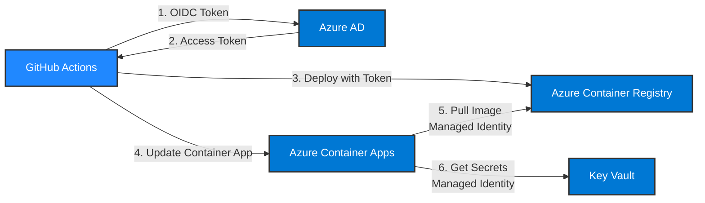

# GitHub Actions によるアプリケーション CI/CD 設定

このドキュメントでは、GitHub Actions を使用して Azure Container Apps へのアプリケーション自動デプロイ (CI/CD) を実現する手順を説明します。セキュリティベストプラクティスに従い、Federated Identity (Workload Identity) と Key Vault を使用した安全な構成を採用します。

## 📋 目次

1. [前提条件](#前提条件)
2. [セキュリティアーキテクチャ](#セキュリティアーキテクチャ)
3. [GitHub と Azure の連携設定](#1-github-と-azure-の連携設定)
4. [Key Vault へのシークレット登録](#2-key-vault-へのシークレット登録)
5. [GitHub Actions ワークフローの設定](#3-github-actions-ワークフローの設定)
6. [動作確認](#4-動作確認)
7. [トラブルシューティング](#5-トラブルシューティング)
8. [セキュリティベストプラクティス](#6-セキュリティベストプラクティス)

---

## 前提条件

- GitHub アカウントとリポジトリ
- Azure リソースが作成済みであること ([Azure リソースの作成 (CLI 版)](setup-azure_cli.md) を参照)
- Azure CLI がインストールされていること
- 以下の Azure リソースが作成済み:
  - Azure Container Registry (ACR)
  - Azure Container Apps (ACA)
  - Azure Key Vault
  - Container Apps に Managed Identity が設定済み

---

## セキュリティアーキテクチャ

### 認証フロー



### セキュリティの特徴

| 項目                       | 従来方式 (非推奨)                   | 推奨方式 (本ドキュメント)                                |
| -------------------------- | ----------------------------------- | -------------------------------------------------------- |
| **GitHub → Azure 認証**    | サービスプリンシパル + シークレット | **Federated Identity (OIDC)**                            |
| **ACR 認証**               | 管理者パスワード                    | **Managed Identity + RBAC**                              |
| **シークレット管理**       | GitHub Secrets に直接保存           | **Key Vault 参照**                                       |
| **権限管理**               | Contributor ロール                  | **最小権限の原則 (AcrPush, Container Apps Contributor)** |
| **シークレット露出リスク** | 高 (静的クレデンシャル)             | 低 (短期トークン、パスワードレス)                        |

---

## 1. GitHub と Azure の連携設定

### 1.1 アプリケーション登録の作成

GitHub Actions が Azure にアクセスするための App Registration を作成します。

```bash
# 変数の設定
APP_NAME="github-actions-slackbotaca"
REPO_OWNER="hondouchi"
REPO_NAME="slackbotsample_aca"
SUBSCRIPTION_ID=$(az account show --query id -o tsv)
RESOURCE_GROUP="rg-slackbot-aca"

# App Registration の作成
APP_ID=$(az ad app create \
  --display-name $APP_NAME \
  --query appId -o tsv)

echo "Application ID: $APP_ID"

# サービスプリンシパルの作成
az ad sp create --id $APP_ID
```

### 1.2 Federated Identity Credential の設定

GitHub Actions から Azure AD への OpenID Connect (OIDC) 認証を設定します。

```bash
# main ブランチ用の Federated Credential
az ad app federated-credential create \
  --id $APP_ID \
  --parameters '{
    "name": "github-main-branch",
    "issuer": "https://token.actions.githubusercontent.com",
    "subject": "repo:'$REPO_OWNER'/'$REPO_NAME':ref:refs/heads/main",
    "description": "GitHub Actions deployment from main branch",
    "audiences": ["api://AzureADTokenExchange"]
  }'

# develop ブランチ用の Federated Credential (オプション)
az ad app federated-credential create \
  --id $APP_ID \
  --parameters '{
    "name": "github-develop-branch",
    "issuer": "https://token.actions.githubusercontent.com",
    "subject": "repo:'$REPO_OWNER'/'$REPO_NAME':ref:refs/heads/develop",
    "description": "GitHub Actions deployment from develop branch",
    "audiences": ["api://AzureADTokenExchange"]
  }'
```

> **📝 Federated Identity とは**: GitHub Actions が実行時に短期間有効な Azure AD トークンを取得する仕組みです。静的なシークレットが不要で、セキュリティリスクが大幅に低減されます。

### 1.3 Azure ロールの割り当て

GitHub Actions に必要な最小権限を付与します。

#### ACR へのアクセス権 (イメージ Push 用)

```bash
# ACR のリソース ID を取得
ACR_NAME="slackbotaca"
ACR_ID=$(az acr show --name $ACR_NAME --query id -o tsv)

# サービスプリンシパルに AcrPush ロールを付与
az role assignment create \
  --assignee $APP_ID \
  --role AcrPush \
  --scope $ACR_ID
```

#### Container Apps へのアクセス権

```bash
# Container Apps Contributor ロールを付与
az role assignment create \
  --assignee $APP_ID \
  --role "Container Apps Contributor" \
  --scope /subscriptions/$SUBSCRIPTION_ID/resourceGroups/$RESOURCE_GROUP
```

#### Key Vault へのアクセス権 (シークレット書き込み用)

```bash
# Key Vault のリソース ID を取得
KV_NAME="kv-slackbot-aca"
KV_ID=$(az keyvault show --name $KV_NAME --query id -o tsv)

# Key Vault Secrets Officer ロールを付与 (シークレット更新用)
az role assignment create \
  --assignee $APP_ID \
  --role "Key Vault Secrets Officer" \
  --scope $KV_ID
```

> **📝 権限の説明**:
>
> - **AcrPush**: ACR へのイメージ push 権限 (pull も含む)
> - **Container Apps Contributor**: Container Apps の更新権限
> - **Key Vault Secrets Officer**: シークレットの作成・更新・削除権限

### 1.4 必要な情報の取得

GitHub Secrets に設定するための情報を取得します。

```bash
# Tenant ID の取得
TENANT_ID=$(az account show --query tenantId -o tsv)

# Subscription ID の取得
SUBSCRIPTION_ID=$(az account show --query id -o tsv)

# Application (Client) ID の表示
echo "AZURE_CLIENT_ID: $APP_ID"
echo "AZURE_TENANT_ID: $TENANT_ID"
echo "AZURE_SUBSCRIPTION_ID: $SUBSCRIPTION_ID"
```

**出力例**:

```
AZURE_CLIENT_ID: 34d391fe-3f7c-4bf1-a529-a71c659fd9ee
AZURE_TENANT_ID: 4029eb38-8689-465c-92e1-9464066c814c
AZURE_SUBSCRIPTION_ID: d79e0410-8e3c-4207-8d0a-1f7885d35859
```

これらの値を次のステップで GitHub Secrets に設定します。

---

## 2. Key Vault へのシークレット登録

CI/CD パイプラインで使用するシークレットを Key Vault に登録します。

### 2.1 ACR 情報の登録 (オプション)

Managed Identity を使用する場合、ACR 認証情報は不要ですが、互換性のために登録する場合:

```bash
# ACR ログインサーバーの取得
ACR_LOGIN_SERVER=$(az acr show --name $ACR_NAME --query loginServer -o tsv)

az keyvault secret set \
  --vault-name $KV_NAME \
  --name acr-login-server \
  --value $ACR_LOGIN_SERVER
```

> **✅ 推奨**: ACR 認証は Managed Identity を使用するため、パスワードの登録は不要です。

### 2.2 Slack トークンの登録 (既存確認)

[Azure リソースの作成](setup-azure_cli.md) のセクション 7.2 で既に登録済みの場合はスキップしてください。

```bash
# 既存のシークレットを確認
az keyvault secret list --vault-name $KV_NAME --query "[].name" -o table
```

**期待される出力**:

```
Result
---------------
slack-bot-token
slack-app-token
bot-user-id
```

未登録の場合は登録:

```bash
az keyvault secret set --vault-name $KV_NAME --name slack-bot-token --value <SLACK_BOT_TOKEN>
az keyvault secret set --vault-name $KV_NAME --name slack-app-token --value <SLACK_APP_TOKEN>
az keyvault secret set --vault-name $KV_NAME --name bot-user-id --value <BOT_USER_ID>
```

---

## 3. GitHub Actions ワークフローの設定

### 3.1 GitHub Secrets の設定

GitHub リポジトリにシークレットを追加します。

#### 手順

1. GitHub リポジトリ (`https://github.com/hondouchi/slackbotsample_aca`) にアクセス
2. **Settings** タブをクリック
3. 左サイドバーから **Secrets and variables** → **Actions** を選択
4. **New repository secret** をクリック

#### 設定するシークレット

| Name                    | Value                                     | 説明                           |
| ----------------------- | ----------------------------------------- | ------------------------------ |
| `AZURE_CLIENT_ID`       | セクション 1.4 で取得した Application ID  | GitHub Actions の認証用        |
| `AZURE_TENANT_ID`       | セクション 1.4 で取得した Tenant ID       | Azure AD のテナント ID         |
| `AZURE_SUBSCRIPTION_ID` | セクション 1.4 で取得した Subscription ID | デプロイ先のサブスクリプション |

> **⚠️ 重要**: `AZURE_CREDENTIALS` (JSON 形式の静的クレデンシャル) は**不要**です。Federated Identity を使用するため、シークレット値を保存する必要がありません。

### 3.2 ワークフローファイルの作成

`.github/workflows/deploy-production.yml` を作成します。

```yaml
name: Deploy to Azure Container Apps (Production)

on:
  push:
    branches:
      - main

permissions:
  id-token: write # Federated Identity 用
  contents: read

jobs:
  deploy:
    runs-on: ubuntu-latest

    env:
      ACR_NAME: slackbotaca
      IMAGE_NAME: slackbot-sample
      CONTAINER_APP_NAME: slackbot-acasample
      RESOURCE_GROUP: rg-slackbot-aca
      KEY_VAULT_NAME: kv-slackbot-aca

    steps:
      - name: Checkout repository
        uses: actions/checkout@v4

      - name: Log in to Azure using Federated Identity
        uses: azure/login@v2
        with:
          client-id: ${{ secrets.AZURE_CLIENT_ID }}
          tenant-id: ${{ secrets.AZURE_TENANT_ID }}
          subscription-id: ${{ secrets.AZURE_SUBSCRIPTION_ID }}

      - name: Get next version tag from ACR
        id: version
        run: |
          # 既存のタグ一覧を取得
          TAGS=$(az acr repository show-tags \
            --name ${{ env.ACR_NAME }} \
            --repository ${{ env.IMAGE_NAME }} \
            --orderby time_desc \
            --output tsv 2>/dev/null || echo "")

          if [ -z "$TAGS" ]; then
            # タグが存在しない場合は v1 から開始
            NEXT_VERSION="1"
          else
            # 最新のタグから次のバージョンを計算
            LATEST_TAG=$(echo "$TAGS" | head -n 1)
            LATEST_VERSION=$(echo $LATEST_TAG | sed 's/v//' | sed 's/[^0-9]*//g')
            NEXT_VERSION=$((LATEST_VERSION + 1))
          fi

          echo "next_version=$NEXT_VERSION" >> $GITHUB_OUTPUT
          echo "Next version: v$NEXT_VERSION"

      - name: Log in to Azure Container Registry (Managed Identity)
        run: |
          az acr login --name ${{ env.ACR_NAME }}

      - name: Build and push Docker image
        run: |
          VERSION=${{ steps.version.outputs.next_version }}
          IMAGE_TAG="${{ env.ACR_NAME }}.azurecr.io/${{ env.IMAGE_NAME }}:v${VERSION}"
          IMAGE_LATEST="${{ env.ACR_NAME }}.azurecr.io/${{ env.IMAGE_NAME }}:latest"

          docker build -t $IMAGE_TAG -t $IMAGE_LATEST .
          docker push $IMAGE_TAG
          docker push $IMAGE_LATEST

          echo "Pushed image: $IMAGE_TAG"
          echo "Pushed image: $IMAGE_LATEST"

      - name: Update Container App
        run: |
          VERSION=${{ steps.version.outputs.next_version }}
          IMAGE_TAG="${{ env.ACR_NAME }}.azurecr.io/${{ env.IMAGE_NAME }}:v${VERSION}"

          az containerapp update \
            --name ${{ env.CONTAINER_APP_NAME }} \
            --resource-group ${{ env.RESOURCE_GROUP }} \
            --image $IMAGE_TAG \
            --output table

      - name: Verify deployment
        run: |
          echo "Deployment completed successfully!"
          echo "Image: ${{ env.ACR_NAME }}.azurecr.io/${{ env.IMAGE_NAME }}:v${{ steps.version.outputs.next_version }}"

          # Container App の状態確認
          az containerapp show \
            --name ${{ env.CONTAINER_APP_NAME }} \
            --resource-group ${{ env.RESOURCE_GROUP }} \
            --query "properties.{ProvisioningState:provisioningState, RunningStatus:runningStatus, LatestRevision:latestRevisionName}" \
            --output table
```

### 3.3 開発環境用ワークフロー (オプション)

開発環境への自動デプロイが必要な場合は、`.github/workflows/deploy-develop.yml` を作成します。

```yaml
name: Deploy to Azure Container Apps (Develop)

on:
  push:
    branches:
      - develop

permissions:
  id-token: write
  contents: read

jobs:
  deploy:
    runs-on: ubuntu-latest

    env:
      ACR_NAME: slackbotaca
      IMAGE_NAME: slackbot-sample
      CONTAINER_APP_NAME: slackbot-acasample-dev
      RESOURCE_GROUP: rg-slackbot-aca-dev
      KEY_VAULT_NAME: kv-slackbot-aca-dev

    steps:
      # 本番環境と同じステップ (環境変数のみ変更)
      - name: Checkout repository
        uses: actions/checkout@v4

      - name: Log in to Azure using Federated Identity
        uses: azure/login@v2
        with:
          client-id: ${{ secrets.AZURE_CLIENT_ID }}
          tenant-id: ${{ secrets.AZURE_TENANT_ID }}
          subscription-id: ${{ secrets.AZURE_SUBSCRIPTION_ID }}

      # 以降は本番環境と同じステップ...
```

---

## 4. 動作確認

### 4.1 初回デプロイの実行

1. **ワークフローファイルをリポジトリに追加**

   ```bash
   cd /path/to/slackbotsample_aca
   git add .github/workflows/deploy-production.yml
   git commit -m "ci: GitHub Actions CI/CD with Federated Identity"
   git push origin main
   ```

2. **GitHub Actions の実行確認**

   - GitHub リポジトリの **Actions** タブを開く
   - 「Deploy to Azure Container Apps (Production)」ワークフローが実行されていることを確認
   - すべてのステップが緑色のチェックマークになれば成功

3. **デプロイされたバージョンの確認**

   ```bash
   az containerapp show \
     --name slackbot-acasample \
     --resource-group rg-slackbot-aca \
     --query "properties.template.containers[0].image" \
     --output tsv
   ```

   **期待される出力**:

   ```
   slackbotaca.azurecr.io/slackbot-sample:v1
   ```

### 4.2 Container Apps のログ確認

```bash
az containerapp logs show \
  --name slackbot-acasample \
  --resource-group rg-slackbot-aca \
  --follow
```

**期待されるログ**:

```
✅ Slack auth test success: { ok: true, ... }
⚡️ Slack Bot is running!
🚀 Current Bot Version: v1.0.0
```

### 4.3 Slack での動作確認

Slack チャンネルでボットにメンション:

```
@slackbot-aca /version
```

ボットが返信すれば、CI/CD パイプラインが正常に動作しています!

---

## 5. トラブルシューティング

### 5.1 Federated Identity 認証エラー

**エラーメッセージ**:

```
Error: Login failed with Error: AADSTS70021: No matching federated identity record found
```

**原因**: Federated Credential の `subject` が GitHub リポジトリと一致していない

**解決方法**:

1. Federated Credential の設定を確認:

   ```bash
   az ad app federated-credential list --id $APP_ID --query "[].{Name:name, Subject:subject}" -o table
   ```

2. `subject` の形式を確認:

   - 正: `repo:hondouchi/slackbotsample_aca:ref:refs/heads/main`
   - 誤: `repo:hondouchi/slackbotsample_aca:main`

3. 修正が必要な場合は再作成:

   ```bash
   az ad app federated-credential delete --id $APP_ID --federated-credential-id <CREDENTIAL_ID>
   # セクション 1.2 の手順で再作成
   ```

### 5.2 ACR Push エラー

**エラーメッセージ**:

```
Error: denied: requested access to the resource is denied
```

**原因**: サービスプリンシパルに `AcrPush` ロールが付与されていない

**解決方法**:

```bash
# ロール割り当ての確認
az role assignment list \
  --assignee $APP_ID \
  --scope $ACR_ID \
  --query "[].roleDefinitionName" -o tsv

# AcrPush ロールが表示されない場合は付与
az role assignment create \
  --assignee $APP_ID \
  --role AcrPush \
  --scope $ACR_ID
```

### 5.3 Container Apps 更新エラー

**エラーメッセージ**:

```
Error: (AuthorizationFailed) The client '<client-id>' with object id '<object-id>' does not have authorization to perform action
```

**原因**: サービスプリンシパルに `Container Apps Contributor` ロールが付与されていない

**解決方法**:

```bash
# ロール割り当ての確認
az role assignment list \
  --assignee $APP_ID \
  --scope /subscriptions/$SUBSCRIPTION_ID/resourceGroups/$RESOURCE_GROUP \
  --query "[].roleDefinitionName" -o tsv

# Container Apps Contributor ロールが表示されない場合は付与
az role assignment create \
  --assignee $APP_ID \
  --role "Container Apps Contributor" \
  --scope /subscriptions/$SUBSCRIPTION_ID/resourceGroups/$RESOURCE_GROUP
```

### 5.4 イメージ Pull エラー (Container Apps)

**エラーメッセージ**:

```
Failed to pull image: unauthorized: authentication required
```

**原因**: Container Apps の Managed Identity に ACR への `AcrPull` ロールが付与されていない

**解決方法**:

```bash
# Container Apps の Managed Identity を取得
APP_PRINCIPAL_ID=$(az containerapp show \
  --name slackbot-acasample \
  --resource-group rg-slackbot-aca \
  --query identity.principalId -o tsv)

# AcrPull ロールを付与
az role assignment create \
  --assignee $APP_PRINCIPAL_ID \
  --role AcrPull \
  --scope $ACR_ID
```

---

## 6. セキュリティベストプラクティス

### 6.1 Federated Identity (推奨)

✅ **採用している方式**:

- GitHub Actions が OIDC トークンで Azure AD に認証
- 静的なシークレット (パスワード) が不要
- トークンの有効期限が短い (セッション単位)

❌ **従来方式 (非推奨)**:

- サービスプリンシパルのシークレット (パスワード) を GitHub Secrets に保存
- シークレットが漏洩すると長期間悪用される可能性

### 6.2 最小権限の原則

各コンポーネントに必要最小限の権限のみを付与:

| コンポーネント                  | 権限                                                           | 理由                                               |
| ------------------------------- | -------------------------------------------------------------- | -------------------------------------------------- |
| GitHub Actions SP               | AcrPush, Container Apps Contributor, Key Vault Secrets Officer | イメージ push、デプロイ、シークレット更新のみ      |
| Container Apps Managed Identity | AcrPull, Key Vault Secrets User                                | イメージ pull、シークレット参照のみ (書き込み不可) |

### 6.3 Key Vault によるシークレット管理

✅ **採用している方式**:

- すべてのシークレットを Key Vault で一元管理
- Container Apps は Key Vault 参照で取得
- アクセスログの監査が可能

❌ **従来方式 (非推奨)**:

- GitHub Secrets に Slack トークンを直接保存
- Container Apps の環境変数に直接設定
- 監査ログが不十分

### 6.4 シークレットのローテーション

定期的なシークレット更新を推奨:

```bash
# Slack トークンの更新
az keyvault secret set --vault-name $KV_NAME --name slack-bot-token --value <NEW_TOKEN>

# Container App を再起動 (Key Vault から新しい値を取得)
REVISION_NAME=$(az containerapp revision list \
  --name slackbot-acasample \
  --resource-group rg-slackbot-aca \
  --query "[0].name" -o tsv)

az containerapp revision restart \
  --name slackbot-acasample \
  --resource-group rg-slackbot-aca \
  --revision $REVISION_NAME
```

### 6.5 ブランチ保護

`main` ブランチを保護して、直接 push を防ぐ:

1. GitHub リポジトリの **Settings** → **Branches**
2. **Branch protection rules** → **Add rule**
3. **Branch name pattern**: `main`
4. 以下を有効化:
   - ✅ **Require a pull request before merging**
   - ✅ **Require status checks to pass before merging**
   - ✅ **Require signed commits** (推奨)

### 6.6 監査ログの有効化

#### Key Vault 診断設定

```bash
# Log Analytics Workspace ID の取得
LOG_ANALYTICS_ID=$(az monitor log-analytics workspace show \
  --resource-group rg-slackbot-aca \
  --workspace-name slackbot-aca-logs \
  --query id -o tsv)

# Key Vault 診断設定の有効化
az monitor diagnostic-settings create \
  --name kv-audit-logs \
  --resource $(az keyvault show --name $KV_NAME --query id -o tsv) \
  --logs '[{"category":"AuditEvent","enabled":true}]' \
  --workspace $LOG_ANALYTICS_ID
```

#### Container Apps 診断設定

```bash
# Container Apps 診断設定の有効化
az monitor diagnostic-settings create \
  --name aca-logs \
  --resource $(az containerapp show --name slackbot-acasample --resource-group rg-slackbot-aca --query id -o tsv) \
  --logs '[{"category":"ContainerAppConsoleLogs","enabled":true},{"category":"ContainerAppSystemLogs","enabled":true}]' \
  --workspace $LOG_ANALYTICS_ID
```

---

## 次のステップ

- [デプロイフロー](deployment.md) - 開発から本番へのデプロイの流れ
- [ローカル開発環境](local-development.md) - ローカルでの開発方法
- [トラブルシューティング](troubleshooting.md) - よくある問題と解決方法

---

## 参考リンク

- [Azure Workload Identity (Federated Identity)](https://learn.microsoft.com/azure/active-directory/workload-identities/workload-identity-federation)
- [GitHub Actions と Azure の統合](https://learn.microsoft.com/azure/developer/github/connect-from-azure)
- [Azure Container Registry のベストプラクティス](https://learn.microsoft.com/azure/container-registry/container-registry-best-practices)
- [Azure Key Vault のセキュリティ](https://learn.microsoft.com/azure/key-vault/general/security-features)
