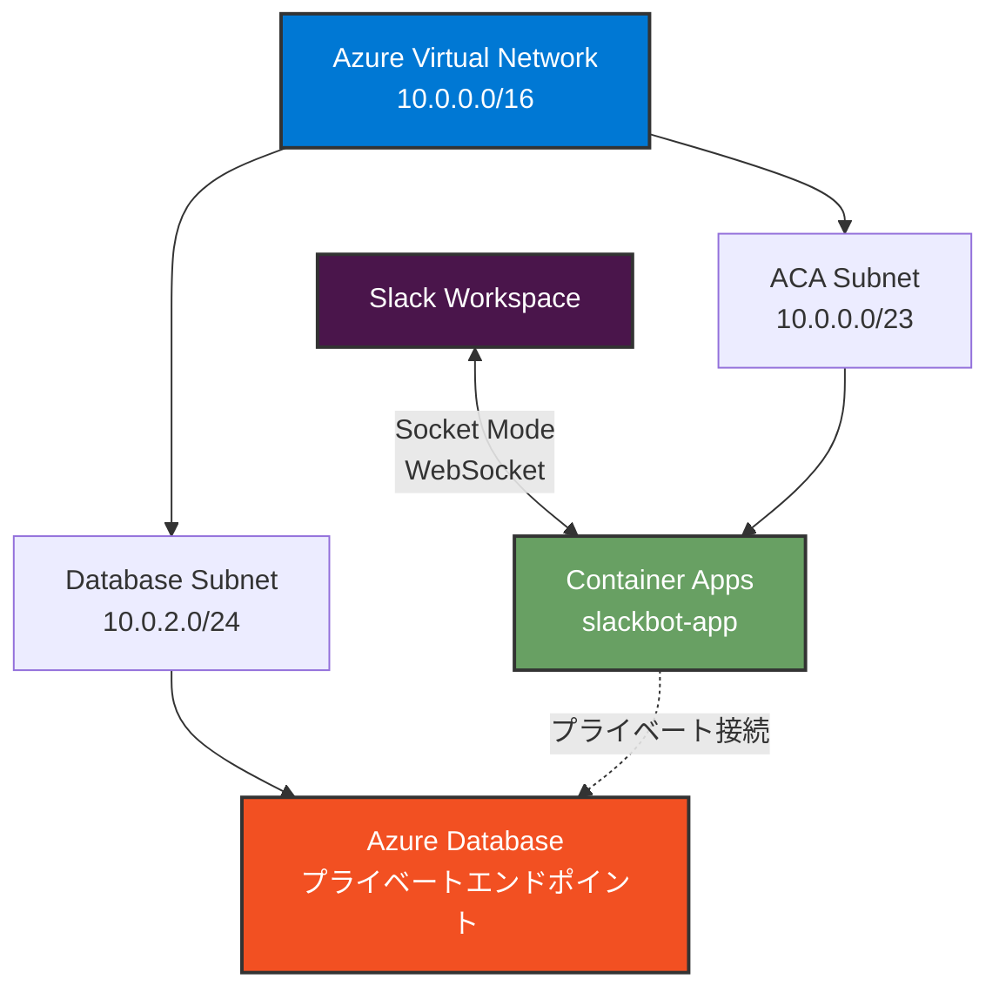

# Azure Container Apps のセキュリティ設定

このドキュメントでは、Azure Container Apps (ACA) のセキュリティを強化するための設定手順を説明します。

## 📋 目次

- [概要](#概要)
- [VNET 統合の設定](#vnet-統合の設定)
- [プライベートエンドポイントの設定](#プライベートエンドポイントの設定)
- [セキュリティのベストプラクティス](#セキュリティのベストプラクティス)

---

## 概要

### セキュリティ強化の目的

- **VNET 統合**: Container Apps を仮想ネットワーク内に配置し、外部からの直接アクセスを防ぐ
- **プライベート通信**: データベースなどの Azure リソースとプライベートに接続
- **最小権限の原則**: 必要最小限のネットワークアクセスのみを許可

### アーキテクチャ



---

## VNET 統合の設定

### 前提条件

- リソースグループが作成済み
- Azure CLI または Azure Portal へのアクセス

---

## Azure CLI 版

### 1. Virtual Network の作成

```bash
# VNET の作成
az network vnet create \
  --resource-group slackbot-aca-rg \
  --name slackbot-vnet \
  --address-prefix 10.0.0.0/16 \
  --location japaneast
```

### 2. サブネットの作成

#### Container Apps 用サブネット

Container Apps Environment には最低でも `/23` (512 アドレス) のサブネットが必要です。

```bash
az network vnet subnet create \
  --resource-group slackbot-aca-rg \
  --vnet-name slackbot-vnet \
  --name aca-subnet \
  --address-prefixes 10.0.0.0/23
```

#### データベース用サブネット (将来の拡張用)

```bash
az network vnet subnet create \
  --resource-group slackbot-aca-rg \
  --vnet-name slackbot-vnet \
  --name database-subnet \
  --address-prefixes 10.0.2.0/24 \
  --disable-private-endpoint-network-policies false
```

### 3. VNET 統合された Container Apps Environment の作成

```bash
# サブネット ID の取得
SUBNET_ID=$(az network vnet subnet show \
  --resource-group slackbot-aca-rg \
  --vnet-name slackbot-vnet \
  --name aca-subnet \
  --query id \
  --output tsv)

# VNET 統合された Environment の作成
az containerapp env create \
  --name slackbot-aca-env \
  --resource-group slackbot-aca-rg \
  --location japaneast \
  --infrastructure-subnet-resource-id $SUBNET_ID \
  --internal-only false
```

### パラメータの説明

| パラメータ                            | 説明                                     | 推奨値                           |
| ------------------------------------- | ---------------------------------------- | -------------------------------- |
| `--infrastructure-subnet-resource-id` | Container Apps が使用するサブネットの ID | `/23` 以上のサブネット           |
| `--internal-only`                     | 内部専用環境にするか                     | `false` (Slack からの接続を許可) |

> **📝 Note**: Socket Mode では外部からの WebSocket 接続が必要なため、`--internal-only` は `false` に設定します。

### 4. Container Apps の作成

通常の手順で Container Apps を作成します ([Azure リソースの作成](setup-azure.md) の Azure CLI 手順を参照)。

```bash
az containerapp create \
  --name slackbot-app \
  --resource-group slackbot-aca-rg \
  --environment slackbot-aca-env \
  --image <YOUR_ACR_NAME>.azurecr.io/slackbot-sample:1 \
  --ingress internal \
  --target-port 3000 \
  --registry-server <YOUR_ACR_NAME>.azurecr.io \
  --registry-username <ACR_USERNAME> \
  --registry-password <ACR_PASSWORD> \
  --secrets \
    slack-bot-token=<SLACK_BOT_TOKEN> \
    slack-app-token=<SLACK_APP_TOKEN> \
    bot-user-id=<BOT_USER_ID> \
  --env-vars \
    SLACK_BOT_TOKEN=secretref:slack-bot-token \
    SLACK_APP_TOKEN=secretref:slack-app-token \
    BOT_USER_ID=secretref:bot-user-id \
  --min-replicas 1 \
  --max-replicas 1 \
  --cpu 0.5 \
  --memory 1.0Gi
```

---

## Azure Portal 版

### 1. Virtual Network の作成

1. Azure Portal で **仮想ネットワーク** を検索
2. **+ 作成** をクリック
3. **基本** タブ:
   - **サブスクリプション**: 使用するサブスクリプション
   - **リソース グループ**: `slackbot-aca-rg`
   - **名前**: `slackbot-vnet`
   - **リージョン**: `Japan East`
4. **IP アドレス** タブ:
   - **IPv4 アドレス空間**: `10.0.0.0/16`
   - **+ サブネットの追加**:
     - **名前**: `aca-subnet`
     - **サブネット アドレス範囲**: `10.0.0.0/23`
   - **+ サブネットの追加**:
     - **名前**: `database-subnet`
     - **サブネット アドレス範囲**: `10.0.2.0/24`
5. **確認および作成** → **作成**

### 2. Container Apps Environment の作成 (VNET 統合)

1. Azure Portal で **コンテナー アプリ環境** を検索
2. **+ 作成** をクリック
3. **基本** タブ:
   - **サブスクリプション**: 使用するサブスクリプション
   - **リソース グループ**: `slackbot-aca-rg`
   - **コンテナー アプリ環境名**: `slackbot-aca-env`
   - **リージョン**: `Japan East`
4. **ネットワーク** タブ:
   - **仮想ネットワーク**: `slackbot-vnet`
   - **インフラストラクチャ サブネット**: `aca-subnet`
   - **仮想ネットワーク内部専用**: `いいえ` (Slack からの接続を許可)
5. **監視** タブ:
   - **Log Analytics ワークスペース**: 新規作成
6. **確認および作成** → **作成**

### 3. Container Apps の作成

通常の手順で Container Apps を作成します ([Azure リソースの作成](setup-azure.md) の Azure Portal 手順を参照)。

---

## プライベートエンドポイントの設定

将来、Azure Database などのリソースに接続する場合のプライベートエンドポイント設定例です。

### Azure Database for PostgreSQL の例

#### CLI 版

```bash
# プライベートエンドポイントの作成
az network private-endpoint create \
  --resource-group slackbot-aca-rg \
  --name postgres-private-endpoint \
  --vnet-name slackbot-vnet \
  --subnet database-subnet \
  --private-connection-resource-id <POSTGRES_RESOURCE_ID> \
  --group-id postgresqlServer \
  --connection-name postgres-connection

# プライベート DNS ゾーンの作成
az network private-dns zone create \
  --resource-group slackbot-aca-rg \
  --name privatelink.postgres.database.azure.com

# VNET リンクの作成
az network private-dns link vnet create \
  --resource-group slackbot-aca-rg \
  --zone-name privatelink.postgres.database.azure.com \
  --name postgres-dns-link \
  --virtual-network slackbot-vnet \
  --registration-enabled false

# DNS レコードの自動作成
az network private-endpoint dns-zone-group create \
  --resource-group slackbot-aca-rg \
  --endpoint-name postgres-private-endpoint \
  --name postgres-dns-zone-group \
  --private-dns-zone privatelink.postgres.database.azure.com \
  --zone-name postgres
```

#### Portal 版

1. Azure Database for PostgreSQL を作成
2. **ネットワーク** → **プライベート エンドポイント接続**
3. **+ プライベート エンドポイント** をクリック
4. 以下を設定:
   - **リソース グループ**: `slackbot-aca-rg`
   - **名前**: `postgres-private-endpoint`
   - **リージョン**: `Japan East`
5. **リソース** タブ:
   - **ターゲット サブリソース**: `postgresqlServer`
6. **仮想ネットワーク** タブ:
   - **仮想ネットワーク**: `slackbot-vnet`
   - **サブネット**: `database-subnet`
7. **DNS** タブ:
   - **プライベート DNS ゾーンと統合する**: `はい`
8. **確認および作成** → **作成**

---

## セキュリティのベストプラクティス

### 1. ネットワークセキュリティグループ (NSG) の設定

```bash
# NSG の作成
az network nsg create \
  --resource-group slackbot-aca-rg \
  --name aca-nsg

# 必要最小限のルールのみを追加
az network nsg rule create \
  --resource-group slackbot-aca-rg \
  --nsg-name aca-nsg \
  --name allow-https-outbound \
  --priority 100 \
  --direction Outbound \
  --access Allow \
  --protocol Tcp \
  --destination-port-ranges 443 \
  --source-address-prefixes '*' \
  --destination-address-prefixes '*'

# NSG をサブネットに適用
az network vnet subnet update \
  --resource-group slackbot-aca-rg \
  --vnet-name slackbot-vnet \
  --name aca-subnet \
  --network-security-group aca-nsg
```

### 2. Azure Container Registry のプライベートエンドポイント

ACR へのアクセスもプライベート化できます:

```bash
# ACR 用サブネットの作成
az network vnet subnet create \
  --resource-group slackbot-aca-rg \
  --vnet-name slackbot-vnet \
  --name acr-subnet \
  --address-prefixes 10.0.3.0/24

# ACR のプライベートエンドポイント作成
az network private-endpoint create \
  --resource-group slackbot-aca-rg \
  --name acr-private-endpoint \
  --vnet-name slackbot-vnet \
  --subnet acr-subnet \
  --private-connection-resource-id <ACR_RESOURCE_ID> \
  --group-id registry \
  --connection-name acr-connection

# プライベート DNS ゾーンの作成
az network private-dns zone create \
  --resource-group slackbot-aca-rg \
  --name privatelink.azurecr.io

# VNET リンクの作成
az network private-dns link vnet create \
  --resource-group slackbot-aca-rg \
  --zone-name privatelink.azurecr.io \
  --name acr-dns-link \
  --virtual-network slackbot-vnet \
  --registration-enabled false
```

### 3. マネージド ID の使用

パスワードを使用せず、マネージド ID で ACR にアクセス:

```bash
# システム割り当てマネージド ID の有効化
az containerapp identity assign \
  --name slackbot-app \
  --resource-group slackbot-aca-rg \
  --system-assigned

# マネージド ID に ACR へのアクセス権を付与
PRINCIPAL_ID=$(az containerapp show \
  --name slackbot-app \
  --resource-group slackbot-aca-rg \
  --query identity.principalId \
  --output tsv)

ACR_ID=$(az acr show \
  --name <YOUR_ACR_NAME> \
  --query id \
  --output tsv)

az role assignment create \
  --assignee $PRINCIPAL_ID \
  --role AcrPull \
  --scope $ACR_ID
```

### 4. シークレット管理の強化

Azure Key Vault を使用してシークレットを管理:

```bash
# Key Vault の作成
az keyvault create \
  --name slackbot-kv \
  --resource-group slackbot-aca-rg \
  --location japaneast \
  --enable-rbac-authorization false

# シークレットの追加
az keyvault secret set \
  --vault-name slackbot-kv \
  --name slack-bot-token \
  --value <SLACK_BOT_TOKEN>

# Container Apps からのアクセスを許可
az keyvault set-policy \
  --name slackbot-kv \
  --object-id $PRINCIPAL_ID \
  --secret-permissions get list
```

### 5. 診断ログの有効化

```bash
# Log Analytics Workspace ID の取得
WORKSPACE_ID=$(az monitor log-analytics workspace show \
  --resource-group slackbot-aca-rg \
  --workspace-name <WORKSPACE_NAME> \
  --query id \
  --output tsv)

# 診断設定の作成
az monitor diagnostic-settings create \
  --name aca-diagnostics \
  --resource <ACA_RESOURCE_ID> \
  --workspace $WORKSPACE_ID \
  --logs '[{"category": "ContainerAppConsoleLogs", "enabled": true}]' \
  --metrics '[{"category": "AllMetrics", "enabled": true}]'
```

---

## セキュリティチェックリスト

実装後、以下の項目を確認してください:

- [ ] Container Apps Environment が VNET 内に配置されている
- [ ] データベースなどの Azure リソースがプライベートエンドポイント経由で接続されている
- [ ] NSG で不要なトラフィックがブロックされている
- [ ] マネージド ID を使用して、認証情報をコードに含めていない
- [ ] Azure Key Vault でシークレットを管理している
- [ ] 診断ログが有効化されている
- [ ] 最小権限の原則に従ってロールが割り当てられている

---

## コスト影響

VNET 統合による追加コスト:

| リソース                   | 追加コスト                          |
| -------------------------- | ----------------------------------- |
| Virtual Network            | 無料                                |
| プライベートエンドポイント | 約 ¥1,000/月 (エンドポイントあたり) |
| NSG                        | 無料                                |
| Key Vault                  | 約 ¥500/月 + トランザクション料金   |

---

## トラブルシューティング

### Container Apps が起動しない

**確認項目**:

1. サブネットサイズが `/23` 以上であることを確認
2. サブネットが他のリソースで使用されていないことを確認
3. NSG ルールが HTTPS アウトバウンドを許可していることを確認

### データベースに接続できない

**確認項目**:

1. プライベートエンドポイントが正しく作成されていることを確認
2. DNS 解決が正しく行われていることを確認
3. データベースのファイアウォール設定を確認

---

## 次のステップ

- [デプロイフロー](deployment.md) - セキュアな環境へのデプロイ方法
- [トラブルシューティング](troubleshooting.md) - セキュリティ関連の問題解決
